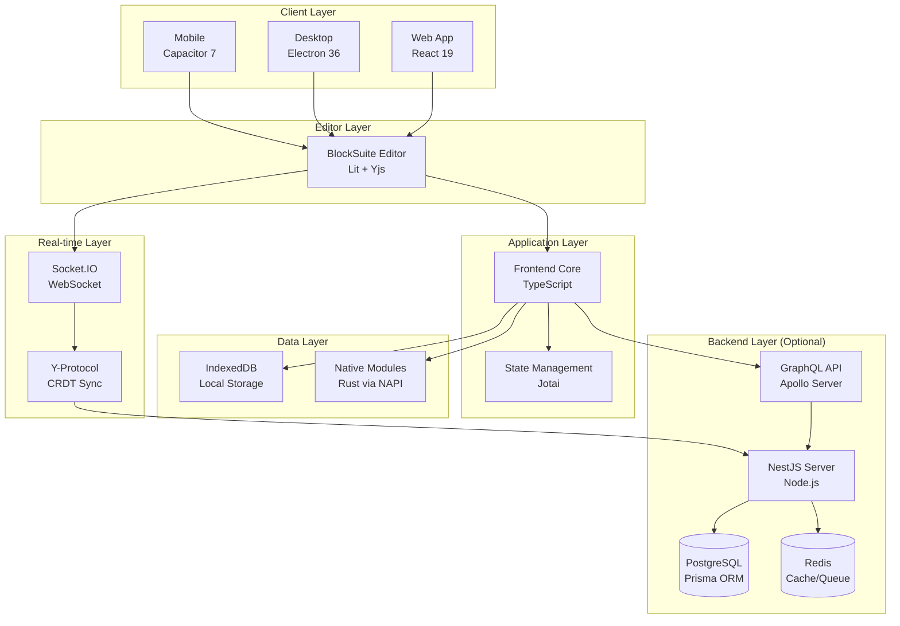
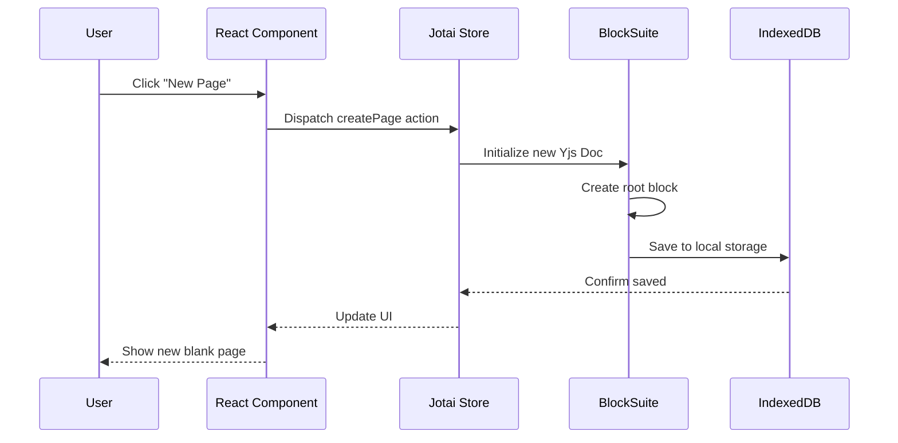
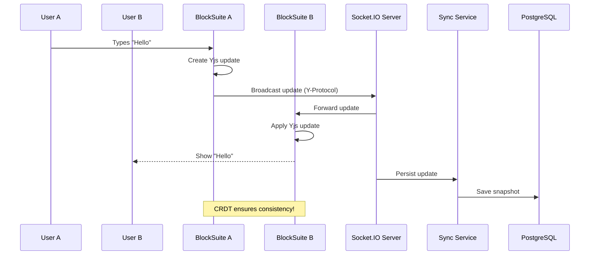
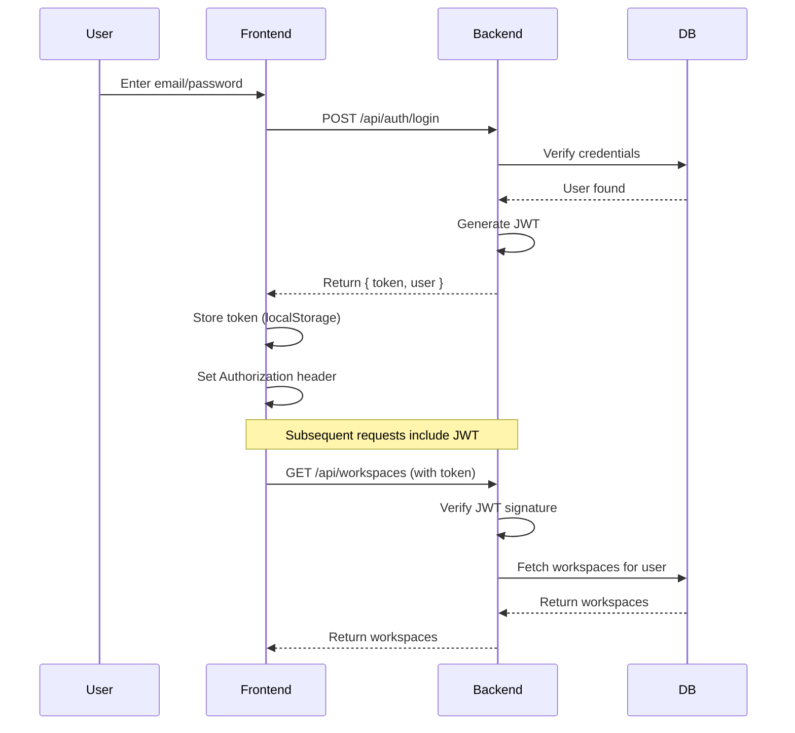

# AFFiNE Architecture Overview

**Documented:** November 2025
**Tech Stack Research:** [TECH_STACK_RESEARCH.md](./TECH_STACK_RESEARCH.md)
**Prerequisites:** [Getting Started](./GETTING_STARTED.md)

> **Goal:** Understand the high-level architecture, key components, and how they work together.

---

## Table of Contents

- [Introduction](#introduction)
- [Architecture Principles](#architecture-principles)
- [System Overview](#system-overview)
- [High-Level Architecture](#high-level-architecture)
- [Core Components](#core-components)
- [Data Architecture](#data-architecture)
- [Technology Stack Layers](#technology-stack-layers)
- [Cross-Cutting Concerns](#cross-cutting-concerns)
- [Deployment Architecture](#deployment-architecture)
- [Key Architectural Decisions](#key-architectural-decisions)
- [Architecture Patterns](#architecture-patterns)
- [Next Steps](#next-steps)

---

## Introduction

**AFFiNE** is a sophisticated, multi-platform knowledge management system that combines document editing, visual canvas, databases, and real-time collaboration in a local-first architecture.

### What Makes AFFiNE Unique?

1. **Local-First Architecture** - Data lives on your device, cloud is optional
2. **CRDT-Based Collaboration** - Conflict-free real-time editing with Yjs
3. **Block-Based Editor** - Everything is a composable block (BlockSuite)
4. **Cross-Platform** - Web, Desktop (Electron), Mobile (Capacitor)
5. **Full-Stack TypeScript** - End-to-end type safety
6. **Rust Performance Layer** - Native modules for speed-critical operations

**Estimated Reading Time:** 1.5 hours

---

## Architecture Principles

### 1. **Local-First Philosophy**

🧠 **Mental Model:** Think of AFFiNE like Git - your data lives locally, syncing is optional.

```
User Device (Source of Truth)
    ↓
IndexedDB (Local Storage)
    ↓
Optional Cloud Sync ← Backend Server
```

**Key Implications:**
- ✅ Works offline by default
- ✅ Fast (no network latency for basic operations)
- ✅ Privacy-focused (you own your data)
- ✅ Sync when needed (not required)

See: [packages/frontend/core/src/modules/db/](../../packages/frontend/core/src/modules/db/)

---

### 2. **CRDT-Based Collaboration**

🧠 **Mental Model:** CRDTs are like "conflict-free Git merges" - multiple people editing simultaneously without lock conflicts.

**What is a CRDT?**
- **C**onflict-free **R**eplicated **D**ata **T**ypes
- Mathematical guarantees: merges always converge
- No "last write wins" - intelligent conflict resolution

**How AFFiNE Uses CRDTs:**
```typescript
// Yjs CRDT library powers the editor
import * as Y from 'yjs'

const ydoc = new Y.Doc()
const ytext = ydoc.getText('content')

// Multiple users can edit simultaneously
ytext.insert(0, 'Hello ')  // User A
ytext.insert(6, 'World')   // User B
// Result: "Hello World" (no conflicts!)
```

**Implementation:**
- **Yjs** for document CRDTs
- **y-octo** (Rust) for performance-critical CRDT operations
- **Socket.IO** for real-time transport

See: [Collaboration System Guide](./COLLABORATION_SYSTEM.md) (comprehensive deep-dive)

---

### 3. **Block-Based Everything**

🧠 **Mental Model:** Like React components, but for content. Everything (text, images, databases) is a block.

**Block Hierarchy:**
```
Document
  ├── Text Block
  ├── Heading Block
  ├── Image Block
  ├── Database Block
  │   ├── Table View
  │   ├── Kanban View
  │   └── Gallery View
  └── Canvas Block (Edgeless)
```

**Why Blocks?**
- ✅ Composable and reusable
- ✅ Drag-and-drop reorganization
- ✅ Consistent rendering pipeline
- ✅ Extensible (add new block types)

See: [BlockSuite Editor Guide](./BLOCKSUITE_EDITOR.md)

---

### 4. **Modular Frontend Architecture**

🧠 **Mental Model:** Like microservices, but for frontend. Each "module" is self-contained.

**Module Structure:**
```
modules/
  ├── auth/          # Authentication logic
  ├── workspace/     # Workspace management
  ├── doc/           # Document operations
  ├── editor/        # Editor integration
  └── cloud/         # Cloud sync
```

Each module:
- Declares dependencies
- Provides services
- Can be lazy-loaded
- Has its own tests

See: [packages/frontend/core/src/modules/](../../packages/frontend/core/src/modules/)

---

## System Overview

### Architecture at a Glance



---

## High-Level Architecture

### Three-Tier Architecture

AFFiNE follows a modern three-tier architecture:

#### 1. **Presentation Tier** (Frontend)
- **Web:** Vite + React 19
- **Desktop:** Electron 36 wrapper around web
- **Mobile:** Capacitor 7 wrapper around web

**Key Point:** All platforms share the same core React codebase.

#### 2. **Application Tier** (Business Logic)
- **Frontend Logic:** TypeScript modules in `@affine/core`
- **Backend Logic:** NestJS modules in `@affine/server`
- **Editor Logic:** BlockSuite framework

#### 3. **Data Tier** (Storage)
- **Local:** IndexedDB (browser/desktop), SQLite (mobile)
- **Remote:** PostgreSQL (server), Redis (cache/queue)
- **Sync:** CRDT-based via Yjs and custom protocols

---

### Request Flow Examples

#### Example 1: Create a New Page (Local-Only)



**No server required!** This is local-first in action.

**Code References:**
- Create page action: [packages/frontend/core/src/modules/doc/](../../packages/frontend/core/src/modules/doc/)
- Editor initialization: [blocksuite/framework/store/](../../blocksuite/framework/store/)
- IndexedDB storage: [packages/frontend/core/src/modules/db/](../../packages/frontend/core/src/modules/db/)

---

#### Example 2: Collaborative Editing (With Server)



**Code References:**
- Yjs document: [packages/common/y-octo/](../../packages/common/y-octo/)
- Socket.IO server: [packages/backend/server/src/core/sync/](../../packages/backend/server/src/core/sync/)
- Sync service: [packages/backend/server/src/core/doc-service/](../../packages/backend/server/src/core/doc-service/)

---

## Core Components

### Frontend Components

#### 1. **@affine/core** - Application Core

**Location:** [`packages/frontend/core/`](../../packages/frontend/core/)

**Responsibilities:**
- Main React application
- State management (Jotai)
- Routing (React Router)
- Module system
- Platform abstraction

**Key Directories:**
```
core/src/
├── modules/           # Feature modules (auth, workspace, doc, etc.)
├── components/        # UI components
├── bootstrap/         # App initialization (REMOVED, check actual structure)
├── desktop/           # Desktop-specific code
└── mobile/            # Mobile-specific code
```

**Example Module Structure:**
```typescript
// modules/workspace/
export class WorkspaceModule {
  providers = [WorkspaceService, WorkspaceRepository]

  constructor(
    @Inject(AuthModule) private auth: AuthModule,
    @Inject(CloudModule) private cloud: CloudModule
  ) {}
}
```

See: [packages/frontend/core/src/modules/index.ts](../../packages/frontend/core/src/modules/index.ts)

---

#### 2. **@affine/component** - UI Component Library

**Location:** [`packages/frontend/component/`](../../packages/frontend/component/)

**Responsibilities:**
- Reusable UI components
- Based on Radix UI primitives
- Styled with Vanilla Extract
- Design system implementation

**Example Components:**
- `<Button />`, `<Input />`, `<Modal />`
- `<Sidebar />`, `<Toolbar />`, `<Menu />`
- Custom components like `<PageTree />`, `<DocEditor />`

**Styling Approach:**
```typescript
// style.css.ts (Vanilla Extract)
import { style } from '@vanilla-extract/css'

export const button = style({
  padding: '8px 16px',
  borderRadius: '4px',
  // Type-safe CSS!
})
```

See: [packages/frontend/component/](../../packages/frontend/component/)

---

#### 3. **BlockSuite** - Editor Framework

**Location:** [`blocksuite/`](../../blocksuite/)

**Responsibilities:**
- Rich text editing
- Visual canvas (Edgeless mode)
- Block rendering
- Selection management
- Collaborative editing (Yjs integration)

**Architecture:**
```
blocksuite/
├── framework/         # Core framework
│   ├── store/        # Yjs document store
│   ├── std/          # Standard utilities
│   └── global/       # Global configs
└── affine/           # AFFiNE-specific
    ├── blocks/       # Block implementations
    ├── widgets/      # UI widgets
    └── components/   # Shared components
```

**Block Example:**
```typescript
// Simplified block structure
class ParagraphBlock extends BlockElement {
  render() {
    return html`
      <div contenteditable="true">
        ${this.text}
      </div>
    `
  }
}
```

See: [BlockSuite Editor Guide](./BLOCKSUITE_EDITOR.md)

---

### Backend Components

#### 4. **@affine/server** - NestJS Backend

**Location:** [`packages/backend/server/`](../../packages/backend/server/)

**Responsibilities:**
- GraphQL API (Apollo Server)
- Authentication & Authorization (JWT)
- Database operations (Prisma)
- Real-time sync (Socket.IO)
- Background jobs (BullMQ)
- Email sending
- File storage (S3 compatible)

**NestJS Module Structure:**
```
server/src/
├── core/              # Core business modules
│   ├── auth/         # Authentication
│   ├── user/         # User management
│   ├── workspaces/   # Workspace operations
│   ├── doc/          # Document CRUD
│   └── sync/         # Real-time sync
├── base/              # Base utilities
├── plugins/           # Plugin system
└── app.module.ts      # Root module
```

**Example NestJS Module:**
```typescript
// core/auth/auth.module.ts
@Module({
  imports: [
    JwtModule.register({
      secret: process.env.JWT_SECRET,
      signOptions: { expiresIn: '7d' },
    }),
  ],
  controllers: [AuthController],
  providers: [AuthService, JwtStrategy],
  exports: [AuthService],
})
export class AuthModule {}
```

See: [Backend Architecture Guide](./BACKEND_ARCHITECTURE.md)

---

#### 5. **Prisma ORM** - Database Layer

**Location:** [`packages/backend/server/prisma/`](../../packages/backend/server/prisma/)

**Schema Example:**
```prisma
model User {
  id        String   @id @default(uuid())
  email     String   @unique
  name      String?
  createdAt DateTime @default(now())

  workspaces WorkspaceMember[]
  docs       Doc[]
}

model Workspace {
  id      String   @id @default(uuid())
  name    String

  members WorkspaceMember[]
  docs    Doc[]
}
```

**Usage:**
```typescript
// In a NestJS service
async createUser(email: string, name: string) {
  return this.prisma.user.create({
    data: { email, name },
  })
}
```

See: [Database Schema Guide](./DATABASE_SCHEMA.md)

---

### Data & Storage Components

#### 6. **IndexedDB** - Local Storage

**Implementation:** [`packages/frontend/core/src/modules/db/`](../../packages/frontend/core/src/modules/db/)

**What's Stored Locally:**
- Yjs documents (CRDT data)
- Workspace metadata
- User preferences
- Blob storage (images, files)
- Cached cloud data

**Schema (simplified):**
```typescript
interface LocalWorkspace {
  id: string
  name: string
  docs: Map<string, YDoc>  // Yjs documents
  blobs: Map<string, Blob> // Media files
}
```

---

#### 7. **Native Modules** - Rust Layer

**Locations:**
- Frontend: [`packages/frontend/native/`](../../packages/frontend/native/)
- Backend: [`packages/backend/native/`](../../packages/backend/native/)

**Why Rust?**
- ✅ **Performance:** 10-100x faster than JavaScript for CPU-intensive tasks
- ✅ **Memory safety:** No garbage collection pauses
- ✅ **Cross-platform:** Compile to native code for each OS

**Use Cases:**
- CRDT operations (y-octo)
- File parsing (PDF, DOCX)
- Encryption/decryption
- Local database (SQLite for mobile)

**NAPI-RS Binding Example:**
```rust
#[napi]
pub fn parse_markdown(input: String) -> Result<String> {
  // Rust implementation (fast!)
  markdown::to_html(&input)
}
```

```typescript
// JavaScript usage
import { parseMarkdown } from '@affine/native'

const html = parseMarkdown('# Hello')
```

See: [packages/frontend/native/](../../packages/frontend/native/)

---

## Data Architecture

### Data Flow Layers

```
┌─────────────────────────────────────┐
│   UI Layer (React Components)      │
├─────────────────────────────────────┤
│   State Layer (Jotai Atoms)        │
├─────────────────────────────────────┤
│   Service Layer (Business Logic)   │
├─────────────────────────────────────┤
│   Repository Layer (Data Access)   │
├─────────────────────────────────────┤
│   Storage Layer (IndexedDB/Prisma) │
└─────────────────────────────────────┘
```

---

### State Management (Jotai)

🧠 **Mental Model:** Jotai atoms are like useState, but global and composable.

**Atom Types:**

1. **Primitive Atoms** (basic state)
```typescript
import { atom } from 'jotai'

const userAtom = atom<User | null>(null)
const workspacesAtom = atom<Workspace[]>([])
```

2. **Derived Atoms** (computed state)
```typescript
const activeWorkspaceAtom = atom((get) => {
  const workspaces = get(workspacesAtom)
  const activeId = get(activeWorkspaceIdAtom)
  return workspaces.find(w => w.id === activeId)
})
```

3. **Async Atoms** (data fetching)
```typescript
const userDocsAtom = atom(async (get) => {
  const user = get(userAtom)
  return fetchUserDocs(user.id)
})
```

**Example Usage:**
```typescript
function WorkspaceList() {
  const [workspaces] = useAtom(workspacesAtom)

  return (
    <div>
      {workspaces.map(w => <WorkspaceItem key={w.id} workspace={w} />)}
    </div>
  )
}
```

See: [Frontend Architecture Guide](./FRONTEND_ARCHITECTURE.md)

---

### Data Synchronization

**Sync Strategies:**

1. **Optimistic UI**
```typescript
// Update UI immediately
setDocTitle(newTitle)

// Sync to server in background
await syncDocToServer(docId, { title: newTitle })

// Rollback if failed
if (!success) setDocTitle(oldTitle)
```

2. **CRDT Sync (Yjs)**
```typescript
// User A's edit
ytext.insert(0, 'Hello ')

// Creates a Yjs update (binary format)
const update = Y.encodeStateAsUpdate(ydoc)

// Broadcast to other users
socket.emit('doc:update', { docId, update })

// User B receives and applies
Y.applyUpdate(theirYdoc, update)
// Guaranteed consistency!
```

3. **Snapshot Persistence**
```
Every N edits or M seconds:
  1. Create Yjs snapshot
  2. Compress snapshot
  3. Save to PostgreSQL
  4. Update last-sync timestamp
```

See: [Data Flow Guide](./DATA_FLOW_GUIDE.md)

---

## Technology Stack Layers

### Layer 1: Platform Layer

| Platform | Technology | Purpose |
|----------|------------|---------|
| **Web** | Vite + React | Browser-based app |
| **Desktop** | Electron 36 | macOS, Windows, Linux |
| **Mobile** | Capacitor 7 | iOS, Android |

All platforms share 95%+ of the same codebase.

---

### Layer 2: UI Layer

| Technology | Version | Purpose |
|------------|---------|---------|
| **React** | 19.1.0 | UI framework |
| **Jotai** | 2.10.3 | State management |
| **React Router** | 6.28.0 | Client-side routing |
| **Radix UI** | Various | Accessible primitives |
| **Vanilla Extract** | 1.17.0 | Type-safe styling |

---

### Layer 3: Editor Layer

| Technology | Version | Purpose |
|------------|---------|---------|
| **Lit** | 3.2.1 | Web Components |
| **Yjs** | 13.6.21 | CRDT library |
| **BlockSuite** | Custom | Editor framework |

---

### Layer 4: Backend Layer

| Technology | Version | Purpose |
|------------|---------|---------|
| **NestJS** | 11.0.12 | Server framework |
| **Prisma** | 6.6.0 | ORM |
| **GraphQL** | 16.9.0 | API layer |
| **Socket.IO** | 4.8.1 | Real-time |
| **BullMQ** | Latest | Job queue |

---

### Layer 5: Data Layer

| Technology | Purpose |
|------------|---------|
| **PostgreSQL** (pgvector) | Primary database |
| **Redis** | Cache & queue |
| **IndexedDB** | Browser local storage |
| **SQLite** | Mobile local storage |

---

### Layer 6: Native Layer

| Technology | Purpose |
|------------|---------|
| **Rust** (Edition 2024) | Performance modules |
| **NAPI-RS** | Node.js bindings |
| **y-octo** | CRDT implementation |

---

## Cross-Cutting Concerns

### Authentication & Authorization

**Flow:**


**JWT Structure:**
```typescript
{
  sub: 'user-id-123',      // Subject (user ID)
  email: 'user@example.com',
  iat: 1699999999,         // Issued at
  exp: 1700604799,         // Expires (7 days)
}
```

See: [packages/backend/server/src/core/auth/](../../packages/backend/server/src/core/auth/)

---

### Error Handling

**Error Flow:**
```
Error Occurs
  ↓
Try-Catch Block
  ↓
Log to Console (dev)
  ↓
Send to Sentry (prod)
  ↓
Show User-Friendly Message
  ↓
Rollback Optimistic Update (if applicable)
```

**Example:**
```typescript
try {
  await saveDoc(doc)
} catch (error) {
  // Log
  console.error('Failed to save doc:', error)

  // Report (production)
  if (process.env.NODE_ENV === 'production') {
    Sentry.captureException(error)
  }

  // User feedback
  toast.error('Failed to save document. Please try again.')

  // Rollback
  revertDocChanges()
}
```

---

### Logging & Monitoring

**Frontend:**
- Console logs (development)
- Sentry (production errors)
- Analytics events (Mixpanel/Amplitude)

**Backend:**
- Winston logger (structured logs)
- OpenTelemetry (traces, metrics)
- Prometheus metrics export
- Zipkin tracing

See: [packages/backend/server/src/base/](../../packages/backend/server/src/base/)

---

### Internationalization (i18n)

**Implementation:**
```typescript
import { useI18n } from '@affine/i18n'

function WelcomeMessage() {
  const t = useI18n()

  return <h1>{t['com.affine.welcome']()}</h1>
}
```

**Translation Files:**
```typescript
// packages/frontend/i18n/src/resources/en.json
{
  "com.affine.welcome": "Welcome to AFFiNE",
  "com.affine.new-page": "New Page"
}
```

**Supported Languages:**
- English, Chinese, Japanese, Korean
- German, French, Spanish, Portuguese
- Russian, and more

See: [packages/frontend/i18n/](../../packages/frontend/i18n/)

---

## Deployment Architecture

### Local Development

```
Developer Machine
├── Frontend (localhost:8080)
├── Backend (localhost:3010)
└── Docker Compose
    ├── PostgreSQL (localhost:5432)
    ├── Redis (localhost:6379)
    └── Mailhog (localhost:8025)
```

---

### Production (Self-Hosted)

```
┌──────────────────────────┐
│   Reverse Proxy (Nginx)  │
│   SSL Termination        │
└────────┬─────────────────┘
         │
    ┌────┴────┬────────────┬──────────┐
    │         │            │          │
┌───▼───┐ ┌──▼───┐  ┌─────▼────┐ ┌──▼──────┐
│ Web   │ │ API  │  │ Socket.IO│ │ Storage │
│ (CDN) │ │ Node │  │ Node     │ │ S3/MinIO│
└───────┘ └──┬───┘  └─────┬────┘ └─────────┘
             │            │
        ┌────┴────┬───────┘
        │         │
    ┌───▼───┐ ┌──▼────┐
    │ Postgres│ │ Redis │
    └────────┘ └───────┘
```

See: Official docs at https://docs.affine.pro/self-host-affine

---

### Cloud (AFFiNE.pro)

⚠️ **UNCLEAR:** Exact cloud infrastructure details are not public.

**Known Components:**
- Multi-region deployment
- Auto-scaling (Kubernetes likely)
- CDN for static assets
- Database replicas for read scaling

---

## Key Architectural Decisions

### ADR 1: Local-First Architecture

**Decision:** Make local storage the source of truth, cloud sync optional.

**Rationale:**
- ✅ Privacy: User owns their data
- ✅ Performance: No network latency
- ✅ Reliability: Works offline
- ✅ Simplicity: Fewer failure modes

**Trade-offs:**
- ❌ Sync complexity with CRDTs
- ❌ Multi-device state management
- ⚠️ Storage limits (IndexedDB ~50GB)

---

### ADR 2: CRDT for Collaboration

**Decision:** Use Yjs (CRDT library) instead of Operational Transform (OT).

**Rationale:**
- ✅ Provably conflict-free
- ✅ Peer-to-peer capable
- ✅ Simpler mental model
- ✅ Better for offline edits

**Trade-offs:**
- ❌ Larger document size (tombstones)
- ❌ Steeper learning curve
- ⚠️ Memory usage for large docs

---

### ADR 3: Monorepo Structure

**Decision:** Use Yarn workspaces for monorepo.

**Rationale:**
- ✅ Share code between frontend/backend
- ✅ Consistent dependency versions
- ✅ Atomic commits across packages
- ✅ Easier refactoring

**Trade-offs:**
- ❌ Slower `yarn install` initially
- ❌ More complex build setup
- ⚠️ Requires discipline to avoid circular deps

---

### ADR 4: TypeScript Everywhere

**Decision:** Use TypeScript for frontend, backend, and tooling.

**Rationale:**
- ✅ End-to-end type safety
- ✅ Better IDE support
- ✅ Catch errors at compile time
- ✅ GraphQL codegen works seamlessly

**Trade-offs:**
- ❌ Compilation step required
- ❌ Steeper learning curve
- ⚠️ Type gymnastics for complex patterns

---

### ADR 5: BlockSuite as Separate Project

**Decision:** Maintain BlockSuite as standalone editor framework.

**Rationale:**
- ✅ Reusable by other projects
- ✅ Clear separation of concerns
- ✅ Independent release cycle
- ✅ Potential for ecosystem

**Trade-offs:**
- ❌ Coordination overhead
- ❌ Version sync complexity
- ⚠️ Duplication of some code

---

## Architecture Patterns

### Pattern 1: Module Pattern

**Used in:** Frontend (`packages/frontend/core/src/modules/`)

```typescript
// workspace.module.ts
export class WorkspaceModule {
  // Declare what this module provides
  providers = [
    WorkspaceService,
    WorkspaceRepository,
  ]

  // Declare dependencies
  constructor(
    @Inject(AuthModule) private auth: AuthModule,
    @Inject(CloudModule) private cloud: CloudModule,
  ) {}

  // Lifecycle hooks
  onInit() {
    // Initialize workspace manager
  }
}
```

**Benefits:**
- ✅ Clear dependencies
- ✅ Lazy loading support
- ✅ Testable in isolation

---

### Pattern 2: Repository Pattern

**Used in:** Data access layer

```typescript
// workspace.repository.ts
export class WorkspaceRepository {
  async findById(id: string): Promise<Workspace | null> {
    // IndexedDB access
    return this.db.get('workspaces', id)
  }

  async save(workspace: Workspace): Promise<void> {
    await this.db.put('workspaces', workspace)
  }
}
```

**Benefits:**
- ✅ Abstraction over storage
- ✅ Easy to swap storage backend
- ✅ Mockable for testing

---

### Pattern 3: Service Layer

**Used in:** Business logic

```typescript
// workspace.service.ts
export class WorkspaceService {
  constructor(
    private repo: WorkspaceRepository,
    private sync: SyncService,
  ) {}

  async createWorkspace(name: string): Promise<Workspace> {
    // Business logic
    const workspace = { id: uuid(), name, createdAt: new Date() }

    // Save locally
    await this.repo.save(workspace)

    // Sync to cloud (if online)
    await this.sync.syncWorkspace(workspace.id)

    return workspace
  }
}
```

**Benefits:**
- ✅ Centralized business logic
- ✅ Orchestrates multiple operations
- ✅ Handles cross-cutting concerns

---

### Pattern 4: Observer Pattern (Yjs)

**Used in:** Document synchronization

```typescript
// Listen to document changes
ydoc.on('update', (update: Uint8Array, origin: any) => {
  if (origin !== 'local') {
    // Remote change - apply to UI
    applyRemoteChange(update)
  } else {
    // Local change - broadcast to peers
    broadcastUpdate(update)
  }
})
```

**Benefits:**
- ✅ Reactive to changes
- ✅ Decoupled components
- ✅ Natural fit for collaboration

---

## Next Steps

### Dive Deeper

1. **Frontend Focus?** → [Frontend Architecture](./FRONTEND_ARCHITECTURE.md)
2. **Backend Focus?** → [Backend Architecture](./BACKEND_ARCHITECTURE.md)
3. **Editor Focus?** → [BlockSuite Editor](./BLOCKSUITE_EDITOR.md)
4. **Collaboration Focus?** → [Collaboration System](./COLLABORATION_SYSTEM.md)

### Understand Details

1. **Project Structure** → [Project Structure Guide](./PROJECT_STRUCTURE.md)
2. **Tech Stack** → [Tech Stack Guide](./TECH_STACK_GUIDE.md)
3. **Data Flow** → [Data Flow Guide](./DATA_FLOW_GUIDE.md)

### Get Practical

1. **Coding Patterns** → [Patterns & Conventions](./PATTERNS_AND_CONVENTIONS.md)
2. **How-To Tasks** → [How-To Guide](./HOW_TO_GUIDE.md)
3. **Code Walkthroughs** → [Code Tours](./CODE_TOURS.md)

---

## Key Takeaways

✅ **Local-first** architecture with optional cloud sync
✅ **CRDT-based collaboration** via Yjs for conflict-free editing
✅ **Block-based editor** (BlockSuite) for composable content
✅ **Modular frontend** with clear separation of concerns
✅ **Full-stack TypeScript** for end-to-end type safety
✅ **Rust native modules** for performance-critical operations
✅ **Cross-platform** (Web, Desktop, Mobile) sharing same codebase

---

## Quick Reference

| Component | Location | Purpose |
|-----------|----------|---------|
| Frontend Core | `packages/frontend/core/` | Main React app |
| UI Components | `packages/frontend/component/` | Reusable components |
| BlockSuite | `blocksuite/` | Editor framework |
| Backend Server | `packages/backend/server/` | NestJS API |
| Native Modules | `packages/*/native/` | Rust performance layer |
| Database Schema | `packages/backend/server/prisma/` | Prisma models |
| i18n | `packages/frontend/i18n/` | Translations |

---

**🎉 You now understand AFFiNE's architecture!**

Continue to [Data Flow Guide](./DATA_FLOW_GUIDE.md) to see how data moves through these components.

---

*Last updated: November 18, 2025*
*See [README.md](./README.md) for the complete learning path.*
