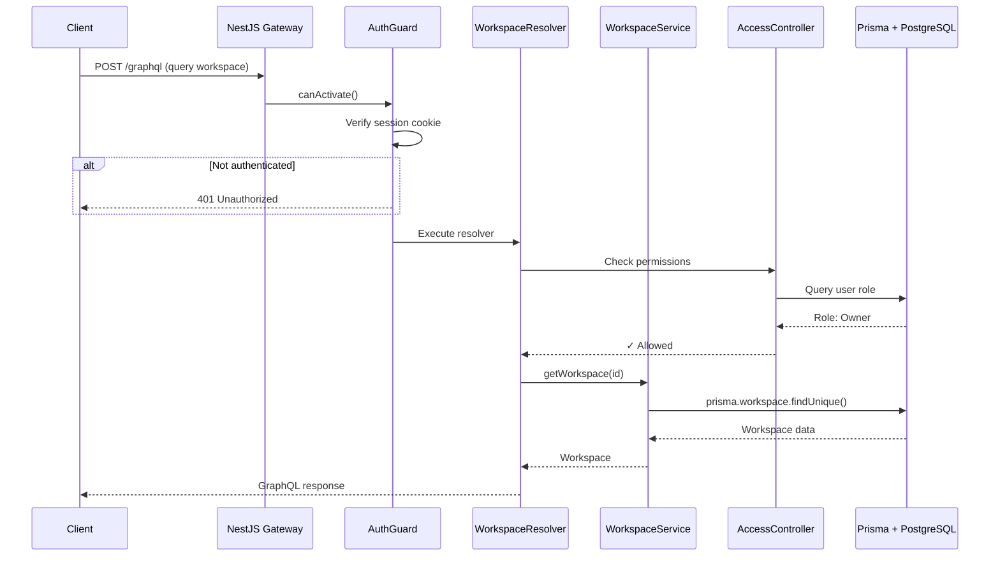

# Backend Architecture

> **Mental Model**: AFFiNE's backend is a **NestJS microservices architecture** - modular, type-safe, and designed for real-time collaboration. Think of it as "TypeScript backend done right" with GraphQL for queries, REST for blobs, and WebSocket for live updates.

**For React Developers**: If frontend has components and state, backend has **modules** (like NestJS controllers), **services** (business logic), **resolvers** (GraphQL), and **guards** (authentication/permissions). The architecture mirrors frontend patterns but for server-side.

---

## Table of Contents

1. [Architecture Overview](#architecture-overview)
2. [NestJS Module System](#nestjs-module-system)
3. [GraphQL Layer](#graphql-layer)
4. [Database with Prisma](#database-with-prisma)
5. [Real-Time with Socket.IO](#real-time-with-socketio)
6. [Authentication & Sessions](#authentication--sessions)
7. [Permission System](#permission-system)
8. [File Storage & Blobs](#file-storage--blobs)
9. [Background Jobs with BullMQ](#background-jobs-with-bullmq)
10. [Deployment & Scaling](#deployment--scaling)

---

## Architecture Overview

### Technology Stack

```
┌─────────────────────────────────────────────────┐
│  API Layer                                      │
│  ├─ GraphQL (queries, mutations, subscriptions)│
│  ├─ REST (blob upload/download)                │
│  └─ WebSocket (real-time collaboration)        │
├─────────────────────────────────────────────────┤
│  Application Layer (NestJS)                    │
│  ├─ Controllers (REST endpoints)               │
│  ├─ Resolvers (GraphQL)                        │
│  ├─ Services (business logic)                  │
│  └─ Guards (auth + permissions)                │
├─────────────────────────────────────────────────┤
│  Domain Layer                                  │
│  ├─ Entities (Prisma models)                   │
│  ├─ Repositories (data access)                 │
│  └─ Events (domain events)                     │
├─────────────────────────────────────────────────┤
│  Infrastructure                                │
│  ├─ PostgreSQL (relational data)               │
│  ├─ Redis (cache, sessions, queues)            │
│  └─ S3 (blob storage)                          │
└─────────────────────────────────────────────────┘
```

### Directory Structure

```
packages/backend/server/src/
├── core/                    # Core business modules
│   ├── auth/               # Authentication
│   ├── user/               # User management
│   ├── workspaces/         # Workspace CRUD
│   ├── doc/                # Document storage
│   ├── permission/         # Access control
│   ├── quota/              # Storage quotas
│   ├── storage/            # Blob storage
│   ├── sync/               # Real-time sync (WebSocket)
│   └── config/             # Server configuration
├── plugins/                # Feature plugins
│   ├── payment/            # Stripe integration
│   ├── copilot/            # AI features
│   ├── oauth/              # OAuth providers
│   └── license/            # Self-hosted licensing
├── base/                   # Shared utilities
│   ├── error.ts            # Error types
│   ├── logger.ts           # Logging
│   └── metrics.ts          # Prometheus metrics
├── models/                 # Prisma generated models
└── app.module.ts           # Root module
```

### Request Flow Diagram



---

## NestJS Module System

### What is a NestJS Module?

A **module** encapsulates related functionality (like a microservice within the monolith).

**Structure**:
```typescript
// packages/backend/server/src/core/user/index.ts
import { Module } from '@nestjs/common';
import { UserController } from './controller';
import { UserResolver } from './resolver';
import { UserService } from './service';

@Module({
  imports: [],              // Other modules this depends on
  controllers: [UserController], // REST endpoints
  providers: [UserResolver, UserService], // Services and resolvers
  exports: [UserService],   // Public API
})
export class UserModule {}
```

### Module Hierarchy

```
AppModule (root)
├── CoreModule
│   ├── AuthModule
│   ├── UserModule
│   ├── WorkspaceModule
│   │   ├── WorkspaceResolver
│   │   ├── WorkspaceController
│   │   └── WorkspaceService
│   ├── DocModule
│   ├── PermissionModule
│   ├── QuotaModule
│   └── StorageModule
├── PluginModule
│   ├── PaymentModule
│   ├── CopilotModule
│   └── OAuthModule
└── DatabaseModule (Prisma)
```

### Dependency Injection

**Auto-injection via constructor**:

```typescript
// packages/backend/server/src/core/workspaces/service.ts
import { Injectable } from '@nestjs/common';
import { Models } from '../../models';
import { QuotaService } from '../quota';
import { PermissionService } from '../permission';

@Injectable()
export class WorkspaceService {
  constructor(
    private readonly models: Models,           // Prisma client
    private readonly quota: QuotaService,      // Auto-injected
    private readonly permission: PermissionService, // Auto-injected
  ) {}

  async createWorkspace(userId: string, name: string) {
    // Check quota
    await this.quota.checkWorkspaceQuota(userId);

    // Create in database
    const workspace = await this.models.workspace.create({
      data: {
        name,
        members: {
          create: {
            userId,
            role: 'Owner',
          },
        },
      },
    });

    return workspace;
  }
}
```

**Providers scope**:

```typescript
@Module({
  providers: [
    WorkspaceService,      // Singleton (default)
    {
      provide: 'REQUEST_SCOPED_SERVICE',
      useClass: RequestScopedService,
      scope: Scope.REQUEST, // New instance per request
    },
  ],
})
```

**Location References**:
- App module: `packages/backend/server/src/app.module.ts`
- Core modules: `packages/backend/server/src/core/*/index.ts`

---

## GraphQL Layer

### Schema-First Approach

AFFiNE uses **code-first GraphQL** - schema generated from TypeScript decorators.

**Defining types**:

```typescript
// packages/backend/server/src/core/workspaces/types.ts
import { Field, ID, ObjectType } from '@nestjs/graphql';

@ObjectType('Workspace')
export class WorkspaceType {
  @Field(() => ID)
  id!: string;

  @Field()
  name!: string;

  @Field(() => Date)
  createdAt!: Date;

  @Field({ nullable: true })
  avatar?: string;

  @Field(() => Boolean)
  public!: boolean;

  // Computed fields (resolved separately)
  @Field(() => WorkspaceRole)
  role!: WorkspaceRole;

  @Field(() => [DocType])
  docs!: DocType[];
}
```

**Generated GraphQL schema**:

```graphql
type Workspace {
  id: ID!
  name: String!
  createdAt: DateTime!
  avatar: String
  public: Boolean!
  role: WorkspaceRole!
  docs: [Doc!]!
}
```

### Queries & Mutations

**Query resolver**:

```typescript
// packages/backend/server/src/core/workspaces/resolvers/workspace.ts
import { Query, Args, Resolver } from '@nestjs/graphql';
import { CurrentUser } from '../../auth';
import { WorkspaceType } from '../types';
import { WorkspaceService } from '../service';

@Resolver(() => WorkspaceType)
export class WorkspaceResolver {
  constructor(
    private readonly workspaceService: WorkspaceService,
  ) {}

  @Query(() => [WorkspaceType], { name: 'workspaces' })
  async getWorkspaces(
    @CurrentUser() user: CurrentUser,
  ): Promise<WorkspaceType[]> {
    return await this.workspaceService.listWorkspaces(user.id);
  }

  @Query(() => WorkspaceType, { name: 'workspace', nullable: true })
  async getWorkspace(
    @Args('id') id: string,
    @CurrentUser() user: CurrentUser,
  ): Promise<WorkspaceType | null> {
    // Permission check happens in guard
    return await this.workspaceService.getWorkspace(id);
  }
}
```

**Mutation resolver**:

```typescript
@Mutation(() => WorkspaceType)
async createWorkspace(
  @CurrentUser() user: CurrentUser,
  @Args('name') name: string,
): Promise<WorkspaceType> {
  return await this.workspaceService.createWorkspace(user.id, name);
}

@Mutation(() => WorkspaceType)
async updateWorkspace(
  @CurrentUser() user: CurrentUser,
  @Args('input') input: UpdateWorkspaceInput,
): Promise<WorkspaceType> {
  // Check permission
  await this.ac
    .user(user.id)
    .workspace(input.id)
    .assert('Workspace.Update');

  return await this.workspaceService.updateWorkspace(input);
}
```

### Field Resolvers (Lazy Loading)

**Resolve nested fields on-demand**:

```typescript
@Resolver(() => WorkspaceType)
export class WorkspaceResolver {
  @ResolveField(() => [DocType], { name: 'docs' })
  async getDocs(
    @Parent() workspace: WorkspaceType,
    @CurrentUser() user: CurrentUser,
  ): Promise<DocType[]> {
    // Only loads docs if client requests them
    return await this.docService.listDocs(workspace.id);
  }

  @ResolveField(() => WorkspaceRole, { name: 'role' })
  async getRole(
    @Parent() workspace: WorkspaceType,
    @CurrentUser() user: CurrentUser,
  ): Promise<WorkspaceRole> {
    const { role } = await this.ac
      .user(user.id)
      .workspace(workspace.id)
      .permissions();

    return role;
  }
}
```

**GraphQL query example**:

```graphql
query {
  workspace(id: "workspace-123") {
    id
    name
    role           # Triggers getRole() resolver
    docs {         # Triggers getDocs() resolver
      id
      title
    }
  }
}
```

### Input Types & Validation

**Input DTO with validation**:

```typescript
import { Field, InputType } from '@nestjs/graphql';
import { IsString, MinLength, MaxLength } from 'class-validator';

@InputType()
export class UpdateWorkspaceInput {
  @Field()
  @IsString()
  id!: string;

  @Field({ nullable: true })
  @IsString()
  @MinLength(1)
  @MaxLength(100)
  name?: string;

  @Field({ nullable: true })
  @IsString()
  avatar?: string;
}
```

**Automatic validation**:

```typescript
@Mutation(() => WorkspaceType)
async updateWorkspace(
  @Args('input') input: UpdateWorkspaceInput, // Auto-validated
): Promise<WorkspaceType> {
  // If validation fails, NestJS throws 400 error automatically
  return await this.workspaceService.updateWorkspace(input);
}
```

### Error Handling

**Custom errors**:

```typescript
// packages/backend/server/src/base/error.ts
export class WorkspaceNotFound extends Error {
  constructor(workspaceId: string) {
    super(`Workspace ${workspaceId} not found`);
    this.name = 'WorkspaceNotFound';
  }
}

export class SpaceAccessDenied extends Error {
  constructor(workspaceId: string) {
    super(`Access denied to workspace ${workspaceId}`);
    this.name = 'SpaceAccessDenied';
  }
}
```

**Error response**:

```json
{
  "errors": [
    {
      "message": "Access denied to workspace workspace-123",
      "extensions": {
        "code": "SPACE_ACCESS_DENIED",
        "workspaceId": "workspace-123"
      }
    }
  ]
}
```

**Location References**:
- GraphQL resolvers: `packages/backend/server/src/core/*/resolver.ts`
- GraphQL types: `packages/backend/server/src/core/*/types.ts`
- Error types: `packages/backend/server/src/base/error.ts`

---

## Database with Prisma

### Prisma Schema

**Location**: `packages/backend/server/prisma/schema.prisma`

```prisma
datasource db {
  provider = "postgresql"
  url      = env("DATABASE_URL")
}

generator client {
  provider = "prisma-client-js"
  output   = "../src/models"
}

model User {
  id            String   @id @default(uuid())
  name          String
  email         String   @unique
  password      String
  createdAt     DateTime @default(now())

  workspaces    WorkspaceMember[]
  sessions      Session[]

  @@map("users")
}

model Workspace {
  id            String   @id @default(uuid())
  name          String
  avatar        String?
  public        Boolean  @default(false)
  createdAt     DateTime @default(now())

  members       WorkspaceMember[]
  docs          Doc[]

  @@map("workspaces")
}

model WorkspaceMember {
  id           String        @id @default(uuid())
  workspaceId  String
  userId       String
  role         WorkspaceRole @default(Member)
  createdAt    DateTime      @default(now())

  workspace    Workspace @relation(fields: [workspaceId], references: [id], onDelete: Cascade)
  user         User      @relation(fields: [userId], references: [id], onDelete: Cascade)

  @@unique([workspaceId, userId])
  @@map("workspace_members")
}

enum WorkspaceRole {
  Owner
  Admin
  Member
  External
}

model Doc {
  id           String   @id
  workspaceId  String
  title        String
  createdAt    DateTime @default(now())
  updatedAt    DateTime @updatedAt

  workspace    Workspace @relation(fields: [workspaceId], references: [id], onDelete: Cascade)
  snapshots    DocSnapshot[]
  updates      DocUpdate[]

  @@map("docs")
}

model DocSnapshot {
  id        String   @id @default(uuid())
  docId     String
  bin       Bytes
  timestamp DateTime @default(now())

  doc       Doc @relation(fields: [docId], references: [id], onDelete: Cascade)

  @@map("doc_snapshots")
}

model DocUpdate {
  id        String   @id @default(uuid())
  docId     String
  bin       Bytes
  timestamp DateTime @default(now())

  doc       Doc @relation(fields: [docId], references: [id], onDelete: Cascade)

  @@index([docId, timestamp])
  @@map("doc_updates")
}
```

### Prisma Client Usage

**Generated client**:

```typescript
// packages/backend/server/src/models/index.ts
import { PrismaClient } from '@prisma/client';
import { Injectable } from '@nestjs/common';

@Injectable()
export class Models extends PrismaClient {
  constructor() {
    super({
      log: ['query', 'error', 'warn'],
    });
  }
}
```

**Queries**:

```typescript
export class WorkspaceService {
  constructor(private readonly models: Models) {}

  async getWorkspace(id: string) {
    return await this.models.workspace.findUnique({
      where: { id },
      include: {
        members: {
          include: {
            user: true, // Join with users table
          },
        },
      },
    });
  }

  async createWorkspace(userId: string, name: string) {
    return await this.models.workspace.create({
      data: {
        name,
        members: {
          create: {
            userId,
            role: 'Owner',
          },
        },
      },
    });
  }

  async listUserWorkspaces(userId: string) {
    return await this.models.workspace.findMany({
      where: {
        members: {
          some: { userId },
        },
      },
      orderBy: { createdAt: 'desc' },
    });
  }
}
```

### Transactions

**Atomic operations**:

```typescript
async transferOwnership(
  workspaceId: string,
  fromUserId: string,
  toUserId: string,
) {
  return await this.models.$transaction(async (prisma) => {
    // 1. Demote current owner
    await prisma.workspaceMember.update({
      where: {
        workspaceId_userId: {
          workspaceId,
          userId: fromUserId,
        },
      },
      data: { role: 'Admin' },
    });

    // 2. Promote new owner
    await prisma.workspaceMember.update({
      where: {
        workspaceId_userId: {
          workspaceId,
          userId: toUserId,
        },
      },
      data: { role: 'Owner' },
    });

    // 3. Log event
    await prisma.auditLog.create({
      data: {
        event: 'OWNERSHIP_TRANSFERRED',
        workspaceId,
        fromUserId,
        toUserId,
      },
    });
  });
}
```

### Migrations

**Create migration**:

```bash
yarn prisma migrate dev --name add_workspace_avatar
```

**Generated migration**:

```sql
-- migrations/20250101000000_add_workspace_avatar/migration.sql
ALTER TABLE "workspaces" ADD COLUMN "avatar" TEXT;
```

**Apply in production**:

```bash
yarn prisma migrate deploy
```

**Location References**:
- Prisma schema: `packages/backend/server/prisma/schema.prisma`
- Prisma client: `packages/backend/server/src/models/index.ts`
- Migrations: `packages/backend/server/prisma/migrations/`

---

## Real-Time with Socket.IO

### WebSocket Gateway

**Location**: `packages/backend/server/src/core/sync/gateway.ts`

```typescript
import {
  WebSocketGateway,
  WebSocketServer,
  SubscribeMessage,
  ConnectedSocket,
  MessageBody,
} from '@nestjs/websockets';
import { Server, Socket } from 'socket.io';
import { CurrentUser } from '../auth';

@WebSocketGateway({
  namespace: '/sync',
  cors: { origin: '*', credentials: true },
})
export class SyncGateway {
  @WebSocketServer()
  server!: Server;

  constructor(
    private readonly docStorage: DocStorageAdapter,
    private readonly ac: AccessController,
  ) {}

  // Client connects
  async handleConnection(socket: Socket) {
    const user = await this.authenticateSocket(socket);

    if (!user) {
      socket.disconnect();
      return;
    }

    socket.data.userId = user.id;
    console.log(`User ${user.id} connected`);
  }

  // Client disconnects
  handleDisconnect(socket: Socket) {
    console.log(`User ${socket.data.userId} disconnected`);
  }

  // Client sends document update
  @SubscribeMessage('doc:update')
  async handleDocUpdate(
    @ConnectedSocket() socket: Socket,
    @MessageBody() data: {
      workspaceId: string;
      docId: string;
      bin: number[];
    },
  ) {
    // 1. Check permissions
    await this.ac
      .user(socket.data.userId)
      .workspace(data.workspaceId)
      .doc(data.docId)
      .assert('Doc.Write');

    // 2. Convert to Uint8Array
    const update = new Uint8Array(data.bin);

    // 3. Store in database
    await this.docStorage.pushDocUpdate({
      docId: data.docId,
      bin: update,
      editor: socket.data.userId,
    });

    // 4. Broadcast to other clients in workspace
    socket.to(data.workspaceId).emit('doc:update', {
      docId: data.docId,
      bin: data.bin,
      editor: socket.data.userId,
    });

    return { success: true };
  }

  // Client joins workspace room
  @SubscribeMessage('workspace:join')
  async handleJoinWorkspace(
    @ConnectedSocket() socket: Socket,
    @MessageBody() workspaceId: string,
  ) {
    // Check permissions
    const canAccess = await this.ac
      .user(socket.data.userId)
      .workspace(workspaceId)
      .can('Workspace.Read');

    if (!canAccess) {
      return { error: 'Access denied' };
    }

    // Join Socket.IO room
    socket.join(workspaceId);

    return { success: true };
  }

  // Client leaves workspace room
  @SubscribeMessage('workspace:leave')
  handleLeaveWorkspace(
    @ConnectedSocket() socket: Socket,
    @MessageBody() workspaceId: string,
  ) {
    socket.leave(workspaceId);
    return { success: true };
  }
}
```

### Broadcasting Events

**Notify all users in workspace**:

```typescript
export class WorkspaceService {
  constructor(
    private readonly syncGateway: SyncGateway,
  ) {}

  async renameWorkspace(workspaceId: string, name: string) {
    // Update in database
    const workspace = await this.models.workspace.update({
      where: { id: workspaceId },
      data: { name },
    });

    // Broadcast to all connected clients
    this.syncGateway.server
      .to(workspaceId)
      .emit('workspace:updated', {
        id: workspaceId,
        name,
      });

    return workspace;
  }
}
```

**Location References**:
- WebSocket gateway: `packages/backend/server/src/core/sync/gateway.ts`

---

## Authentication & Sessions

### Session-Based Auth

**Session storage in Redis**:

```typescript
// packages/backend/server/src/core/auth/session.ts
import { Injectable } from '@nestjs/common';
import { RedisService } from '../redis';

export interface Session {
  userId: string;
  createdAt: Date;
  expiresAt: Date;
}

@Injectable()
export class SessionService {
  constructor(private readonly redis: RedisService) {}

  async createSession(userId: string): Promise<string> {
    const sessionId = randomUUID();
    const session: Session = {
      userId,
      createdAt: new Date(),
      expiresAt: new Date(Date.now() + 7 * 24 * 60 * 60 * 1000), // 7 days
    };

    await this.redis.set(
      `session:${sessionId}`,
      JSON.stringify(session),
      'EX',
      7 * 24 * 60 * 60, // 7 days in seconds
    );

    return sessionId;
  }

  async getSession(sessionId: string): Promise<Session | null> {
    const data = await this.redis.get(`session:${sessionId}`);

    if (!data) {
      return null;
    }

    return JSON.parse(data);
  }

  async deleteSession(sessionId: string): Promise<void> {
    await this.redis.del(`session:${sessionId}`);
  }
}
```

### Auth Guard

**Location**: `packages/backend/server/src/core/auth/guard.ts:28`

```typescript
import { Injectable, CanActivate, ExecutionContext } from '@nestjs/common';
import { Reflector } from '@nestjs/core';

@Injectable()
export class AuthGuard implements CanActivate {
  constructor(
    private readonly reflector: Reflector,
    private readonly auth: AuthService,
  ) {}

  async canActivate(context: ExecutionContext): Promise<boolean> {
    // Check if route is public
    const isPublic = this.reflector.get<boolean>(
      'public',
      context.getHandler(),
    );

    if (isPublic) {
      return true;
    }

    // Extract request
    const { req, res } = getRequestResponseFromContext(context);

    // Get session from cookie
    const sessionId = req.cookies['session_id'];

    if (!sessionId) {
      throw new AuthenticationRequired();
    }

    const session = await this.auth.getSession(sessionId);

    if (!session) {
      throw new AuthenticationRequired();
    }

    // Attach user to request
    req.user = { id: session.userId };

    return true;
  }
}
```

**Public routes**:

```typescript
import { Controller, Get, Public } from '@nestjs/common';

@Controller('/api')
export class PublicController {
  @Public() // Bypass auth guard
  @Get('/health')
  health() {
    return { status: 'ok' };
  }
}
```

**Location References**:
- Auth guard: `packages/backend/server/src/core/auth/guard.ts`
- Session service: `packages/backend/server/src/core/auth/session.ts`

---

## Permission System

### Access Control Builder

**Fluent API for permission checks**:

```typescript
// packages/backend/server/src/core/permission/builder.ts:11
@Injectable()
export class AccessController {
  user(userId: string) {
    return new UserAccessBuilder(userId);
  }
}

class UserAccessBuilder {
  workspace(workspaceId: string) {
    return new WorkspaceAccessBuilder(userId, workspaceId);
  }
}

class WorkspaceAccessBuilder {
  doc(docId: string) {
    return new DocAccessBuilder(userId, workspaceId, docId);
  }

  async assert(action: WorkspaceAction) {
    const permissions = await this.getPermissions();

    if (!permissions[action]) {
      throw new SpaceAccessDenied({ workspaceId });
    }
  }

  async can(action: WorkspaceAction): Promise<boolean> {
    const permissions = await this.getPermissions();
    return permissions[action] ?? false;
  }
}
```

**Usage**:

```typescript
@Mutation(() => WorkspaceType)
async deleteWorkspace(
  @CurrentUser() user: CurrentUser,
  @Args('id') id: string,
) {
  // Throws if user doesn't have permission
  await this.ac
    .user(user.id)
    .workspace(id)
    .assert('Workspace.Delete');

  return await this.workspaceService.deleteWorkspace(id);
}
```

### Role-Based Permissions

**Permissions matrix**:

```typescript
// packages/backend/server/src/core/permission/types.ts
export const ROLE_PERMISSIONS: Record<
  WorkspaceRole,
  Record<WorkspaceAction, boolean>
> = {
  Owner: {
    'Workspace.Read': true,
    'Workspace.Write': true,
    'Workspace.Delete': true,
    'Workspace.InviteMember': true,
    'Workspace.RemoveMember': true,
    'Workspace.ManageBilling': true,
  },
  Admin: {
    'Workspace.Read': true,
    'Workspace.Write': true,
    'Workspace.Delete': false,
    'Workspace.InviteMember': true,
    'Workspace.RemoveMember': true,
    'Workspace.ManageBilling': false,
  },
  Member: {
    'Workspace.Read': true,
    'Workspace.Write': true,
    'Workspace.Delete': false,
    'Workspace.InviteMember': false,
    'Workspace.RemoveMember': false,
    'Workspace.ManageBilling': false,
  },
  External: {
    'Workspace.Read': false,
    'Workspace.Write': false,
    'Workspace.Delete': false,
    'Workspace.InviteMember': false,
    'Workspace.RemoveMember': false,
    'Workspace.ManageBilling': false,
  },
};
```

**Location References**:
- Permission builder: `packages/backend/server/src/core/permission/builder.ts`
- Permission types: `packages/backend/server/src/core/permission/types.ts`

---

## File Storage & Blobs

### Blob Storage Abstraction

```typescript
// packages/backend/server/src/core/storage/blob.ts
export interface BlobStorage {
  put(key: string, data: Buffer): Promise<void>;
  get(key: string): Promise<{ body: Readable; metadata: BlobMetadata } | null>;
  delete(key: string): Promise<void>;
  list(prefix: string): Promise<string[]>;
}
```

### S3-Compatible Storage

```typescript
import { S3Client, PutObjectCommand, GetObjectCommand } from '@aws-sdk/client-s3';

export class S3BlobStorage implements BlobStorage {
  private client: S3Client;

  constructor(
    private readonly bucket: string,
    private readonly region: string,
  ) {
    this.client = new S3Client({ region });
  }

  async put(key: string, data: Buffer): Promise<void> {
    await this.client.send(
      new PutObjectCommand({
        Bucket: this.bucket,
        Key: key,
        Body: data,
      })
    );
  }

  async get(key: string) {
    const response = await this.client.send(
      new GetObjectCommand({
        Bucket: this.bucket,
        Key: key,
      })
    );

    return {
      body: response.Body as Readable,
      metadata: {
        contentType: response.ContentType,
        contentLength: response.ContentLength,
      },
    };
  }
}
```

### Blob Upload Endpoint

```typescript
// packages/backend/server/src/core/workspaces/controller.ts:38
@Controller('/api/workspaces')
export class WorkspacesController {
  @Post('/:id/blobs/:name')
  async uploadBlob(
    @CurrentUser() user: CurrentUser,
    @Param('id') workspaceId: string,
    @Param('name') name: string,
    @Body() buffer: Buffer,
  ) {
    // 1. Check permissions
    await this.ac
      .user(user.id)
      .workspace(workspaceId)
      .assert('Workspace.Write');

    // 2. Check quota
    await this.quota.checkBlobQuota(workspaceId, buffer.length);

    // 3. Upload to S3
    await this.storage.put(workspaceId, name, buffer);

    return { success: true };
  }

  @Get('/:id/blobs/:name')
  async getBlob(
    @Param('id') workspaceId: string,
    @Param('name') name: string,
    @Res() res: Response,
  ) {
    const { body, metadata } = await this.storage.get(workspaceId, name);

    res.setHeader('Content-Type', metadata.contentType);
    res.setHeader('Content-Length', metadata.contentLength);

    body.pipe(res);
  }
}
```

**Location References**:
- Blob storage: `packages/backend/server/src/core/storage/`
- Blob controller: `packages/backend/server/src/core/workspaces/controller.ts`

---

## Background Jobs with BullMQ

### Job Queue Setup

```typescript
import { BullModule } from '@nestjs/bull';

@Module({
  imports: [
    BullModule.forRoot({
      redis: {
        host: 'localhost',
        port: 6379,
      },
    }),
    BullModule.registerQueue({
      name: 'cleanup',
    }),
  ],
})
export class QueueModule {}
```

### Job Producer

```typescript
import { Injectable } from '@nestjs/common';
import { InjectQueue } from '@nestjs/bull';
import { Queue } from 'bull';

@Injectable()
export class DocService {
  constructor(
    @InjectQueue('cleanup') private cleanupQueue: Queue,
  ) {}

  async deleteDoc(docId: string) {
    // Immediate delete
    await this.models.doc.update({
      where: { id: docId },
      data: { deletedAt: new Date() },
    });

    // Schedule cleanup job (30 days later)
    await this.cleanupQueue.add(
      'delete-doc',
      { docId },
      {
        delay: 30 * 24 * 60 * 60 * 1000, // 30 days
      }
    );
  }
}
```

### Job Processor

```typescript
import { Processor, Process } from '@nestjs/bull';
import { Job } from 'bull';

@Processor('cleanup')
export class CleanupProcessor {
  constructor(private readonly models: Models) {}

  @Process('delete-doc')
  async handleDeleteDoc(job: Job<{ docId: string }>) {
    const { docId } = job.data;

    // Permanently delete doc and all related data
    await this.models.doc.delete({
      where: { id: docId },
    });

    console.log(`Permanently deleted doc ${docId}`);
  }
}
```

---

## Deployment & Scaling

### Docker Compose (Development)

```yaml
version: '3.8'

services:
  app:
    build: .
    ports:
      - '3000:3000'
    environment:
      DATABASE_URL: postgresql://postgres:password@db:5432/affine
      REDIS_URL: redis://redis:6379
    depends_on:
      - db
      - redis

  db:
    image: postgres:16
    environment:
      POSTGRES_PASSWORD: password
      POSTGRES_DB: affine
    volumes:
      - db-data:/var/lib/postgresql/data

  redis:
    image: redis:7
    volumes:
      - redis-data:/data

volumes:
  db-data:
  redis-data:
```

### Horizontal Scaling

**Load balancer distributes requests**:

```
         ┌─────────────┐
         │   Nginx     │
         │ (Load Bal.) │
         └──────┬──────┘
                │
      ┌─────────┼─────────┐
      │         │         │
   ┌──▼──┐   ┌──▼──┐   ┌──▼──┐
   │ App │   │ App │   │ App │
   │  1  │   │  2  │   │  3  │
   └──┬──┘   └──┬──┘   └──┬──┘
      │         │         │
      └─────────┼─────────┘
                │
         ┌──────▼──────┐
         │  PostgreSQL │
         │   (Single)  │
         └─────────────┘
```

**Sticky sessions for WebSocket**:

```nginx
upstream affine_backend {
  ip_hash; # Sticky sessions

  server app1:3000;
  server app2:3000;
  server app3:3000;
}

server {
  listen 80;

  location / {
    proxy_pass http://affine_backend;
    proxy_http_version 1.1;
    proxy_set_header Upgrade $http_upgrade;
    proxy_set_header Connection "upgrade";
  }
}
```

---

## Summary

**Key Backend Patterns**:

1. **NestJS modules** - Modular architecture like frontend
2. **Code-first GraphQL** - Schema from TypeScript decorators
3. **Prisma ORM** - Type-safe database access
4. **Socket.IO** - Real-time collaboration
5. **Redis sessions** - Stateless auth across servers
6. **Role-based permissions** - Fluent API for access control
7. **S3 blob storage** - Scalable file storage
8. **BullMQ jobs** - Background processing

**Next**: See `BLOCKSUITE_EDITOR.md` and `COLLABORATION_SYSTEM.md`

---

*Created to help React developers understand the NestJS backend architecture.*
