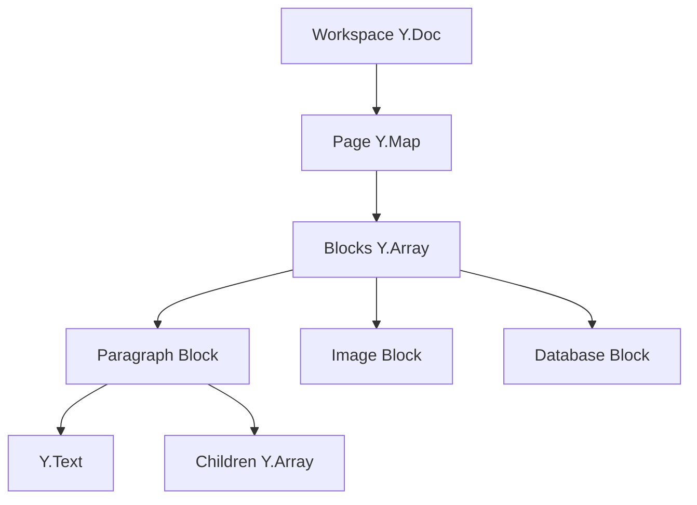

# BlockSuite Editor

> **Mental Model**: BlockSuite is like **Notion's editor as an open-source framework**. Everything is a block (paragraph, image, database) that can be nested, transformed, and collaborated on in real-time using Yjs CRDTs.

**For React Developers**: Unlike React-based editors (Draft.js, Slate), BlockSuite uses **Lit (Web Components)** for performance and **Y.js for state** instead of React state. Think of it as a completely different paradigm - imperative, DOM-based, and CRDT-native.

---

## Table of Contents

1. [What is BlockSuite?](#what-is-blocksuite)
2. [Architecture Overview](#architecture-overview)
3. [Block System](#block-system)
4. [Document Model (Yjs)](#document-model-yjs)
5. [Lit Web Components](#lit-web-components)
6. [Editor Widgets & Toolbars](#editor-widgets--toolbars)
7. [Block Transformations](#block-transformations)
8. [Custom Blocks](#custom-blocks)
9. [Integration with AFFiNE](#integration-with-affine)
10. [Performance Optimizations](#performance-optimizations)

---

## What is BlockSuite?

**BlockSuite** is AFFiNE's custom editor framework, designed for:

✅ **Block-based editing** - Everything is a block (like Notion)
✅ **Real-time collaboration** - Built on Yjs CRDTs
✅ **Framework-agnostic** - Uses Web Components (works with React, Vue, Angular)
✅ **Extensible** - Easy to add custom blocks
✅ **Performant** - No virtual DOM, direct DOM manipulation

### Why Not Use Existing Editors?

| Editor | Issue |
|--------|-------|
| **Draft.js** | React-only, poor real-time collab support |
| **Slate** | Complex API, CRDT integration difficult |
| **ProseMirror** | Not block-based, steep learning curve |
| **Quill** | Limited extensibility, not CRDT-native |

**BlockSuite's advantage**: Built from the ground up for **blocks + CRDTs + real-time collaboration**.

### Package Structure

```
packages/frontend/
├── @blocksuite/affine/        # AFFiNE-specific blocks
│   ├── block-paragraph/
│   ├── block-image/
│   ├── block-code/
│   ├── block-database/
│   └── ...
├── @blocksuite/blocks/         # Core block library
├── @blocksuite/store/          # Yjs document store
└── @blocksuite/inline/         # Inline editing (for text)
```

---

## Architecture Overview

### Three-Layer Architecture

```
┌─────────────────────────────────────────────────┐
│  UI Layer (Lit Components)                     │
│  ├─ ParagraphBlock                             │
│  ├─ ImageBlock                                 │
│  ├─ DatabaseBlock                              │
│  └─ Toolbar, Widgets, Formatters               │
├─────────────────────────────────────────────────┤
│  Block Store (Abstraction)                     │
│  ├─ Block CRUD operations                      │
│  ├─ Block tree navigation                      │
│  └─ Selection management                       │
├─────────────────────────────────────────────────┤
│  Data Layer (Yjs)                              │
│  ├─ Y.Doc (document root)                      │
│  ├─ Y.Map (block properties)                   │
│  ├─ Y.Array (children blocks)                  │
│  └─ Y.Text (inline content)                    │
└─────────────────────────────────────────────────┘
```

### Component Hierarchy



---

## Block System

### What is a Block?

A **block** is a self-contained unit of content with:

- **Type**: `paragraph`, `image`, `code`, `database`, etc.
- **Properties**: Block-specific data (e.g., `sourceId` for images, `language` for code)
- **Text**: Inline content (for text blocks)
- **Children**: Nested blocks

### Block Data Structure (Yjs)

```typescript
// Simplified block structure in Yjs
interface BlockData {
  id: string;              // Unique block ID
  type: string;            // 'paragraph' | 'image' | 'code' | ...
  props: Y.Map;            // Block properties
  text?: Y.Text;           // Inline content (for text blocks)
  children: Y.Array;       // Child blocks
}
```

**Example in Y.Doc**:

```typescript
const doc = new Y.Doc();
const blocks = doc.getMap('blocks');

// Create a paragraph block
const paragraphId = nanoid();
blocks.set(paragraphId, new Y.Map([
  ['type', 'paragraph'],
  ['props', new Y.Map([
    ['textAlign', 'left'],
  ])],
  ['text', new Y.Text('Hello World')],
  ['children', new Y.Array()],
]));

// Create a nested image block
const imageId = nanoid();
const paragraph = blocks.get(paragraphId);
paragraph.get('children').push([
  new Y.Map([
    ['type', 'image'],
    ['props', new Y.Map([
      ['sourceId', 'blob-key-123'],
      ['width', 600],
    ])],
    ['children', new Y.Array()],
  ]),
]);
```

### Block Tree Example

```
Document
├─ Paragraph: "Welcome to AFFiNE"
│   └─ Image: welcome.png
├─ Heading: "Features"
├─ Paragraph: "AFFiNE is..."
├─ Code: language="typescript"
│   └─ (code content in Y.Text)
└─ Database: type="table"
    ├─ Row 1
    ├─ Row 2
    └─ Row 3
```

---

## Document Model (Yjs)

### Workspace Document Structure

```typescript
// Root Yjs document for a workspace
const workspace = new Y.Doc({ guid: 'workspace-id' });

// Workspace metadata
const meta = workspace.getMap('meta');
meta.set('name', 'My Workspace');
meta.set('avatar', 'avatar.png');

// Pages (each page is a sub-document)
const pages = workspace.getMap('pages');

// Create a page
const page = new Y.Doc({ guid: 'page-id' });
const pageBlocks = page.getMap('blocks');

// Root block (page block)
pageBlocks.set('page-block-id', new Y.Map([
  ['type', 'page'],
  ['props', new Y.Map([
    ['title', new Y.Text('My First Page')],
  ])],
  ['children', new Y.Array([
    // Child block IDs
    'paragraph-1',
    'paragraph-2',
  ])],
]));

// Paragraph blocks
pageBlocks.set('paragraph-1', new Y.Map([
  ['type', 'paragraph'],
  ['text', new Y.Text('First paragraph')],
  ['children', new Y.Array()],
]));
```

### Y.Text for Inline Content

**Y.Text** handles rich text with formatting:

```typescript
const text = new Y.Text();

// Insert text
text.insert(0, 'Hello World');

// Apply formatting
text.format(0, 5, { bold: true }); // "Hello" becomes bold
text.format(6, 5, { italic: true, link: 'https://affine.pro' }); // "World" becomes italic + link

// Result: **Hello** _[World](https://affine.pro)_
```

**Delta format** (internal representation):

```typescript
text.toDelta();
// [
//   { insert: 'Hello', attributes: { bold: true } },
//   { insert: ' ' },
//   { insert: 'World', attributes: { italic: true, link: 'https://affine.pro' } },
// ]
```

### Observing Changes

```typescript
// Listen to block changes
pageBlocks.observe(event => {
  event.changes.keys.forEach((change, key) => {
    if (change.action === 'add') {
      console.log(`Block added: ${key}`);
    } else if (change.action === 'update') {
      console.log(`Block updated: ${key}`);
    } else if (change.action === 'delete') {
      console.log(`Block deleted: ${key}`);
    }
  });
});

// Listen to text changes
const paragraph = pageBlocks.get('paragraph-1');
const text = paragraph.get('text');

text.observe(event => {
  event.delta.forEach(change => {
    if (change.insert) {
      console.log(`Inserted: ${change.insert}`);
    } else if (change.delete) {
      console.log(`Deleted ${change.delete} chars`);
    } else if (change.retain) {
      console.log(`Retained ${change.retain} chars`);
    }
  });
});
```

---

## Lit Web Components

### Why Lit?

**Lit** is a lightweight Web Component library:

✅ **Fast**: No virtual DOM, direct DOM updates
✅ **Small**: ~5KB (vs 40KB for React)
✅ **Standards-based**: Uses native Web Components
✅ **Reactive**: Efficient re-renders

### Basic Lit Component

```typescript
import { LitElement, html, css } from 'lit';
import { customElement, property } from 'lit/decorators.js';

@customElement('paragraph-block')
export class ParagraphBlock extends LitElement {
  @property({ type: String })
  blockId!: string;

  // Styles scoped to this component
  static styles = css`
    :host {
      display: block;
      margin: 4px 0;
    }

    .paragraph {
      line-height: 1.6;
      color: var(--affine-text-primary);
    }
  `;

  // Reactive rendering
  render() {
    return html`
      <div class="paragraph" contenteditable="true">
        <slot></slot>
      </div>
    `;
  }
}
```

**Usage in HTML**:

```html
<paragraph-block blockId="para-123">
  Hello World
</paragraph-block>
```

### BlockSuite Block Component

**Real example** (simplified):

```typescript
import { BlockElement } from '@blocksuite/block-std';
import { html } from 'lit';
import { customElement, query } from 'lit/decorators.js';

@customElement('affine-paragraph')
export class ParagraphBlockComponent extends BlockElement {
  @query('.paragraph-content')
  contentElement!: HTMLElement;

  // Reference to Yjs block data
  get blockModel() {
    return this.model; // Injected by BlockSuite
  }

  override firstUpdated() {
    // Connect Y.Text to contenteditable
    const yText = this.blockModel.text;

    // Sync Y.Text changes to DOM
    yText.observe(() => {
      if (document.activeElement !== this.contentElement) {
        // Don't update while user is typing
        this.contentElement.textContent = yText.toString();
      }
    });

    // Sync DOM changes to Y.Text
    this.contentElement.addEventListener('input', () => {
      const text = this.contentElement.textContent ?? '';
      yText.delete(0, yText.length);
      yText.insert(0, text);
    });
  }

  render() {
    return html`
      <div
        class="paragraph-content"
        contenteditable="true"
        data-block-id="${this.blockModel.id}"
      ></div>
    `;
  }
}
```

---

## Editor Widgets & Toolbars

### Floating Toolbar

**Appears when text is selected**:

```typescript
@customElement('affine-format-bar')
export class FormatBar extends LitElement {
  @property()
  selection: TextSelection | null = null;

  render() {
    if (!this.selection) {
      return html``;
    }

    const { from, to } = this.selection;

    return html`
      <div class="format-bar" style=${this.getPosition()}>
        <button @click=${this.toggleBold}>
          <strong>B</strong>
        </button>
        <button @click=${this.toggleItalic}>
          <em>I</em>
        </button>
        <button @click=${this.toggleLink}>
          🔗
        </button>
      </div>
    `;
  }

  toggleBold() {
    const text = this.getSelectedText();
    text.format(this.selection.from, this.selection.to - this.selection.from, {
      bold: true,
    });
  }

  toggleItalic() {
    // Similar to toggleBold
  }

  toggleLink() {
    const url = prompt('Enter URL:');
    if (url) {
      const text = this.getSelectedText();
      text.format(this.selection.from, this.selection.to - this.selection.from, {
        link: url,
      });
    }
  }

  getPosition() {
    // Calculate toolbar position based on selection
    const range = window.getSelection()?.getRangeAt(0);
    const rect = range?.getBoundingClientRect();

    return `
      position: fixed;
      top: ${rect.top - 40}px;
      left: ${rect.left}px;
    `;
  }
}
```

### Slash Commands

**Type `/` to insert blocks**:

```typescript
@customElement('slash-menu')
export class SlashMenu extends LitElement {
  @property()
  query = '';

  @property()
  blocks = [
    { type: 'paragraph', label: 'Text', icon: '📝' },
    { type: 'heading', label: 'Heading', icon: '📰' },
    { type: 'image', label: 'Image', icon: '🖼️' },
    { type: 'code', label: 'Code', icon: '💻' },
    { type: 'database', label: 'Table', icon: '📊' },
  ];

  get filteredBlocks() {
    return this.blocks.filter(block =>
      block.label.toLowerCase().includes(this.query.toLowerCase())
    );
  }

  render() {
    return html`
      <div class="slash-menu">
        ${this.filteredBlocks.map(block => html`
          <div
            class="menu-item"
            @click=${() => this.insertBlock(block.type)}
          >
            <span class="icon">${block.icon}</span>
            <span class="label">${block.label}</span>
          </div>
        `)}
      </div>
    `;
  }

  insertBlock(type: string) {
    const { page, blockId } = this.context;

    page.addBlock(type, {}, blockId); // Insert after current block
    this.dispatchEvent(new CustomEvent('close'));
  }
}
```

---

## Block Transformations

### Turning Blocks Into Other Types

**Example**: Turn paragraph into heading

```typescript
function turnInto(blockId: string, newType: string) {
  const block = page.getBlockById(blockId);

  // Get current content
  const text = block.text?.clone();

  // Delete old block
  page.deleteBlock(blockId);

  // Create new block with same content
  const newBlockId = page.addBlock(newType, {}, block.parent.id);
  const newBlock = page.getBlockById(newBlockId);

  // Transfer content
  if (text && newBlock.text) {
    newBlock.text.applyDelta(text.toDelta());
  }
}

// Usage
turnInto('paragraph-123', 'heading');
```

### Drag & Drop Reordering

```typescript
function moveBlock(blockId: string, newParentId: string, index: number) {
  const block = page.getBlockById(blockId);
  const oldParent = block.parent;
  const newParent = page.getBlockById(newParentId);

  // Remove from old parent
  const oldIndex = oldParent.children.indexOf(blockId);
  oldParent.children.delete(oldIndex, 1);

  // Add to new parent
  newParent.children.insert(index, [blockId]);
}
```

---

## Custom Blocks

### Creating a Custom Block

**1. Define block schema**:

```typescript
// packages/frontend/core/src/blocksuite/custom-blocks/callout.ts
import { defineBlockSchema } from '@blocksuite/store';

export const CalloutBlockSchema = defineBlockSchema({
  flavour: 'affine:callout',
  props: (internal) => ({
    type: 'info' as 'info' | 'warning' | 'error' | 'success',
    text: internal.Text(),
  }),
  metadata: {
    version: 1,
    role: 'content',
    parent: ['affine:page', 'affine:note'],
  },
});
```

**2. Create Lit component**:

```typescript
import { BlockElement } from '@blocksuite/block-std';
import { html, css } from 'lit';
import { customElement } from 'lit/decorators.js';

@customElement('affine-callout')
export class CalloutBlockComponent extends BlockElement {
  static styles = css`
    .callout {
      padding: 12px;
      border-left: 4px solid;
      border-radius: 4px;
      margin: 8px 0;
    }

    .callout.info {
      background: #e3f2fd;
      border-color: #2196f3;
    }

    .callout.warning {
      background: #fff3e0;
      border-color: #ff9800;
    }

    .callout.error {
      background: #ffebee;
      border-color: #f44336;
    }
  `;

  render() {
    const type = this.model.type;

    return html`
      <div class="callout ${type}">
        <div class="callout-content" contenteditable="true">
          ${this.model.text.toString()}
        </div>
      </div>
    `;
  }
}
```

**3. Register block**:

```typescript
import { BlockSuitePreset } from '@blocksuite/presets';

const preset = new BlockSuitePreset();

preset.registerBlock(CalloutBlockSchema, CalloutBlockComponent);
```

**4. Use in editor**:

```typescript
page.addBlock('affine:callout', {
  type: 'warning',
  text: new Y.Text('This is a warning!'),
});
```

---

## Integration with AFFiNE

### Workspace ↔ BlockSuite Bridge

```typescript
// packages/frontend/core/src/modules/workspace/impls/workspace.ts
import { Workspace as BlockSuiteWorkspace } from '@blocksuite/store';
import { Doc as YDoc } from 'yjs';

export class WorkspaceImpl extends BlockSuiteWorkspace {
  constructor(options: {
    id: string;
    rootDoc: YDoc;
    blobSource: BlobSource;
  }) {
    super({
      id: options.id,
      schema: AFFiNESchema,
    });

    // Connect BlockSuite to AFFiNE's Yjs document
    this.doc = options.rootDoc;

    // Connect blob storage
    this.blobSource = options.blobSource;
  }
}
```

### Page Component

```typescript
// packages/frontend/core/src/components/page-editor.tsx
import { useService } from '@toeverything/infra';
import { WorkspaceService } from '@affine/core/modules/workspace';
import '@blocksuite/presets'; // Registers all block components

export function PageEditor({ pageId }: { pageId: string }) {
  const workspaceService = useService(WorkspaceService);
  const workspace = workspaceService.workspace.docCollection;

  const page = workspace.getPage(pageId);

  if (!page) {
    return <div>Page not found</div>;
  }

  // Render BlockSuite editor
  return (
    <div>
      <edgeless-editor page={page}></edgeless-editor>
    </div>
  );
}
```

---

## Performance Optimizations

### 1. Virtual Scrolling for Large Documents

```typescript
// Only render visible blocks
const VIEWPORT_HEIGHT = 800;
const BLOCK_HEIGHT = 40;

const visibleBlocks = computed(() => {
  const startIndex = Math.floor(scrollTop / BLOCK_HEIGHT);
  const endIndex = Math.ceil((scrollTop + VIEWPORT_HEIGHT) / BLOCK_HEIGHT);

  return blocks.slice(startIndex, endIndex);
});
```

### 2. Debounced Yjs Updates

```typescript
import { debounce } from 'lodash-es';

const debouncedUpdate = debounce((yText: Y.Text, content: string) => {
  yText.delete(0, yText.length);
  yText.insert(0, content);
}, 100);

contentElement.addEventListener('input', () => {
  debouncedUpdate(yText, contentElement.textContent);
});
```

### 3. Lazy Block Loading

```typescript
// Load heavy blocks (database, PDF) on-demand
const loadBlock = async (blockId: string) => {
  const block = page.getBlockById(blockId);

  if (block.type === 'database') {
    const DatabaseBlock = await import('./blocks/database');
    customElements.define('affine-database', DatabaseBlock);
  }
};
```

---

## Summary

**BlockSuite Key Concepts**:

1. **Block-based architecture** - Everything is a block
2. **Yjs-native** - CRDTs built-in, no manual conflict resolution
3. **Lit Web Components** - Fast, lightweight, framework-agnostic
4. **Extensible** - Easy to add custom blocks
5. **Real-time ready** - Collaboration out-of-the-box

**Next**: See `COLLABORATION_SYSTEM.md` for how BlockSuite enables real-time collaboration.

---

*This guide was created to help developers understand BlockSuite's architecture and how to extend it.*
