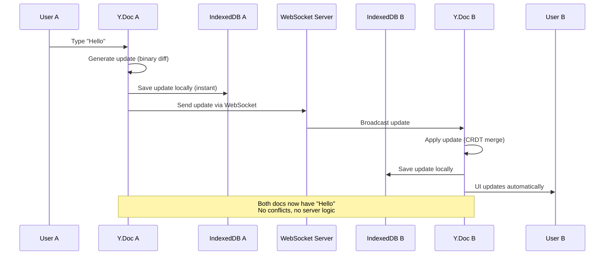
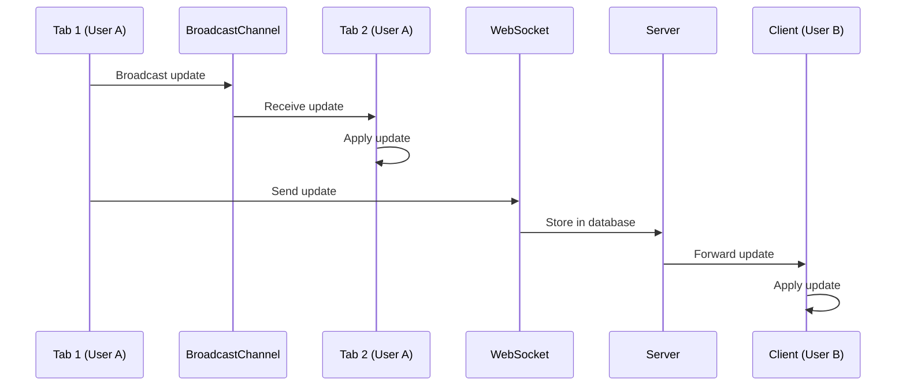

# Collaboration System

> **Mental Model**: Think of AFFiNE's collaboration like **Google Docs**, but with a key difference - changes work **offline-first**. You can edit disconnected, and when reconnected, all changes merge automatically without conflicts using **CRDTs** (Conflict-free Replicated Data Types).

**For React Developers**: Traditional real-time apps use **operational transformation** (complex, server-dependent). AFFiNE uses **Yjs CRDTs** - a mathematical approach where concurrent edits merge automatically, no server coordination needed.

---

## Table of Contents

1. [Collaboration Architecture](#collaboration-architecture)
2. [Yjs CRDT Fundamentals](#yjs-crdt-fundamentals)
3. [Awareness Protocol](#awareness-protocol)
4. [Sync Protocols](#sync-protocols)
5. [Conflict Resolution](#conflict-resolution)
6. [Network Layers](#network-layers)
7. [Offline Support](#offline-support)
8. [Performance & Optimization](#performance--optimization)
9. [Security & Access Control](#security--access-control)
10. [Debugging Collaboration](#debugging-collaboration)

---

## Collaboration Architecture

### High-Level Flow



### Components

```
┌─────────────────────────────────────────────────┐
│  Application Layer                             │
│  └─ BlockSuite Editor (Lit components)         │
├─────────────────────────────────────────────────┤
│  CRDT Layer                                    │
│  ├─ Y.Doc (document state)                     │
│  ├─ Yjs updates (binary diffs)                 │
│  └─ Awareness (ephemeral state)                │
├─────────────────────────────────────────────────┤
│  Sync Layer                                    │
│  ├─ Local: IndexedDB/SQLite                    │
│  ├─ Remote: WebSocket to server                │
│  └─ Broadcast: Between browser tabs            │
├─────────────────────────────────────────────────┤
│  Storage Layer                                 │
│  ├─ IndexedDB (browser)                        │
│  ├─ SQLite (desktop/mobile)                    │
│  └─ PostgreSQL (server)                        │
└─────────────────────────────────────────────────┘
```

---

## Yjs CRDT Fundamentals

### What is a CRDT?

**CRDT** = **Conflict-free Replicated Data Type**

A data structure that:
- Can be edited concurrently on multiple devices
- Automatically merges changes without conflicts
- Guarantees **eventual consistency** (all replicas converge to the same state)

### How Yjs Works

**Traditional approach** (operational transformation):

```
User A: Insert "!" at position 5
User B: Insert "?" at position 5

Server must decide:
- Which insert comes first?
- Adjust positions?
- Complex coordination required
```

**Yjs approach** (CRDT):

```
User A: Insert "!" with ID {client:A, clock:10}
User B: Insert "?" with ID {client:B, clock:5}

No coordination needed:
- Each character has unique ID
- Deterministic ordering (by client ID + clock)
- Result: "!?" or "?!" (consistent across all clients)
```

### Yjs Data Types

**1. Y.Text** - Collaborative text

```typescript
const doc = new Y.Doc();
const text = doc.getText('content');

// User A inserts "Hello"
text.insert(0, 'Hello');

// User B inserts "World" (concurrently)
text.insert(5, ' World');

// Result (after sync): "Hello World"
console.log(text.toString()); // "Hello World"
```

**2. Y.Map** - Collaborative object/map

```typescript
const map = doc.getMap('metadata');

// User A sets name
map.set('name', 'My Workspace');

// User B sets avatar (concurrently)
map.set('avatar', 'avatar.png');

// Result: Both properties exist
console.log(map.toJSON()); // { name: 'My Workspace', avatar: 'avatar.png' }
```

**3. Y.Array** - Collaborative array

```typescript
const array = doc.getArray('blocks');

// User A adds paragraph
array.push(['paragraph-1']);

// User B adds heading (concurrently)
array.push(['heading-1']);

// Result: Both blocks exist
console.log(array.toArray()); // ['paragraph-1', 'heading-1']
```

### Update Encoding

**Yjs encodes changes as binary diffs**:

```typescript
const doc = new Y.Doc();
const text = doc.getText('content');

// Listen to updates
doc.on('update', (update: Uint8Array) => {
  console.log('Update size:', update.length, 'bytes');
  console.log('Update (hex):', Array.from(update).map(b => b.toString(16)));
});

// Insert "Hello" - generates update
text.insert(0, 'Hello');
// Update size: 12 bytes
// Update (hex): [01, 03, 48, 65, 6c, 6c, 6f, ...]
```

**Apply update to another document**:

```typescript
const doc2 = new Y.Doc();
const text2 = doc2.getText('content');

// Apply update from doc1
Y.applyUpdate(doc2, update);

console.log(text2.toString()); // "Hello"
```

### State Vectors

**State vector** = summary of what a document knows

```typescript
const stateVector = Y.encodeStateVector(doc);
// Represents: "I have updates up to clock X from each client"

// Get missing updates
const diff = Y.encodeStateAsUpdate(doc, stateVector);
// Returns: Only updates not in the state vector
```

**Use case**: Efficient sync - only send what the other side doesn't have

---

## Awareness Protocol

### What is Awareness?

**Awareness** = **ephemeral state** (not persisted, only shared with active users)

Examples:
- Cursor positions
- User presence (who's online)
- Selections
- Temporary UI state

### Awareness API

```typescript
import { Awareness } from 'y-protocols/awareness';

const doc = new Y.Doc();
const awareness = new Awareness(doc);

// Set local state (my cursor position)
awareness.setLocalStateField('cursor', {
  user: {
    id: 'user-123',
    name: 'Alice',
    color: '#FF6B6B',
  },
  position: {
    blockId: 'paragraph-1',
    offset: 42,
  },
});

// Listen to others' state changes
awareness.on('change', ({ added, updated, removed }) => {
  // Added: new users joined
  added.forEach(clientId => {
    const state = awareness.getStates().get(clientId);
    console.log('User joined:', state.user.name);
    renderCursor(state.cursor);
  });

  // Updated: users moved cursor
  updated.forEach(clientId => {
    const state = awareness.getStates().get(clientId);
    updateCursor(clientId, state.cursor);
  });

  // Removed: users left
  removed.forEach(clientId => {
    removeCursor(clientId);
  });
});
```

### Awareness in AFFiNE

**Location**: `packages/frontend/core/src/modules/workspace/entities/workspace.ts:66`

```typescript
export class Workspace extends Entity {
  onLoadAwareness: awareness => this.engine.awareness.connectAwareness(awareness)
}
```

**Rendering cursors**:

```typescript
function renderCollaboratorCursor(clientId: number, cursor: CursorState) {
  const { user, position } = cursor;

  // Find block element
  const blockElement = document.querySelector(`[data-block-id="${position.blockId}"]`);

  if (!blockElement) return;

  // Create cursor element
  const cursorEl = document.createElement('div');
  cursorEl.className = 'collaborator-cursor';
  cursorEl.style.borderColor = user.color;
  cursorEl.style.left = `${getOffsetForPosition(position.offset)}px`;

  // Add user label
  const label = document.createElement('div');
  label.className = 'cursor-label';
  label.style.backgroundColor = user.color;
  label.textContent = user.name;

  cursorEl.appendChild(label);
  blockElement.appendChild(cursorEl);
}
```

---

## Sync Protocols

### Three Sync Mechanisms

AFFiNE uses **three parallel sync mechanisms**:

1. **Local sync** - Between browser tabs (BroadcastChannel)
2. **Cloud sync** - To server (WebSocket)
3. **Peer sync** - Between devices on same network (WebRTC, future)

### 1. Local Sync (BroadcastChannel)

**Syncs between tabs in same browser**:

```typescript
// packages/common/nbstore/src/impls/broadcast-channel/awareness.ts
export class BroadcastChannelAwarenessStorage {
  private channel: BroadcastChannel;

  constructor(workspaceId: string) {
    this.channel = new BroadcastChannel(`workspace:${workspaceId}`);

    // Listen to awareness updates from other tabs
    this.channel.onmessage = (event) => {
      const { type, update } = event.data;

      if (type === 'awareness-update') {
        this.awareness.applyUpdate(update);
      }
    };
  }

  // Broadcast local awareness to other tabs
  update(update: Uint8Array) {
    this.channel.postMessage({
      type: 'awareness-update',
      update: Array.from(update),
    });
  }
}
```

### 2. Cloud Sync (WebSocket)

**Syncs to server via WebSocket**:

```typescript
// packages/common/nbstore/src/impls/cloud/doc.ts
export class CloudDocStorage {
  private socket: Socket;

  constructor(workspaceId: string) {
    this.socket = io('/sync', {
      transports: ['websocket'],
    });

    // Join workspace room
    this.socket.emit('workspace:join', workspaceId);

    // Listen to updates from server
    this.socket.on('doc:update', ({ docId, bin }) => {
      const update = new Uint8Array(bin);
      this.applyUpdate(docId, update);
    });
  }

  // Send update to server
  async pushDocUpdate(docId: string, update: Uint8Array) {
    this.socket.emit('doc:update', {
      workspaceId: this.workspaceId,
      docId,
      bin: Array.from(update),
    });
  }
}
```

**Server broadcasts to other clients**:

```typescript
// packages/backend/server/src/core/sync/gateway.ts
@SubscribeMessage('doc:update')
async handleDocUpdate(
  @ConnectedSocket() socket: Socket,
  @MessageBody() data: { workspaceId: string; docId: string; bin: number[] }
) {
  // Save to database
  await this.docStorage.pushDocUpdate({
    docId: data.docId,
    bin: new Uint8Array(data.bin),
  });

  // Broadcast to all clients in workspace (except sender)
  socket.to(data.workspaceId).emit('doc:update', {
    docId: data.docId,
    bin: data.bin,
  });
}
```

### Sync Flow Diagram



---

## Conflict Resolution

### The Beauty of CRDTs: No Conflicts!

**Traditional conflict resolution**:

```
User A: Change name to "Alice"
User B: Change name to "Bob"

❌ Conflict! Server must choose:
- Last-write-wins? (Bob)
- First-write-wins? (Alice)
- Ask user to resolve?
```

**With Yjs CRDTs**:

```
User A: Insert "Alice" at position 0
User B: Insert "Bob" at position 0

✅ No conflict! Both operations valid:
- Deterministic merge (alphabetical by client ID)
- Result: "AliceBob" or "BobAlice" (consistent across all clients)
```

### Concurrent Edits Example

**Scenario**: Two users edit the same paragraph simultaneously

```typescript
// Initial state
const doc = new Y.Doc();
const text = doc.getText('paragraph');
text.insert(0, 'Hello World');

// User A deletes "World"
const docA = doc.clone();
const textA = docA.getText('paragraph');
textA.delete(6, 5); // "Hello "

// User B inserts "Beautiful " (concurrently)
const docB = doc.clone();
const textB = docB.getText('paragraph');
textB.insert(6, 'Beautiful '); // "Hello Beautiful World"

// Merge updates
const updateA = Y.encodeStateAsUpdate(docA);
const updateB = Y.encodeStateAsUpdate(docB);

Y.applyUpdate(docA, updateB);
Y.applyUpdate(docB, updateA);

// Both converge to the same state
console.log(textA.toString()); // "Hello Beautiful "
console.log(textB.toString()); // "Hello Beautiful "
```

**How it works**:

1. User A's delete targets characters with specific IDs
2. User B's insert creates new characters with different IDs
3. Yjs merges: keeps User B's insert, applies User A's delete
4. Result: "Hello Beautiful "

### Complex Conflict: Same Position Insert

```typescript
const text = new Y.Text();
text.insert(0, 'Hello');

// User A inserts "!" at position 5
text.insert(5, '!'); // {client:A, clock:1}

// User B inserts "?" at position 5 (concurrently)
text.insert(5, '?'); // {client:B, clock:1}

// Result depends on client IDs (deterministic)
// If clientId A < clientId B: "Hello!?"
// If clientId B < clientId A: "Hello?!"
```

**Key insight**: Order is deterministic (always the same result), even if not intuitive to users.

### Tombstones (Deleted Items)

```typescript
// User A inserts "Hello"
text.insert(0, 'Hello');

// User B deletes "ello"
text.delete(1, 4);

// Internally, Yjs marks as deleted (tombstone)
// { id: {client:A, clock:1}, content: 'H', deleted: false }
// { id: {client:A, clock:2}, content: 'e', deleted: true }  ← tombstone
// { id: {client:A, clock:3}, content: 'l', deleted: true }
// { id: {client:A, clock:4}, content: 'l', deleted: true }
// { id: {client:A, clock:5}, content: 'o', deleted: true }

// Display: "H"
```

**Why tombstones?**
- Preserve history for undo/redo
- Allow late-arriving updates to reference deleted items

---

## Network Layers

### Connection Status

```typescript
export type ConnectionStatus =
  | 'disconnected'
  | 'connecting'
  | 'connected'
  | 'error';

export class SyncEngine {
  status$ = new BehaviorSubject<ConnectionStatus>('disconnected');

  constructor(private socket: Socket) {
    this.socket.on('connect', () => {
      this.status$.next('connected');
    });

    this.socket.on('disconnect', () => {
      this.status$.next('disconnected');
      this.queueOfflineUpdates();
    });

    this.socket.on('connect_error', () => {
      this.status$.next('error');
    });
  }
}
```

### Offline Queue

```typescript
export class OfflineQueue {
  private queue: DocUpdate[] = [];

  enqueue(update: DocUpdate) {
    this.queue.push(update);

    // Persist to IndexedDB
    await this.storage.saveOfflineUpdate(update);
  }

  async flush() {
    while (this.queue.length > 0) {
      const update = this.queue.shift()!;

      try {
        await this.cloudStorage.pushDocUpdate(update);
        await this.storage.deleteOfflineUpdate(update.id);
      } catch (error) {
        // Re-queue on failure
        this.queue.unshift(update);
        throw error;
      }
    }
  }
}
```

### Reconnection Strategy

```typescript
export class ReconnectionManager {
  private retryCount = 0;
  private maxRetries = 10;
  private baseDelay = 1000; // 1 second

  async reconnect() {
    if (this.retryCount >= this.maxRetries) {
      throw new Error('Max retries exceeded');
    }

    // Exponential backoff: 1s, 2s, 4s, 8s, ...
    const delay = this.baseDelay * Math.pow(2, this.retryCount);

    await new Promise(resolve => setTimeout(resolve, delay));

    try {
      await this.socket.connect();
      this.retryCount = 0; // Reset on success
    } catch (error) {
      this.retryCount++;
      await this.reconnect(); // Retry
    }
  }
}
```

---

## Offline Support

### Offline-First Architecture

**Key principle**: App works without internet, syncs when reconnected.

```typescript
// User creates a page offline
const page = workspace.createPage();
page.title.insert(0, 'My Offline Page');

// Changes saved to IndexedDB immediately
await this.localDocStorage.pushDocUpdate({
  docId: page.id,
  bin: encodeStateAsUpdate(page.doc),
});

// When reconnected, sync to cloud
this.socket.on('connect', async () => {
  const offlineUpdates = await this.localDocStorage.getOfflineUpdates();

  for (const update of offlineUpdates) {
    await this.cloudDocStorage.pushDocUpdate(update);
  }
});
```

### Conflict-Free Offline Edits

**Scenario**: User A and User B both edit offline, then reconnect

```typescript
// User A (offline) edits paragraph
const docA = new Y.Doc({ guid: 'page-123' });
const textA = docA.getText('para-1');
textA.insert(0, 'Hello from A');

const updateA = encodeStateAsUpdate(docA);

// User B (offline) edits same paragraph
const docB = new Y.Doc({ guid: 'page-123' });
const textB = docB.getText('para-1');
textB.insert(0, 'Hello from B');

const updateB = encodeStateAsUpdate(docB);

// Both reconnect and sync
applyUpdate(docA, updateB);
applyUpdate(docB, updateA);

// Result (both converge):
// "Hello from AHello from B" or "Hello from BHello from A"
// (deterministic based on client IDs)
```

---

## Performance & Optimization

### 1. Update Batching

**Don't send every keystroke**:

```typescript
import { debounce } from 'lodash-es';

const sendUpdate = debounce((update: Uint8Array) => {
  this.socket.emit('doc:update', {
    docId,
    bin: Array.from(update),
  });
}, 200); // Wait 200ms after last change

doc.on('update', (update) => {
  // Save locally immediately
  this.localDocStorage.pushDocUpdate({ docId, bin: update });

  // Batch send to server
  sendUpdate(update);
});
```

### 2. Compression

**Compress updates for network transmission**:

```typescript
import pako from 'pako';

function compressUpdate(update: Uint8Array): Uint8Array {
  return pako.deflate(update);
}

function decompressUpdate(compressed: Uint8Array): Uint8Array {
  return pako.inflate(compressed);
}

// Send compressed
const compressed = compressUpdate(update);
this.socket.emit('doc:update', {
  docId,
  bin: Array.from(compressed),
  compressed: true,
});

// Receive and decompress
this.socket.on('doc:update', ({ bin, compressed }) => {
  const update = compressed
    ? decompressUpdate(new Uint8Array(bin))
    : new Uint8Array(bin);

  applyUpdate(doc, update);
});
```

### 3. Snapshot Merging

**Periodically merge updates into snapshots**:

```typescript
async function mergeUpdates(docId: string) {
  // Get all updates
  const updates = await this.storage.getDocUpdates(docId);

  if (updates.length < 100) {
    return; // Not worth merging yet
  }

  // Merge all updates into single snapshot
  const mergedBin = mergeUpdates(updates.map(u => u.bin));

  // Save snapshot
  await this.storage.setDocSnapshot({
    docId,
    bin: mergedBin,
    timestamp: new Date(),
  });

  // Delete old updates
  await this.storage.deleteDocUpdates(docId);
}
```

**When to merge**:
- On idle (no activity for 30 seconds)
- When update count exceeds threshold (100+)
- During garbage collection

---

## Security & Access Control

### Permission Checks

**Before applying updates**:

```typescript
@SubscribeMessage('doc:update')
async handleDocUpdate(
  @ConnectedSocket() socket: Socket,
  @MessageBody() data: { workspaceId: string; docId: string; bin: number[] }
) {
  // 1. Check user has write permission
  const canWrite = await this.ac
    .user(socket.data.userId)
    .workspace(data.workspaceId)
    .doc(data.docId)
    .can('Doc.Write');

  if (!canWrite) {
    throw new Error('Permission denied');
  }

  // 2. Apply update
  const update = new Uint8Array(data.bin);
  await this.docStorage.pushDocUpdate({ docId: data.docId, bin: update });

  // 3. Broadcast to authorized users only
  const authorizedClients = await this.getAuthorizedClients(data.workspaceId);

  authorizedClients.forEach(clientId => {
    this.server.to(clientId).emit('doc:update', data);
  });
}
```

### Read-Only Mode

```typescript
// Client-side enforcement
if (workspace.isReadOnly) {
  doc.on('update', (update, origin) => {
    if (origin === 'local') {
      // Revert local changes
      console.warn('Document is read-only');
      // Don't apply or send update
    }
  });
}
```

---

## Debugging Collaboration

### Enable Yjs Logging

```typescript
import * as Y from 'yjs';

// Enable debug logging
Y.enableLogging(true);

// Now all Yjs operations log to console
const doc = new Y.Doc();
const text = doc.getText('content');

text.insert(0, 'Hello');
// Console: [Yjs] Insert "Hello" at position 0
```

### Inspect Document State

```typescript
import { encodeStateVector, encodeStateAsUpdate } from 'yjs';

// Get document state
const stateVector = encodeStateVector(doc);
console.log('State vector:', stateVector);

// Get full document as update
const fullUpdate = encodeStateAsUpdate(doc);
console.log('Full update size:', fullUpdate.length, 'bytes');

// Inspect content
const text = doc.getText('content');
console.log('Text content:', text.toString());
console.log('Text delta:', text.toDelta());
```

### Monitor Network Traffic

```typescript
// Log all WebSocket messages
socket.onAny((event, ...args) => {
  console.log('[WebSocket]', event, args);
});

// Track update sizes
doc.on('update', (update) => {
  console.log('Update size:', update.length, 'bytes');

  if (update.length > 10000) {
    console.warn('Large update detected!');
  }
});
```

---

## Summary

**Collaboration Key Concepts**:

1. **CRDTs eliminate conflicts** - Concurrent edits merge automatically
2. **Offline-first** - Changes work without internet
3. **Three sync layers** - Local (tabs), Cloud (server), Peer (future)
4. **Awareness** - Ephemeral state (cursors, presence)
5. **Deterministic** - Same operations always produce same result

**Next**: See practical guides in `PATTERNS_AND_CONVENTIONS.md`

---

*This guide was created to help developers understand AFFiNE's real-time collaboration system.*
