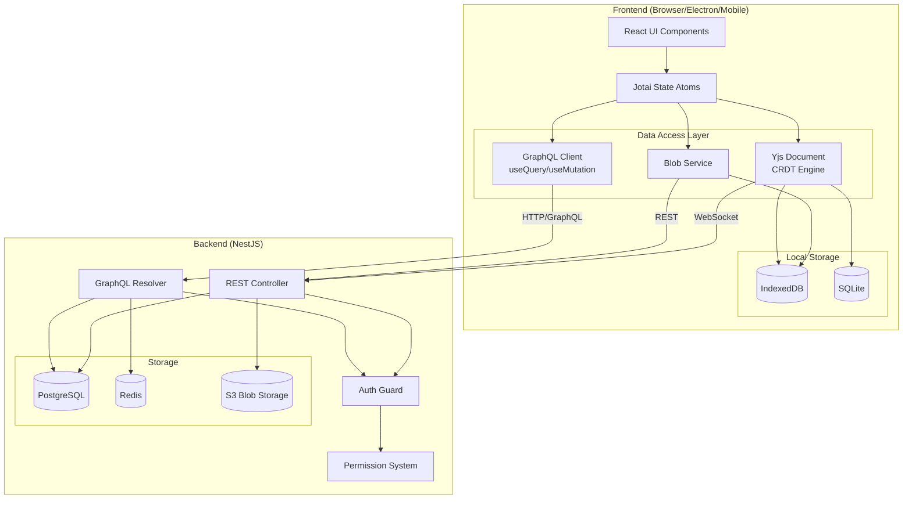
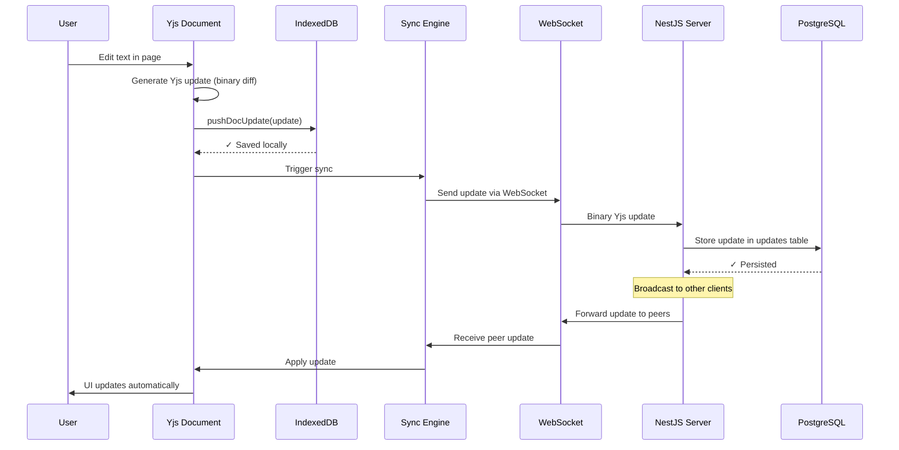
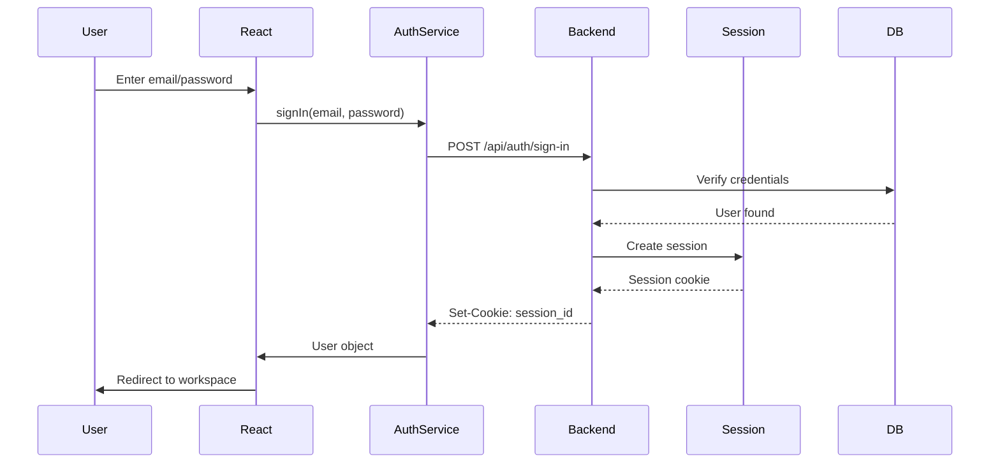
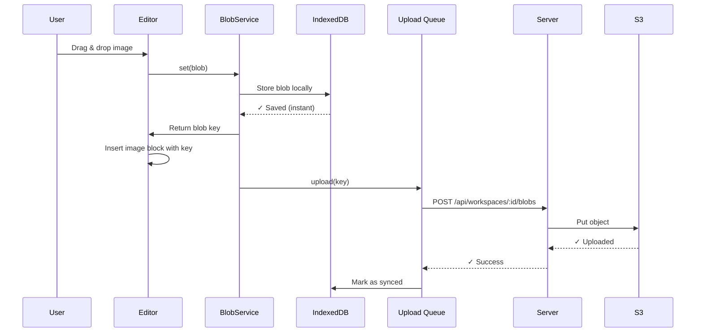

# Data Flow Guide

> **Mental Model**: Think of data flow in AFFiNE like a river system - data can flow locally (streams), sync between devices (tributaries joining), and reach the cloud (ocean). Unlike traditional apps where data only flows through APIs, AFFiNE uses **local-first architecture** where data lives primarily on your device and optionally syncs.

**For React Developers**: If you're used to Redux → API → Database flows, AFFiNE adds a powerful layer: **Yjs CRDTs** that enable offline-first editing and real-time collaboration without server coordination.

---

## Table of Contents

1. [Overview: The Three Data Flow Patterns](#overview-the-three-data-flow-patterns)
2. [Local-Only Data Flow](#local-only-data-flow)
3. [Cloud-Synced Data Flow](#cloud-synced-data-flow)
4. [Collaborative Real-Time Data Flow](#collaborative-real-time-data-flow)
5. [GraphQL API Data Flow](#graphql-api-data-flow)
6. [Storage Layer Architecture](#storage-layer-architecture)
7. [Authentication & Permission Flow](#authentication--permission-flow)
8. [Blob/Asset Upload Flow](#blobasset-upload-flow)
9. [Common Patterns & Best Practices](#common-patterns--best-practices)
10. [Debugging Data Flow Issues](#debugging-data-flow-issues)

---

## Overview: The Three Data Flow Patterns

AFFiNE uses **three distinct data flow patterns** depending on the data type:

### 1. **Document Data (Yjs CRDT)** - Local-first with optional sync
- **What**: Page content, blocks, workspace metadata
- **Storage**: IndexedDB/SQLite → Yjs CRDT → Optional cloud sync
- **Key Feature**: Offline editing, automatic conflict resolution
- **Example**: Creating a page, editing text, adding blocks

### 2. **User/Workspace Metadata (GraphQL)** - Traditional API flow
- **What**: User profiles, permissions, subscriptions, settings
- **Storage**: PostgreSQL via GraphQL API
- **Key Feature**: Server-side validation, permissions
- **Example**: User login, workspace permissions, billing

### 3. **Binary Assets (Blob Storage)** - Direct upload with metadata tracking
- **What**: Images, PDFs, attachments
- **Storage**: IndexedDB/SQLite → Cloud blob storage (S3-compatible)
- **Key Feature**: Lazy loading, signed URLs
- **Example**: Image uploads, PDF attachments



---

## Local-Only Data Flow

**Scenario**: User creates a new page in a local workspace (no cloud sync).

### Step-by-Step Flow

```typescript
// 1. User clicks "New Page" button
// Location: packages/frontend/core/src/modules/doc/services/docs.ts

import { DocsService } from '@affine/core/modules/doc';
import { useService } from '@toeverything/infra';

function NewPageButton() {
  const docsService = useService(DocsService);

  const handleCreatePage = () => {
    // This creates a new Yjs document locally
    const newDoc = docsService.createDoc();
    // newDoc.id is a generated UUID
  };

  return <button onClick={handleCreatePage}>New Page</button>;
}
```

**What happens under the hood:**

1. **DocsService creates a Yjs document**
   - Location: `packages/frontend/core/src/modules/workspace/entities/workspace.ts:69`
   - A new `Y.Doc` instance is created with a unique GUID
   - The document is registered in the workspace's document collection

2. **Yjs document connects to storage**
   - Location: `packages/frontend/core/src/modules/workspace-engine/impls/local.ts`
   - The engine connects the doc to `IndexedDBDocStorage` (browser) or `SqliteDocStorage` (desktop/mobile)
   - An empty document structure is initialized

3. **Document update is written to IndexedDB**
   - Location: `packages/common/nbstore/src/impls/idb/doc.ts`
   - Yjs encodes the document state as a binary `Uint8Array`
   - Stored in IndexedDB with key: `{workspaceId}:{docId}`

```typescript
// packages/common/nbstore/src/storage/doc.ts:64
async pushDocUpdate(update: DocUpdate, origin?: string): Promise<DocClock> {
  // Yjs update is a binary diff of document changes
  const { docId, bin, editor } = update;

  // Store in IndexedDB
  await this.db.transaction('updates', 'readwrite')
    .objectStore('updates')
    .put({
      docId,
      bin,
      timestamp: new Date(),
      editor
    });

  return { docId, timestamp: new Date() };
}
```

4. **UI updates reactively**
   - Yjs observes changes via `doc.on('update')` event
   - React components re-render automatically

### Mental Model: "Git for Documents"

Think of Yjs like Git:
- Each edit creates a **commit** (Yjs update)
- Updates are **binary diffs**, not full snapshots
- IndexedDB stores all updates
- Periodically, updates are **squashed** into snapshots (like `git gc`)

**Code Reference**: See snapshot squashing in `packages/common/nbstore/src/storage/doc.ts:111-143`

---

## Cloud-Synced Data Flow

**Scenario**: User edits a page in a cloud workspace. Changes sync to server and other devices.

### Architecture Overview



### Detailed Code Flow

**1. User types in editor**

```typescript
// packages/frontend/core/src/blocksuite/...
// BlockSuite editor emits changes to underlying Yjs document

const page = workspace.getPage(pageId);
const textBlock = page.getBlockById(blockId);

// This modifies the Yjs document
textBlock.text.insert(0, 'Hello World');
// Yjs automatically generates an update
```

**2. Yjs update triggers storage**

```typescript
// packages/frontend/core/src/modules/workspace/entities/workspace.ts:65
onLoadDoc: doc => this.engine.doc.connectDoc(doc)

// connectDoc sets up the sync pipeline:
// packages/frontend/core/src/modules/workspace-engine/impls/cloud.ts
doc.on('update', async (update: Uint8Array, origin: string) => {
  // Save to local IndexedDB first (instant)
  await this.localDocStorage.pushDocUpdate({
    docId: doc.guid,
    bin: update,
  }, origin);

  // Then sync to cloud (async, retries if offline)
  if (this.cloudDocStorage.connection.status === 'connected') {
    await this.cloudDocStorage.pushDocUpdate({
      docId: doc.guid,
      bin: update,
    }, origin);
  }
});
```

**3. Cloud storage sends via WebSocket**

```typescript
// packages/common/nbstore/src/impls/cloud/doc.ts
async pushDocUpdate(update: DocUpdate, origin?: string): Promise<DocClock> {
  // Send binary update over WebSocket
  const response = await this.socket.emit('doc:update', {
    workspaceId: this.spaceId,
    docId: update.docId,
    bin: Array.from(update.bin), // Convert Uint8Array for transport
  });

  return { docId: update.docId, timestamp: new Date(response.timestamp) };
}
```

**4. Server receives and persists**

```typescript
// packages/backend/server/src/core/doc/gateway.ts
@SubscribeMessage('doc:update')
async handleDocUpdate(
  @ConnectedSocket() client: Socket,
  @MessageBody() data: { workspaceId: string; docId: string; bin: number[] }
) {
  // Check permissions
  await this.ac
    .user(client.userId)
    .workspace(data.workspaceId)
    .doc(data.docId)
    .assert('Doc.Write');

  // Convert back to Uint8Array
  const update = new Uint8Array(data.bin);

  // Store in PostgreSQL
  await this.docStorage.pushDocUpdate({
    docId: data.docId,
    bin: update,
    editor: client.userId,
  });

  // Broadcast to other connected clients
  client.to(data.workspaceId).emit('doc:update', {
    docId: data.docId,
    bin: data.bin,
  });
}
```

**5. Other clients receive and apply**

```typescript
// packages/common/nbstore/src/impls/cloud/doc.ts
this.socket.on('doc:update', (data) => {
  const update = new Uint8Array(data.bin);

  // Yjs automatically merges updates - no conflicts!
  Y.applyUpdate(this.doc, update);

  // Also save to local IndexedDB
  this.localDocStorage.pushDocUpdate({
    docId: data.docId,
    bin: update,
  }, 'remote');
});
```

### Key Insights for React Developers

**✅ No manual state management needed**
- You don't write reducers or handle conflicts
- Yjs CRDTs automatically merge concurrent edits
- Example: Two users typing in the same paragraph → both edits preserved

**✅ Optimistic updates are built-in**
- Changes appear instantly in UI (local Yjs update)
- Network sync happens in background
- If offline, changes queue and sync when reconnected

**✅ Real-time without polling**
- WebSocket broadcasts updates to all connected clients
- Sub-50ms latency for collaborative editing
- No need for `setInterval` or manual refetching

**Location References**:
- Yjs integration: `packages/frontend/core/src/modules/workspace/entities/workspace.ts:28-73`
- Cloud doc storage: `packages/common/nbstore/src/impls/cloud/doc.ts`
- WebSocket gateway: `packages/backend/server/src/core/sync/gateway.ts`

---

## Collaborative Real-Time Data Flow

**Scenario**: Two users edit the same paragraph simultaneously. How does AFFiNE prevent conflicts?

### The Magic: CRDTs (Conflict-free Replicated Data Types)

**Traditional approach (breaks)**:
```javascript
// User A and User B both have: "Hello"
// User A types: "Hello World" → send to server
// User B types: "Hello Friend" → send to server
// ❌ CONFLICT: Server has to choose or reject one
```

**CRDT approach (works)**:
```javascript
// User A: Insert "World" at position 6
// User B: Insert "Friend" at position 6
// Yjs tracks each character with a unique ID
// Result: "Hello World Friend" (both preserved!)
// ✅ NO CONFLICT: Yjs merges intelligently
```

### How Yjs CRDTs Work

**Under the hood structure**:

```typescript
// Simplified mental model of Yjs text structure
interface YjsChar {
  id: { client: string; clock: number }; // Unique ID
  content: string;                       // The actual character
  deleted: boolean;                      // Tombstone for deletions
}

// "Hello" in Yjs might look like:
[
  { id: { client: 'user-A', clock: 0 }, content: 'H', deleted: false },
  { id: { client: 'user-A', clock: 1 }, content: 'e', deleted: false },
  { id: { client: 'user-A', clock: 2 }, content: 'l', deleted: false },
  { id: { client: 'user-A', clock: 3 }, content: 'l', deleted: false },
  { id: { client: 'user-A', clock: 4 }, content: 'o', deleted: false },
]
```

**When User B inserts "Friend"**:
```typescript
// User B inserts between position 5 and 6
[
  // ... existing "Hello" chars ...
  { id: { client: 'user-B', clock: 0 }, content: ' ', deleted: false },
  { id: { client: 'user-B', clock: 1 }, content: 'F', deleted: false },
  { id: { client: 'user-B', clock: 2 }, content: 'r', deleted: false },
  // ... etc
]
```

**When User A's "World" arrives**:
```typescript
// Yjs compares client IDs and clocks to determine order
// Rule: Earlier clock comes first, tie-break by client ID
// Result: Both insertions preserved at position 6
```

### Awareness Protocol (Cursor Positions)

**Beyond document content**: Yjs Awareness tracks ephemeral state like cursor positions.

```typescript
// packages/frontend/core/src/modules/workspace/entities/workspace.ts:66
onLoadAwareness: awareness => this.engine.awareness.connectAwareness(awareness)

// Awareness example:
const awareness = workspace.awarenessStore;

// Set local user's cursor position
awareness.setLocalStateField('cursor', {
  user: { id: 'user-123', name: 'Alice', color: '#FF6B6B' },
  position: { blockId: 'abc', offset: 42 },
});

// Listen to others' cursor positions
awareness.on('change', ({ added, updated, removed }) => {
  // Show cursors in editor
  updated.forEach(clientId => {
    const state = awareness.getStates().get(clientId);
    renderCursor(state.cursor);
  });
});
```

**How awareness syncs**:

```typescript
// packages/common/nbstore/src/sync/awareness/index.ts:19
async update(record: AwarenessRecord, origin?: string) {
  // Awareness is NOT persisted - only synced to active clients
  await Promise.all([
    this.storages.local.update(record, origin),      // Broadcast via local channels
    ...this.storages.remotes.map(r => r.update(record, origin)) // Send to cloud
  ]);
}
```

**Key difference from document updates**:
- Document updates: Persisted forever, merged into document history
- Awareness updates: Ephemeral, only shared with active users, lost on disconnect

**Location References**:
- Awareness sync: `packages/common/nbstore/src/sync/awareness/index.ts`
- Cloud awareness: `packages/common/nbstore/src/impls/cloud/awareness.ts`

---

## GraphQL API Data Flow

**For React developers**: This is the familiar territory! AFFiNE uses GraphQL for user accounts, permissions, billing - data that requires server-side validation.

### useQuery Hook Flow

**Scenario**: Display user's workspace list

```typescript
// packages/frontend/core/src/components/workspace-list.tsx
import { getWorkspacesQuery } from '@affine/graphql';
import { useQuery } from '@affine/core/components/hooks/use-query';

function WorkspaceList() {
  // This is a React hook that uses SWR under the hood
  const { data, error, mutate } = useQuery({
    query: getWorkspacesQuery, // GraphQL query definition
  });

  if (error) return <ErrorView error={error} />;
  if (!data) return <LoadingSpinner />;

  return (
    <ul>
      {data.workspaces.map(ws => (
        <li key={ws.id}>{ws.name}</li>
      ))}
    </ul>
  );
}
```

**Step-by-step flow**:

**1. useQuery hook setup**

```typescript
// packages/frontend/core/src/components/hooks/use-query.ts:63
export const useQuery = (options, config) => {
  const graphqlService = useService(GraphQLService);

  // Uses SWR for caching and revalidation
  return useSWR(
    // Cache key: ['cloud', queryId, variables]
    () => ['cloud', options.query.id, options.variables],
    // Fetcher function
    () => graphqlService.gql(options),
    { suspense: true, ...config }
  );
};
```

**2. GraphQL service makes HTTP request**

```typescript
// packages/frontend/core/src/modules/cloud/services/graphql.ts:35
gql = async <Query>(options: QueryOptions<Query>) => {
  try {
    // Sends POST to /graphql endpoint
    return await this.rawGql(options);
  } catch (anyError) {
    // Auto-revalidate session on 401
    if (error.isStatus(401)) {
      this.framework.get(AuthService).session.revalidate();
    }
    throw error;
  }
};
```

**3. Backend GraphQL resolver executes**

```typescript
// packages/backend/server/src/core/workspaces/resolvers/workspace.ts:200
@Query(() => [WorkspaceType])
async workspaces(
  @CurrentUser() user: CurrentUser,
): Promise<WorkspaceType[]> {
  // Query PostgreSQL for user's workspaces
  const workspaces = await this.models.workspace.findMany({
    where: {
      members: {
        some: { userId: user.id }
      }
    }
  });

  return workspaces.map(ws => ({
    id: ws.id,
    name: ws.name,
    // ... other fields
  }));
}
```

**4. Response flows back to React**

```typescript
// SWR updates the cache
// React component re-renders with new data
// Subsequent renders use cached data (no network request)
```

### useMutation Hook Flow

**Scenario**: User renames a workspace

```typescript
// Frontend component
import { updateWorkspaceMutation } from '@affine/graphql';
import { useMutation } from '@affine/core/components/hooks/use-mutation';

function RenameWorkspace({ workspaceId }) {
  const { trigger, isMutating } = useMutation({
    mutation: updateWorkspaceMutation,
  });

  const handleRename = async (newName: string) => {
    try {
      const result = await trigger({
        id: workspaceId,
        name: newName,
      });
      toast.success('Workspace renamed!');
    } catch (error) {
      toast.error(error.message);
    }
  };

  return <input onBlur={e => handleRename(e.target.value)} />;
}
```

**Backend mutation**:

```typescript
// packages/backend/server/src/core/workspaces/resolvers/workspace.ts
@Mutation(() => WorkspaceType)
async updateWorkspace(
  @CurrentUser() user: CurrentUser,
  @Args('input') input: UpdateWorkspaceInput,
): Promise<WorkspaceType> {
  // 1. Check permissions
  await this.ac
    .user(user.id)
    .workspace(input.id)
    .assert('Workspace.Update');

  // 2. Update in PostgreSQL
  const workspace = await this.models.workspace.update({
    where: { id: input.id },
    data: { name: input.name },
  });

  // 3. Invalidate caches
  await this.cache.del(`workspace:${input.id}`);

  return workspace;
}
```

### Advanced: Optimistic Updates with SWR

**Pattern**: Update UI immediately, rollback if server rejects

```typescript
import { useMutateQueryResource } from '@affine/core/components/hooks/use-mutation';

function OptimisticRename({ workspaceId, currentName }) {
  const { trigger } = useMutation({ mutation: updateWorkspaceMutation });
  const revalidate = useMutateQueryResource();

  const handleRename = async (newName: string) => {
    // 1. Optimistically update the cache (UI updates instantly)
    mutate(
      ['cloud', getWorkspacesQuery.id],
      (prev) => ({
        ...prev,
        workspaces: prev.workspaces.map(ws =>
          ws.id === workspaceId ? { ...ws, name: newName } : ws
        ),
      }),
      false // Don't revalidate yet
    );

    try {
      // 2. Send mutation to server
      await trigger({ id: workspaceId, name: newName });

      // 3. Revalidate to sync with server state
      await revalidate(getWorkspacesQuery);
    } catch (error) {
      // 4. Rollback on error
      mutate(['cloud', getWorkspacesQuery.id]); // Refetch from server
      toast.error('Failed to rename');
    }
  };
}
```

**Location References**:
- useQuery hook: `packages/frontend/core/src/components/hooks/use-query.ts`
- useMutation hook: `packages/frontend/core/src/components/hooks/use-mutation.ts`
- GraphQL service: `packages/frontend/core/src/modules/cloud/services/graphql.ts`
- Workspace resolver: `packages/backend/server/src/core/workspaces/resolvers/workspace.ts`

---

## Storage Layer Architecture

**Mental Model**: AFFiNE has a **layered storage abstraction** that works the same across platforms.

### Storage Hierarchy

```
┌─────────────────────────────────────────────────┐
│  Application Layer (Services, Entities)        │
├─────────────────────────────────────────────────┤
│  Storage Interface (DocStorage, BlobStorage)   │
├─────────────────────────────────────────────────┤
│  Platform Implementation                       │
│  ┌──────────┬──────────┬──────────┬──────────┐ │
│  │ IndexedDB│  SQLite  │  Cloud   │BroadcastCh│ │
│  │ (Browser)│(Electron/│  (Sync)  │(Tabs)   │ │
│  │          │  Mobile) │          │          │ │
│  └──────────┴──────────┴──────────┴──────────┘ │
└─────────────────────────────────────────────────┘
```

### Storage Implementations

**1. IndexedDB (Browser)**

```typescript
// packages/common/nbstore/src/impls/idb/doc.ts
export class IndexedDBDocStorage extends DocStorageBase {
  static readonly identifier = 'IndexedDBDocStorage';

  async getDoc(docId: string): Promise<DocRecord | null> {
    const db = await this.connection.inner.db;

    // Get snapshot (squashed updates)
    const snapshot = await db
      .transaction('snapshots', 'readonly')
      .objectStore('snapshots')
      .get(docId);

    // Get pending updates
    const updates = await db
      .transaction('updates', 'readonly')
      .objectStore('updates')
      .getAll(IDBKeyRange.bound([docId], [docId, []]))
      .then(results => results.map(r => r.bin));

    // Merge snapshot + updates
    if (updates.length) {
      const merged = mergeUpdates([snapshot?.bin, ...updates].filter(Boolean));
      return { docId, bin: merged, timestamp: new Date() };
    }

    return snapshot;
  }
}
```

**Storage schema**:
```typescript
// IndexedDB object stores
{
  snapshots: {
    key: docId,
    value: { docId, bin: Uint8Array, timestamp: Date }
  },
  updates: {
    key: [docId, timestamp],
    value: { docId, bin: Uint8Array, timestamp: Date }
  },
  blobs: {
    key: blobKey,
    value: { key, mime, size, createdAt }
  },
  blobData: {
    key: blobKey,
    value: { key, data: Uint8Array }
  }
}
```

**2. SQLite (Desktop/Mobile)**

```typescript
// packages/common/nbstore/src/impls/sqlite/doc.ts
export class SqliteDocStorage extends DocStorageBase {
  // Uses native Rust bindings via NAPI-RS

  async getDoc(docId: string): Promise<DocRecord | null> {
    // Call native Rust function
    const result = await this.connection.getDoc(this.spaceId, docId);

    if (result) {
      return {
        docId,
        bin: new Uint8Array(result.data),
        timestamp: new Date(result.timestamp),
      };
    }

    return null;
  }
}
```

**Why SQLite?**
- Better performance for desktop (single file, faster than IndexedDB)
- Native platform integration (file system access)
- Shared with mobile (same database format)

**3. Cloud Storage**

```typescript
// packages/common/nbstore/src/impls/cloud/doc.ts
export class StaticCloudDocStorage extends DocStorageBase {
  readonly isReadonly = true; // Cloud storage is read-only on client

  async getDoc(docId: string): Promise<DocRecord | null> {
    // Fetch from server via HTTP
    const response = await fetch(
      `/api/workspaces/${this.spaceId}/docs/${docId}`,
      { headers: { Authorization: `Bearer ${token}` } }
    );

    const blob = await response.blob();
    const bin = new Uint8Array(await blob.arrayBuffer());

    return { docId, bin, timestamp: new Date() };
  }

  // Updates go through WebSocket, not this class
  async pushDocUpdate() {
    throw new Error('Cloud storage is read-only');
  }
}
```

### Multi-Storage Sync Engine

**How AFFiNE coordinates multiple storages**:

```typescript
// packages/common/nbstore/src/sync/doc/index.ts
export class DocSyncEngine {
  constructor(
    readonly local: DocStorage,        // IndexedDB or SQLite
    readonly remotes: DocStorage[]     // [CloudDocStorage]
  ) {}

  async sync(docId: string) {
    // 1. Get local state
    const localDoc = await this.local.getDoc(docId);
    const localTimestamp = localDoc?.timestamp ?? new Date(0);

    // 2. Check remote timestamps
    for (const remote of this.remotes) {
      const remoteTimestamp = await remote.getDocTimestamp(docId);

      if (!remoteTimestamp || localTimestamp > remoteTimestamp.timestamp) {
        // Local is newer → push to remote
        await this.pushToRemote(docId, remote);
      } else if (remoteTimestamp.timestamp > localTimestamp) {
        // Remote is newer → pull from remote
        await this.pullFromRemote(docId, remote);
      }
    }
  }

  async pullFromRemote(docId: string, remote: DocStorage) {
    // Get the diff (only changes we don't have)
    const localDoc = await this.local.getDoc(docId);
    const localState = localDoc ? encodeStateVectorFromUpdate(localDoc.bin) : undefined;

    const diff = await remote.getDocDiff(docId, localState);

    if (diff && !isEmptyUpdate(diff.missing)) {
      // Apply missing updates to local
      await this.local.pushDocUpdate({
        docId,
        bin: diff.missing,
      }, 'remote');
    }
  }
}
```

**Location References**:
- IndexedDB doc storage: `packages/common/nbstore/src/impls/idb/doc.ts`
- SQLite doc storage: `packages/common/nbstore/src/impls/sqlite/doc.ts`
- Cloud doc storage: `packages/common/nbstore/src/impls/cloud/doc.ts`
- Sync engine: `packages/common/nbstore/src/sync/doc/index.ts`

---

## Authentication & Permission Flow

**For React developers**: Authentication uses session cookies + JWT tokens. Permissions use an **Access Control Builder** pattern (fluent API).

### Login Flow



**Frontend auth code**:

```typescript
// packages/frontend/core/src/modules/cloud/services/auth.ts
export class AuthService extends Service {
  async signIn(email: string, password: string) {
    const response = await fetch('/api/auth/sign-in', {
      method: 'POST',
      headers: { 'Content-Type': 'application/json' },
      credentials: 'include', // Send cookies
      body: JSON.stringify({ email, password }),
    });

    if (!response.ok) {
      throw new Error('Invalid credentials');
    }

    const user = await response.json();

    // Session cookie is set automatically by browser
    this.session.revalidate(); // Refresh session state

    return user;
  }
}
```

**Backend auth handler**:

```typescript
// packages/backend/server/src/core/auth/controller.ts
@Controller('/api/auth')
export class AuthController {
  @Post('/sign-in')
  async signIn(
    @Body() { email, password }: SignInInput,
    @Req() req: Request,
    @Res() res: Response,
  ) {
    // 1. Verify password
    const user = await this.auth.signIn(email, password);

    // 2. Create session
    req.session.userId = user.id;

    // 3. Set cookie (express-session handles this)
    // Cookie: session_id=abc123; HttpOnly; Secure; SameSite=Strict

    return res.json(user);
  }
}
```

### Permission Checking Flow

**Pattern**: Fluent API for permission checks

```typescript
// Example: Check if user can edit a document
await this.ac
  .user(userId)
  .workspace(workspaceId)
  .doc(docId)
  .assert('Doc.Write'); // Throws if denied
```

**How it works**:

```typescript
// packages/backend/server/src/core/permission/builder.ts:93
async assert(action: WorkspaceAction) {
  const checker = getAccessController('ws');
  const { permissions } = await checker.role(this.data);

  if (!permissions[action]) {
    throw new SpaceAccessDenied({
      spaceId: this.data.workspaceId,
    });
  }
}
```

**Permission resolution**:

```typescript
// packages/backend/server/src/core/permission/workspace.ts
async role(resource: Resource<'ws'>): Promise<WorkspaceRolePermissions> {
  // 1. Query user's role in workspace
  const member = await this.db.workspaceMember.findFirst({
    where: {
      workspaceId: resource.workspaceId,
      userId: resource.userId,
    },
  });

  if (!member) {
    return { role: WorkspaceRole.External, permissions: {} };
  }

  // 2. Map role to permissions
  const permissions = ROLE_PERMISSIONS[member.role];
  // Example: Owner → { 'Workspace.Read': true, 'Workspace.Write': true, ... }

  return { role: member.role, permissions };
}
```

**Permission types**:

```typescript
// packages/backend/server/src/core/permission/types.ts
export enum WorkspaceRole {
  Owner = 'Owner',
  Admin = 'Admin',
  Member = 'Member',
  External = 'External',
}

export const WORKSPACE_ACTIONS = [
  'Workspace.Read',
  'Workspace.Write',
  'Workspace.Delete',
  'Workspace.InviteMember',
  // ... etc
] as const;
```

**Frontend permission checks**:

```typescript
// Frontend can query permissions via GraphQL
import { workspacePermissionsQuery } from '@affine/graphql';

const { data } = useQuery({
  query: workspacePermissionsQuery,
  variables: { workspaceId },
});

// data.workspace.permissions = { workspace_read: true, workspace_write: false, ... }

if (data.workspace.permissions.workspace_write) {
  return <EditButton />;
} else {
  return <ReadOnlyBadge />;
}
```

**Location References**:
- Auth service (frontend): `packages/frontend/core/src/modules/cloud/services/auth.ts`
- Auth guard (backend): `packages/backend/server/src/core/auth/guard.ts`
- Permission builder: `packages/backend/server/src/core/permission/builder.ts`
- Workspace permissions: `packages/backend/server/src/core/permission/workspace.ts`

---

## Blob/Asset Upload Flow

**Scenario**: User uploads an image to a page.

### Upload Flow Diagram



### Detailed Code Flow

**1. User drops image in editor**

```typescript
// packages/frontend/core/src/blocksuite/...
async function handleImageDrop(file: File) {
  // 1. Generate unique key (hash of content)
  const arrayBuffer = await file.arrayBuffer();
  const hash = await crypto.subtle.digest('SHA-256', arrayBuffer);
  const key = Array.from(new Uint8Array(hash))
    .map(b => b.toString(16).padStart(2, '0'))
    .join('');

  // 2. Save to blob storage
  const workspace = getCurrentWorkspace();
  await workspace.engine.blob.set({
    key,
    data: new Uint8Array(arrayBuffer),
    mime: file.type,
  });

  // 3. Insert image block with key reference
  const imageBlock = page.addBlock('affine:image', {
    sourceId: key, // Points to blob storage
  });

  // 4. Trigger upload (async, happens in background)
  workspace.engine.blob.upload(key).catch(err => {
    console.error('Failed to upload blob', err);
  });
}
```

**2. Blob service saves locally**

```typescript
// packages/common/nbstore/src/impls/idb/blob.ts:38
async set(blob: BlobRecord) {
  const db = await this.connection.inner.db;
  const trx = db.transaction(['blobs', 'blobData'], 'readwrite');

  // Store metadata
  await trx.objectStore('blobs').put({
    key: blob.key,
    mime: blob.mime,
    size: blob.data.byteLength,
    createdAt: new Date(),
    deletedAt: null,
  });

  // Store binary data (separate store for perf)
  await trx.objectStore('blobData').put({
    key: blob.key,
    data: blob.data,
  });
}
```

**3. Upload queue sends to server**

```typescript
// Simplified upload logic
async upload(key: string) {
  const blob = await this.localBlobStorage.get(key);

  if (!blob) {
    throw new Error('Blob not found locally');
  }

  // Upload to server
  const formData = new FormData();
  formData.append('blob', new Blob([blob.data], { type: blob.mime }));

  const response = await fetch(
    `/api/workspaces/${this.workspaceId}/blobs/${key}`,
    {
      method: 'POST',
      body: formData,
      headers: {
        Authorization: `Bearer ${token}`,
      },
    }
  );

  if (!response.ok) {
    throw new Error('Upload failed');
  }

  // Mark as synced in local storage
  await this.markAsSynced(key);
}
```

**4. Backend receives and stores in S3**

```typescript
// packages/backend/server/src/core/workspaces/controller.ts
@Post('/:id/blobs/:name')
async uploadBlob(
  @Param('id') workspaceId: string,
  @Param('name') name: string,
  @Body() blob: Buffer,
  @CurrentUser() user: CurrentUser,
) {
  // 1. Check permissions
  await this.ac
    .user(user.id)
    .workspace(workspaceId)
    .assert('Workspace.Write');

  // 2. Check quota
  await this.quota.checkBlobQuota(workspaceId, blob.length);

  // 3. Upload to S3 (or compatible storage)
  await this.storage.put(workspaceId, name, blob);

  return { success: true };
}
```

### Lazy Loading Blobs

**Key insight**: Blobs are loaded on-demand, not eagerly.

```typescript
// When rendering an image block
function ImageBlock({ sourceId }: { sourceId: string }) {
  const workspace = useWorkspace();
  const [blobUrl, setBlobUrl] = useState<string | null>(null);

  useEffect(() => {
    // This loads from IndexedDB first, falls back to server
    workspace.engine.blob.get(sourceId).then(blob => {
      if (blob) {
        const url = URL.createObjectURL(
          new Blob([blob.data], { type: blob.mime })
        );
        setBlobUrl(url);
      }
    });

    return () => {
      if (blobUrl) {
        URL.revokeObjectURL(blobUrl);
      }
    };
  }, [sourceId]);

  if (!blobUrl) {
    return <Skeleton />;
  }

  return ;
}
```

**Cloud fallback**:

```typescript
// packages/common/nbstore/src/impls/cloud/blob.ts
async get(key: string): Promise<BlobRecord | null> {
  // Get signed URL from server
  const response = await fetch(
    `/api/workspaces/${this.spaceId}/blobs/${key}`,
    { headers: { Authorization: `Bearer ${token}` } }
  );

  if (response.status === 404) {
    return null;
  }

  // Server redirects to S3 signed URL
  const blob = await response.blob();
  const data = new Uint8Array(await blob.arrayBuffer());

  return {
    key,
    data,
    mime: blob.type,
  };
}
```

**Location References**:
- IndexedDB blob storage: `packages/common/nbstore/src/impls/idb/blob.ts`
- Cloud blob storage: `packages/common/nbstore/src/impls/cloud/blob.ts`
- Blob controller: `packages/backend/server/src/core/workspaces/controller.ts:38-94`

---

## Common Patterns & Best Practices

### 1. Loading States with Suspense

**Pattern**: Use React Suspense for async data loading

```typescript
import { Suspense } from 'react';

function WorkspaceView() {
  return (
    <Suspense fallback={<LoadingSpinner />}>
      <WorkspaceContent />
    </Suspense>
  );
}

function WorkspaceContent() {
  // This hook suspends until data loads
  const { data } = useQuery({
    query: getWorkspaceQuery,
    variables: { id: workspaceId },
  });

  // No need to check if (!data) - Suspense handles it
  return <div>{data.workspace.name}</div>;
}
```

**Why this works**: `useQuery` has `suspense: true` by default.

**Location**: `packages/frontend/core/src/components/hooks/use-query.ts:56`

### 2. Jotai for Derived State

**Pattern**: Use Jotai atoms to derive state from Yjs documents

```typescript
import { atom } from 'jotai';
import { atomEffect } from 'jotai-effect';

// Base atom: Yjs document
const workspaceAtom = atom<Y.Doc | null>(null);

// Derived atom: workspace name from Yjs
const workspaceNameAtom = atom((get) => {
  const doc = get(workspaceAtom);
  if (!doc) return '';

  const meta = doc.getMap('meta');
  return meta.get('name') as string ?? '';
});

// Effect: Subscribe to Yjs updates
const workspaceNameEffectAtom = atomEffect((get, set) => {
  const doc = get(workspaceAtom);
  if (!doc) return;

  const meta = doc.getMap('meta');

  const handler = () => {
    set(workspaceNameAtom); // Trigger re-compute
  };

  meta.observe(handler);
  return () => meta.unobserve(handler);
});
```

**Location**: See patterns in `packages/frontend/core/src/modules/workspace/`

### 3. Error Boundaries for GraphQL Errors

**Pattern**: Catch GraphQL errors with React Error Boundaries

```typescript
import { ErrorBoundary } from 'react-error-boundary';

function WorkspaceApp() {
  return (
    <ErrorBoundary
      fallback={({ error }) => <ErrorView error={error} />}
      onError={(error) => {
        // Log to telemetry
        logger.error('GraphQL error', error);
      }}
    >
      <Suspense fallback={<Loading />}>
        <WorkspaceContent />
      </Suspense>
    </ErrorBoundary>
  );
}
```

### 4. Infra Framework Dependency Injection

**Pattern**: Use `@toeverything/infra` for service dependencies

```typescript
import { Service } from '@toeverything/infra';
import { GraphQLService } from '@affine/core/modules/cloud';

export class WorkspaceService extends Service {
  constructor(
    private readonly graphql: GraphQLService, // Auto-injected
    private readonly auth: AuthService,       // Auto-injected
  ) {
    super();
  }

  async loadWorkspace(id: string) {
    const user = this.auth.getCurrentUser();
    return this.graphql.gql({
      query: getWorkspaceQuery,
      variables: { id },
    });
  }
}
```

**Register service**:

```typescript
// packages/frontend/core/src/modules/workspace/index.ts
export function configureWorkspaceModule(framework: Framework) {
  framework
    .service(WorkspaceService)
    .entity(Workspace);
}
```

**Location**: See framework usage in `packages/common/infra/`

### 5. Yjs Transactions for Batch Updates

**Pattern**: Use `transact()` to batch multiple Yjs changes

```typescript
import { transact } from 'yjs';

// ❌ BAD: Each change triggers a separate update
workspace.rootYDoc.getMap('meta').set('name', 'New Name');
workspace.rootYDoc.getMap('meta').set('avatar', 'avatar.png');
workspace.rootYDoc.getMap('meta').set('updatedAt', Date.now());
// → 3 updates sent to server

// ✅ GOOD: All changes in one update
transact(workspace.rootYDoc, () => {
  const meta = workspace.rootYDoc.getMap('meta');
  meta.set('name', 'New Name');
  meta.set('avatar', 'avatar.png');
  meta.set('updatedAt', Date.now());
});
// → 1 update sent to server
```

**Location**: See usage in `packages/frontend/core/src/modules/workspace/entities/workspace.ts:103-119`

### 6. Avoid N+1 Queries with DataLoader

**Backend pattern**: Use DataLoader to batch database queries

```typescript
import DataLoader from 'dataloader';

export class WorkspaceService {
  // Batches multiple findById calls into one query
  private loader = new DataLoader(async (ids: string[]) => {
    const workspaces = await this.db.workspace.findMany({
      where: { id: { in: ids } },
    });

    const map = new Map(workspaces.map(w => [w.id, w]));
    return ids.map(id => map.get(id) ?? null);
  });

  async getWorkspace(id: string) {
    return this.loader.load(id);
  }
}
```

---

## Debugging Data Flow Issues

### Common Issue 1: Changes Not Syncing

**Symptom**: You edit a document, but changes don't appear on other devices.

**Debug steps**:

```typescript
// 1. Check WebSocket connection status
const engine = workspace.engine;
console.log('Cloud connection:', engine.doc.connection.status);
// Should be: 'connected'

// 2. Check if updates are being sent
engine.doc.subscribeDocUpdate((update) => {
  console.log('Doc update:', {
    docId: update.docId,
    size: update.bin.length,
    timestamp: update.timestamp,
  });
});

// 3. Check local storage
const localDoc = await engine.localDocStorage.getDoc(docId);
console.log('Local doc:', localDoc);

// 4. Check cloud storage
const cloudDoc = await engine.cloudDocStorage.getDoc(docId);
console.log('Cloud doc:', cloudDoc);
```

**Common causes**:
- Not authenticated (session expired)
- No internet connection
- Workspace is local-only (not a cloud workspace)
- Permissions issue

### Common Issue 2: GraphQL 401 Errors

**Symptom**: GraphQL queries fail with "Unauthorized"

**Debug steps**:

```typescript
// 1. Check session
const authService = framework.get(AuthService);
const session = authService.session.value;
console.log('Session:', session);

// 2. Check cookies
console.log('Cookies:', document.cookie);

// 3. Manually revalidate
await authService.session.revalidate();
```

**Solution**: Usually fixed by re-login. Session cookies expire after 7 days.

### Common Issue 3: Blob Not Loading

**Symptom**: Images show as broken or don't load.

**Debug steps**:

```typescript
// 1. Check if blob exists locally
const blob = await workspace.engine.blob.get(blobKey);
console.log('Local blob:', blob);

// 2. Check blob sync status
const syncState = await workspace.engine.blob.blobState$(blobKey);
console.log('Blob state:', syncState);

// 3. Try fetching from cloud
const cloudBlob = await fetch(`/api/workspaces/${workspaceId}/blobs/${blobKey}`);
console.log('Cloud blob response:', cloudBlob.status);
```

**Common causes**:
- Blob not uploaded yet (upload pending)
- Blob deleted
- Network error during download
- CORS issue (cloud storage misconfigured)

### Debugging Tools

**1. Enable verbose logging**

```typescript
// In browser console
localStorage.setItem('DEBUG', '*');
// Restart the app

// Filter to specific modules
localStorage.setItem('DEBUG', 'affine:sync,affine:cloud');
```

**2. Inspect Yjs document state**

```typescript
// Get current document state
import { encodeStateAsUpdate } from 'yjs';

const doc = workspace.rootYDoc;
const state = encodeStateAsUpdate(doc);
console.log('Doc state size:', state.length, 'bytes');

// Inspect content
const meta = doc.getMap('meta');
console.log('Workspace meta:', meta.toJSON());
```

**3. Network tab for GraphQL requests**

- Filter by: `/graphql`
- Check request payload (query + variables)
- Check response (data or errors)
- Check cookies sent

**4. IndexedDB inspector**

- Open DevTools → Application → IndexedDB
- Find database: `affine-workspace-{workspaceId}`
- Check object stores: `snapshots`, `updates`, `blobs`

---

## Summary: Key Takeaways for React Developers

### 1. **Three Data Patterns**

| Pattern | Use For | Technology | Example |
|---------|---------|------------|---------|
| **Yjs CRDT** | Document content | IndexedDB + WebSocket | Page editing |
| **GraphQL** | User/workspace metadata | HTTP + PostgreSQL | Permissions, billing |
| **Blob Storage** | Binary assets | IndexedDB + S3 | Image uploads |

### 2. **Local-First Mental Model**

```
Traditional:        UI → API → Database
                    ↑____________↓
                    (network required)

AFFiNE:            UI → Yjs → IndexedDB (instant)
                         ↓
                    WebSocket → Cloud (async)
```

**Key difference**: AFFiNE works offline by default. Sync is an enhancement, not a requirement.

### 3. **No Manual Conflict Resolution**

- Yjs CRDTs handle conflicts automatically
- Multiple users can edit the same document simultaneously
- Changes merge intelligently (character-level for text)

### 4. **Storage Abstraction**

- Same API works across platforms (browser, desktop, mobile)
- Implementation swaps: `IndexedDBDocStorage` ↔ `SqliteDocStorage`
- Cloud sync is an additional layer, not a replacement

### 5. **Permissions are Server-Side**

- Never trust client-side permission checks
- Always verify on backend with `ac.user().workspace().assert()`
- Frontend permissions are for UI only (hide buttons, show badges)

### 6. **Suspense + SWR for Data Fetching**

- `useQuery` returns data or suspends (no loading states needed)
- SWR handles caching, revalidation, retries
- Optimistic updates for instant UI feedback

### 7. **Infra Framework for DI**

- Services are auto-injected (no manual instantiation)
- `useService(SomeService)` in React components
- Framework manages lifecycle and disposal

---

## Next Steps

**To learn more about specific flows**:

- **Frontend Architecture** → See `FRONTEND_ARCHITECTURE.md` (coming next)
- **Backend Architecture** → See `BACKEND_ARCHITECTURE.md`
- **BlockSuite Editor** → See `BLOCKSUITE_EDITOR.md`
- **Collaboration System** → See `COLLABORATION_SYSTEM.md`

**To practice**:

- Try creating a new feature that uses all three data patterns
- Debug a sync issue using the tools in this guide
- Implement optimistic updates for a mutation

---

## References

**Code Locations**:

- Yjs integration: `packages/frontend/core/src/modules/workspace/entities/workspace.ts`
- GraphQL hooks: `packages/frontend/core/src/components/hooks/use-query.ts`
- Storage layer: `packages/common/nbstore/src/`
- Permission system: `packages/backend/server/src/core/permission/`
- Auth system: `packages/backend/server/src/core/auth/`

**External Documentation**:

- Yjs docs: https://docs.yjs.dev
- SWR docs: https://swr.vercel.app
- Jotai docs: https://jotai.org
- GraphQL docs: https://graphql.org

---

*This guide was created to help React developers understand AFFiNE's unique data flow patterns. For questions or corrections, see `#claude/START-HERE.md`.*
