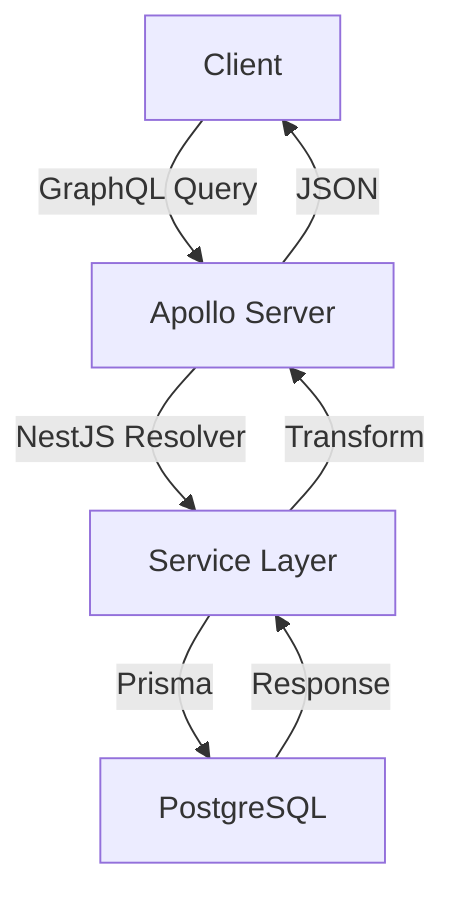

# Documentation Execution Plan

**Created:** November 18, 2025
**Project:** AFFiNE - Complete Learning Documentation
**Purpose:** Comprehensive onboarding documentation for mid-level developers

---

## Project Overview

**AFFiNE** is an open-source, all-in-one workspace that combines:
- **Document editing** (like Notion)
- **Canvas/whiteboard** (like Miro)
- **Database views** (Kanban, Table, etc.)
- **Real-time collaboration** (CRDT-based via Yjs)
- **AI capabilities** (multimodal AI partner)
- **Local-first architecture** with cloud sync
- **Cross-platform** (Web, Desktop via Electron, Mobile via Capacitor)

---

## Repository Structure Analysis

### Monorepo Organization

```
AFFiNE/
├── #claude/                    # Claude Code configuration
├── blocksuite/                 # Editor framework (separate project)
│   ├── affine/                # AFFiNE-specific blocks & widgets
│   ├── framework/             # Core editor framework
│   └── playground/            # Development playground
├── packages/
│   ├── backend/
│   │   ├── server/           # NestJS backend
│   │   └── native/           # Rust native modules
│   ├── frontend/
│   │   ├── apps/
│   │   │   ├── web/         # Web application
│   │   │   ├── electron/     # Desktop app (main process)
│   │   │   ├── electron-renderer/  # Desktop app (renderer)
│   │   │   ├── mobile/       # Mobile app wrapper
│   │   │   ├── ios/          # iOS-specific
│   │   │   └── android/      # Android-specific
│   │   ├── core/             # Core frontend logic
│   │   ├── component/        # UI components
│   │   ├── i18n/             # Internationalization
│   │   └── native/           # Frontend native modules (Rust)
│   └── common/
│       ├── infra/            # Infrastructure code
│       ├── graphql/          # GraphQL schema/types
│       ├── nbstore/          # Storage layer
│       ├── y-octo/           # CRDT implementation (Rust)
│       └── ...
├── tests/                     # E2E and integration tests
├── tools/                     # Build tools and utilities
└── docs/                      # Documentation
    ├── contributing/
    ├── reference/
    └── learning/             # ← Our new documentation home
```

---

## Architecture Patterns Identified

### 1. **Frontend Architecture**
- **Framework:** React 19 + TypeScript 5.7
- **State Management:** Jotai (atomic state)
- **Routing:** React Router v6
- **Styling:** Vanilla Extract + CSS-in-JS
- **Build Tool:** Vite 7
- **Testing:** Vitest + Playwright

### 2. **Backend Architecture**
- **Framework:** NestJS 11 (Node.js)
- **Database:** PostgreSQL with Prisma ORM
- **API:** GraphQL (Apollo Server) + REST
- **Real-time:** Socket.IO
- **Authentication:** JWT-based
- **Queue/Jobs:** BullMQ with Redis

### 3. **Editor (BlockSuite)**
- **Framework:** Lit (Web Components)
- **Rendering:** Custom rendering engine
- **CRDT:** Yjs for collaboration
- **Block System:** Modular blocks architecture

### 4. **Native Modules**
- **Language:** Rust (Edition 2024)
- **Bindings:** NAPI-RS (Node.js <-> Rust)
- **Purpose:** Performance-critical operations, local storage

### 5. **Cross-Platform**
- **Desktop:** Electron 36 (needs upgrade to 39)
- **Mobile:** Capacitor 7
- **Web:** Standard browser support

---

## Documentation Plan

### Phase 2: Central Hub (1 document)
1. `README.md` - Main learning path navigator

### Phase 3: Foundation Documents (5 documents)
1. `GETTING_STARTED.md` - Setup, installation, first run
2. `ARCHITECTURE_OVERVIEW.md` - High-level system design
3. `PROJECT_STRUCTURE.md` - Detailed file/folder guide
4. `TECH_STACK_GUIDE.md` - Deep dive into each technology
5. `DATA_FLOW_GUIDE.md` - How data moves through the system

### Phase 4: Deep-Dive Documents (4 documents)
6. `FRONTEND_ARCHITECTURE.md` - React app, state, routing, components
7. `BACKEND_ARCHITECTURE.md` - NestJS, GraphQL, database, auth
8. `BLOCKSUITE_EDITOR.md` - Editor framework, blocks, rendering
9. `COLLABORATION_SYSTEM.md` - CRDTs, Yjs, real-time sync

### Phase 5: Practical Guides (4 documents)
10. `PATTERNS_AND_CONVENTIONS.md` - Code style, best practices
11. `HOW_TO_GUIDE.md` - Common tasks (add feature, fix bug, etc.)
12. `CODE_TOURS.md` - Guided walkthroughs of key features
13. `DEVELOPMENT_WORKFLOW.md` - Day-to-day development process

### Phase 6: Quality & Reference (5 documents)
14. `TESTING_GUIDE.md` - Unit, integration, E2E testing
15. `DEBUGGING_GUIDE.md` - Debugging techniques and tools
16. `SECURITY_GUIDE.md` - Security considerations
17. `API_DOCUMENTATION.md` - GraphQL API reference
18. `DATABASE_SCHEMA.md` - Prisma schema explained

### Phase 7: Learning Exercises (2 documents)
19. `EXERCISES.md` - Hands-on coding exercises
20. `FIRST_CONTRIBUTIONS.md` - Good first issues, contribution guide

### Phase 8: Finalization (3 documents)
21. `FAQ.md` - Frequently asked questions
22. Update `README.md` with final links
23. Accuracy review pass

---

## Key Learning Paths

### Path 1: Frontend Developer
```
1. GETTING_STARTED.md
2. TECH_STACK_GUIDE.md (focus: React, Jotai, Vite)
3. FRONTEND_ARCHITECTURE.md
4. PATTERNS_AND_CONVENTIONS.md
5. DEVELOPMENT_WORKFLOW.md
6. TESTING_GUIDE.md
7. FIRST_CONTRIBUTIONS.md
```

### Path 2: Backend Developer
```
1. GETTING_STARTED.md
2. TECH_STACK_GUIDE.md (focus: NestJS, Prisma, GraphQL)
3. BACKEND_ARCHITECTURE.md
4. DATABASE_SCHEMA.md
5. API_DOCUMENTATION.md
6. TESTING_GUIDE.md
7. FIRST_CONTRIBUTIONS.md
```

### Path 3: Full-Stack Developer
```
1. GETTING_STARTED.md
2. ARCHITECTURE_OVERVIEW.md
3. DATA_FLOW_GUIDE.md
4. TECH_STACK_GUIDE.md (all sections)
5. FRONTEND_ARCHITECTURE.md
6. BACKEND_ARCHITECTURE.md
7. COLLABORATION_SYSTEM.md
8. PATTERNS_AND_CONVENTIONS.md
9. HOW_TO_GUIDE.md
10. FIRST_CONTRIBUTIONS.md
```

### Path 4: Editor/BlockSuite Developer
```
1. GETTING_STARTED.md
2. BLOCKSUITE_EDITOR.md
3. COLLABORATION_SYSTEM.md (focus: Yjs)
4. CODE_TOURS.md (editor-focused tours)
5. PATTERNS_AND_CONVENTIONS.md
6. FIRST_CONTRIBUTIONS.md
```

---

## Documentation Principles

### 1. **Accuracy Over Completeness**
- Mark uncertainties clearly (⚠️ UNCLEAR, 🔍 NEEDS VERIFICATION, ❓ ASSUMPTION)
- Provide investigation paths for unclear areas
- Never fabricate explanations
- Link to current official docs (Nov 2025)

### 2. **Pedagogy First**
- Use analogies to familiar concepts (React/JS/TS)
- Include mental models and mnemonics
- Progressive disclosure (beginner → advanced)
- Real code examples with hyperlinks

### 3. **Practical Focus**
- How-to guides over theory
- Code examples from actual codebase
- Common pitfalls and gotchas
- Quick checks for self-testing

### 4. **Currency Awareness**
- Mark patterns as ✅ CURRENT, ⚠️ OUTDATED, or 🚨 DEPRECATED
- Reference TECH_STACK_RESEARCH.md for version info
- Explain modern alternatives to outdated patterns

---

## Special Considerations

### Complex Areas (Require Extra Care)

1. **CRDT/Collaboration System**
   - Yjs integration
   - Conflict resolution
   - Performance optimization
   - 🔍 **COMPLEX:** May need deeper investigation

2. **BlockSuite Editor**
   - Custom rendering pipeline
   - Block system architecture
   - Selection and cursor management
   - 🔍 **COMPLEX:** Extensive codebase

3. **Native Modules (Rust)**
   - NAPI-RS bindings
   - FFI (Foreign Function Interface)
   - Memory management across languages
   - ⚠️ **SPECIALIZED:** Not all developers need this

4. **Authentication & Authorization**
   - JWT flow
   - Session management
   - Role-based permissions
   - 🔍 **NEEDS VERIFICATION:** Trace through code

5. **Build System & Tooling**
   - Monorepo management (Yarn workspaces)
   - Build orchestration
   - Cross-platform builds
   - ⚠️ **COMPLEX:** Multiple build targets

---

## Document Templates

### Every Document Must Include:

1. **Header Section**
   ```markdown
   # [Document Title]

   **Documented:** November 2025
   **Tech Stack Research:** [TECH_STACK_RESEARCH.md](./TECH_STACK_RESEARCH.md)
   **Prerequisites:** [Links to prerequisite docs]

   > Brief description of what this document covers
   ```

2. **Table of Contents** (if > 500 lines)

3. **Version/Currency Notes**
   - Note relevant technology versions
   - Mark outdated patterns with ⚠️
   - Link to official current docs

4. **Core Content with Pedagogical Elements**
   - 🧠 Mental Models
   - 🌉 Bridges from React/JS/TS
   - 💡 Aha Moments
   - 🎯 Remember This (mnemonics)
   - ⚠️ Common Pitfalls
   - 🔗 Code Examples with hyperlinks
   - ✅ Quick Checks

5. **Next Steps Section**
   ```markdown
   ## Next Steps

   - **To learn more about X:** See [DOCUMENT.md](./DOCUMENT.md)
   - **To practice:** Try [EXERCISES.md](./EXERCISES.md#exercise-name)
   - **To contribute:** See [FIRST_CONTRIBUTIONS.md](./FIRST_CONTRIBUTIONS.md)
   ```

6. **See Also Section**
   - Related documents
   - Official documentation links
   - Relevant code examples

---

## Code Hyperlinking Strategy

### All Code References Must Use:
```markdown
[DescriptiveName](../relative/path/to/file.ts#L45-L67)
```

### Example:
```markdown
The authentication middleware validates JWT tokens:
- [JWT validation](../packages/backend/server/src/middleware/auth.ts#L23-L45)
- [Token refresh logic](../packages/backend/server/src/auth/refresh.ts#L67-L89)
```

---

## Mermaid Diagrams

### Create Visual Aids For:
1. System architecture
2. Data flow
3. Authentication/authorization flow
4. Real-time collaboration flow
5. Request/response lifecycle
6. State management patterns

### Example:


---

## Commit Strategy

### After Each Major Document:
```bash
git add docs/learning/[DOCUMENT].md
git commit -m "docs: add [DOCUMENT_TITLE]

- [Brief description of content]
- [Number] code examples with hyperlinks
- Includes [special features]
- Marked [outdated/current] patterns"
```

### Every 30-45 Minutes:
```bash
git add docs/learning/
git commit -m "docs: progress on [DOCUMENT_TITLE]

- Completed [section names]
- [X] lines added
- [status note]"
```

---

## Accuracy Checklist (Phase 8)

Before finalizing, verify:

- [ ] All code links point to correct files and line numbers
- [ ] No fabricated explanations for unclear code
- [ ] All uncertainties marked with appropriate indicators
- [ ] References to CURRENT official docs (Nov 2025)
- [ ] Tech stack information verified against TECH_STACK_RESEARCH.md
- [ ] Outdated patterns identified with modern alternatives
- [ ] Clear distinction between facts and inferences
- [ ] No assumptions presented as facts
- [ ] Discovery paths provided for complex/unclear areas
- [ ] All pedagogical elements present (mental models, analogies, etc.)
- [ ] Cross-references between documents working
- [ ] Table of contents accurate (if present)
- [ ] "Next Steps" sections complete

---

## Success Criteria

### Completion:
- ✅ All 23 documents created
- ✅ Minimum 500 code hyperlinks across all docs
- ✅ 20+ Mermaid diagrams
- ✅ All uncertainty markers properly used
- ✅ Central README acts as effective hub
- ✅ Multiple learning paths documented
- ✅ Exercises provide hands-on practice

### Quality:
- ✅ New developer can set up project in < 1 hour
- ✅ Developer can understand architecture in < 2 hours
- ✅ Developer can make first contribution in < 1 week
- ✅ No incorrect information documented
- ✅ All uncertainties clearly marked
- ✅ Modern patterns (Nov 2025) highlighted

---

## Timeline

**Total Estimated Time:** 8-12 hours of continuous work

- **Phase 0:** ✅ Complete (1.5 hours)
- **Phase 1:** 🔄 In Progress (0.5 hours)
- **Phase 2:** Central README (0.5 hours)
- **Phase 3:** Foundation docs (2 hours)
- **Phase 4:** Deep-dive docs (2 hours)
- **Phase 5:** Practical guides (1.5 hours)
- **Phase 6:** Quality & reference (2 hours)
- **Phase 7:** Learning exercises (1 hour)
- **Phase 8:** Review & finalization (1 hour)

---

## Notes for Autonomous Execution

1. **Do not ask for clarification** - make best judgment
2. **Mark ALL uncertainties** - never guess
3. **Link to actual code** - every concept needs examples
4. **Commit frequently** - after each doc or every 45 mins
5. **Use web_search** - verify any uncertain tech info
6. **Be honest about complexity** - some areas are genuinely hard
7. **Provide investigation paths** - when you can't fully explain
8. **Check TECH_STACK_RESEARCH.md** - for version/currency info
9. **Complete in one session** - no breaks, all phases
10. **Update todo list** - track progress continuously

---

**Status:** Ready to execute Phase 2
**Next:** Create docs/learning/README.md (central navigation hub)
