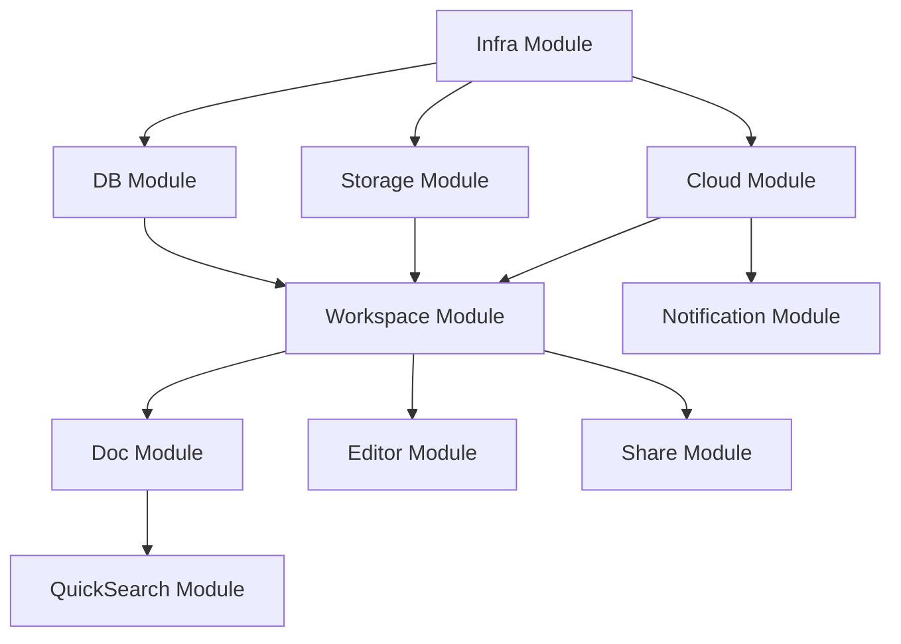

# Frontend Architecture

> **Mental Model**: Think of AFFiNE's frontend as a **plugin architecture** - 60+ independent modules that can be composed together. Unlike monolithic React apps, each feature is a self-contained module with its own services, entities, and components.

**For React Developers**: If you're used to `src/components/` and `src/utils/`, AFFiNE uses a **modular architecture** where each feature (workspace, editor, cloud, etc.) is a separate module with clear boundaries and dependency injection.

---

## Table of Contents

1. [Architecture Overview](#architecture-overview)
2. [Module System](#module-system)
3. [Dependency Injection Framework](#dependency-injection-framework)
4. [State Management with Jotai](#state-management-with-jotai)
5. [Component Architecture](#component-architecture)
6. [Routing & Navigation](#routing--navigation)
7. [Build System & Code Splitting](#build-system--code-splitting)
8. [Platform Variants](#platform-variants)
9. [Performance Patterns](#performance-patterns)
10. [Testing Strategy](#testing-strategy)

---

## Architecture Overview

### High-Level Structure

```
packages/frontend/
├── core/                    # Main application
│   ├── src/
│   │   ├── modules/        # 60+ feature modules
│   │   ├── desktop/        # Desktop-specific UI
│   │   ├── mobile/         # Mobile-specific UI (⚠️ in development)
│   │   ├── components/     # Shared components
│   │   └── blocksuite/     # BlockSuite editor integration
│   └── package.json
├── component/              # UI component library
├── apps/
│   ├── web/               # Browser entry point
│   ├── electron/          # Desktop entry point
│   └── ios/               # Mobile entry point
├── native/                # Rust native modules (NAPI-RS)
└── i18n/                  # Internationalization
```

### Design Principles

**1. Module Independence**

Each module is self-contained:
```typescript
// packages/frontend/core/src/modules/workspace/index.ts
export { WorkspaceModule } from './module';
export { WorkspaceService } from './services/workspace';
export { Workspace } from './entities/workspace';
```

**2. Dependency Injection**

No global singletons - everything injected:
```typescript
export class WorkspaceService extends Service {
  constructor(
    private readonly graphql: GraphQLService,  // Auto-injected
    private readonly auth: AuthService,        // Auto-injected
  ) {
    super();
  }
}
```

**3. Reactive State**

Jotai atoms for fine-grained reactivity:
```typescript
const workspaceAtom = atom<Workspace | null>(null);
const workspaceNameAtom = atom(get => get(workspaceAtom)?.name ?? '');
```

**4. Platform Abstraction**

Same code runs on web, desktop, mobile:
```typescript
// Automatically uses correct storage
const storage = platform === 'electron'
  ? new SqliteDocStorage()
  : new IndexedDBDocStorage();
```

---

## Module System

### What is a Module?

A **module** is a self-contained feature with:
- **Services**: Business logic layer
- **Entities**: Domain models
- **Providers**: Framework integration
- **Views**: React components (optional)
- **Scopes**: Dependency injection containers

### Module Structure Example

```
packages/frontend/core/src/modules/workspace/
├── index.ts                # Public API
├── module.ts               # Module definition
├── services/
│   ├── workspace.ts        # WorkspaceService
│   ├── list.ts             # WorkspacesService
│   ├── engine.ts           # WorkspaceEngineService
│   └── factory.ts          # WorkspaceFactory
├── entities/
│   ├── workspace.ts        # Workspace entity
│   └── engine.ts           # WorkspaceEngine entity
├── scopes/
│   └── workspace.ts        # WorkspaceScope (DI container)
├── impls/
│   └── workspace.ts        # WorkspaceImpl (BlockSuite integration)
└── views/
    └── workspace-header.tsx # UI components
```

### Module Registration

**Location**: `packages/frontend/core/src/modules/index.ts`

```typescript
import { Framework } from '@toeverything/infra';

// Register all modules
export function configureModules(framework: Framework) {
  // Infrastructure modules
  framework.module(CloudModule);
  framework.module(DbModule);
  framework.module(StorageModule);

  // Feature modules
  framework.module(WorkspaceModule);
  framework.module(EditorModule);
  framework.module(DocModule);
  framework.module(ShareModule);
  framework.module(NotificationModule);
  framework.module(QuickSearchModule);

  // Platform modules
  framework.module(DesktopModule); // Only on Electron
  framework.module(MobileModule);  // Only on iOS/Android
}
```

**Module definition**:

```typescript
// packages/frontend/core/src/modules/workspace/module.ts
import { Module } from '@toeverything/infra';

export const WorkspaceModule = Module.create({
  name: 'workspace',

  // Services available app-wide
  services: [
    WorkspacesService,
    WorkspaceFactory,
  ],

  // Entities (created on-demand)
  entities: [
    Workspace,
    WorkspaceEngine,
  ],

  // Scopes (isolated DI containers)
  scopes: [
    WorkspaceScope,
  ],

  // Providers (hooks into other modules)
  providers: [
    WorkspaceFlavoursProvider,
  ],
});
```

### Module Dependencies

**Explicit dependencies**:

```typescript
export const EditorModule = Module.create({
  name: 'editor',

  // This module depends on workspace module
  imports: [WorkspaceModule],

  services: [EditorService],
});
```

**Dependency graph** (simplified):



### Benefits of Module System

**✅ Clear boundaries**: Each feature isolated
**✅ Easy testing**: Mock dependencies per module
**✅ Code splitting**: Load modules on-demand
**✅ Team collaboration**: Teams own specific modules
**✅ Incremental adoption**: Add/remove features easily

**Location References**:
- Module system: `packages/frontend/core/src/modules/`
- Module registration: `packages/frontend/core/src/modules/index.ts`
- Framework code: `packages/common/infra/src/framework/`

---

## Dependency Injection Framework

### The Infra Framework

AFFiNE uses a custom DI framework (`@toeverything/infra`) inspired by Angular and NestJS.

**Core concepts**:

```typescript
import { Framework, Service, Entity } from '@toeverything/infra';

// 1. Services: Singleton business logic
export class UserService extends Service {
  async getCurrentUser() {
    return { id: '123', name: 'Alice' };
  }
}

// 2. Entities: Stateful domain models (scoped)
export class Workspace extends Entity {
  readonly id = this.scope.props.id;

  dispose() {
    // Cleanup when entity is destroyed
  }
}

// 3. Framework: Root DI container
const framework = new Framework();
framework.service(UserService);
framework.entity(Workspace);
```

### Using Services in React

**Hook: `useService()`**

```typescript
import { useService } from '@toeverything/infra';
import { WorkspacesService } from '@affine/core/modules/workspace';

function WorkspaceList() {
  const workspacesService = useService(WorkspacesService);

  // Service methods are available
  const workspaces = workspacesService.list();

  return (
    <ul>
      {workspaces.map(ws => (
        <li key={ws.id}>{ws.name}</li>
      ))}
    </ul>
  );
}
```

**How it works**:

```typescript
// packages/common/infra/src/react/use-service.ts
export function useService<T extends Service>(
  serviceClass: new (...args: any[]) => T
): T {
  const framework = useFramework(); // From React context
  return framework.get(serviceClass);
}
```

### Service Lifecycle

**1. Singleton services** (app-wide):

```typescript
export class AuthService extends Service {
  private session: Session | null = null;

  async signIn(email: string, password: string) {
    this.session = await this.api.login(email, password);
  }

  getCurrentUser() {
    return this.session?.user ?? null;
  }
}

// Same instance everywhere
const auth1 = framework.get(AuthService);
const auth2 = framework.get(AuthService);
console.log(auth1 === auth2); // true
```

**2. Scoped entities** (workspace-specific):

```typescript
export class WorkspaceScope extends Scope {
  constructor(public readonly props: { id: string }) {
    super();
  }
}

export class Workspace extends Entity {
  constructor(public readonly scope: WorkspaceScope) {
    super();
  }

  readonly id = this.scope.props.id;
}

// Different instances per workspace
const ws1 = framework.createEntity(Workspace, { scope: { id: 'workspace-1' } });
const ws2 = framework.createEntity(Workspace, { scope: { id: 'workspace-2' } });
console.log(ws1 === ws2); // false
console.log(ws1.id !== ws2.id); // true
```

### Dependency Resolution

**Automatic injection**:

```typescript
export class EditorService extends Service {
  constructor(
    private readonly workspace: WorkspaceService,  // Injected automatically
    private readonly doc: DocService,              // Injected automatically
    private readonly auth: AuthService,            // Injected automatically
  ) {
    super();
  }

  async openEditor(docId: string) {
    const workspace = this.workspace.current();
    const user = this.auth.getCurrentUser();

    if (!user) {
      throw new Error('Not authenticated');
    }

    const doc = await this.doc.load(workspace.id, docId);
    return doc;
  }
}
```

**Manual retrieval**:

```typescript
export class SomeService extends Service {
  async doSomething() {
    // Get service from framework
    const auth = this.framework.get(AuthService);
    const user = auth.getCurrentUser();
  }
}
```

### LiveData (Reactive Values)

**LiveData** is the Infra framework's reactive primitive:

```typescript
import { LiveData, Service } from '@toeverything/infra';

export class UserService extends Service {
  // LiveData holds a reactive value
  readonly currentUser$ = LiveData.from<User | null>(
    this.fetchUserObservable(),
    null // initial value
  );

  private fetchUserObservable(): Observable<User | null> {
    // Returns an RxJS observable
    return interval(5000).pipe(
      switchMap(() => this.api.getCurrentUser())
    );
  }
}
```

**Use in React**:

```typescript
import { useLiveData } from '@toeverything/infra';

function UserProfile() {
  const userService = useService(UserService);

  // Automatically subscribes and re-renders on change
  const user = useLiveData(userService.currentUser$);

  if (!user) {
    return <div>Not signed in</div>;
  }

  return <div>Hello, {user.name}!</div>;
}
```

**Location References**:
- Infra framework: `packages/common/infra/src/framework/`
- LiveData: `packages/common/infra/src/livedata/`
- React hooks: `packages/common/infra/src/react/`

---

## State Management with Jotai

### Why Jotai?

**Jotai** is a minimal, atomic state library. Unlike Redux:
- ✅ No boilerplate (no reducers, actions)
- ✅ Atomic updates (fine-grained reactivity)
- ✅ Derived state with automatic memoization
- ✅ Works great with React Suspense

### Atom Basics

**Primitive atoms** (read/write):

```typescript
import { atom } from 'jotai';

// Writable atom
const countAtom = atom(0);

function Counter() {
  const [count, setCount] = useAtom(countAtom);

  return (
    <button onClick={() => setCount(c => c + 1)}>
      Count: {count}
    </button>
  );
}
```

**Derived atoms** (read-only):

```typescript
// Derived from other atoms
const doubleCountAtom = atom(get => get(countAtom) * 2);

function DoubleCounter() {
  const doubleCount = useAtomValue(doubleCountAtom);
  return <div>Double: {doubleCount}</div>;
}
```

**Async atoms**:

```typescript
const userAtom = atom(async () => {
  const response = await fetch('/api/user');
  return response.json();
});

function UserProfile() {
  // Suspends until data loads
  const user = useAtomValue(userAtom);
  return <div>{user.name}</div>;
}
```

### AFFiNE Jotai Patterns

**Pattern 1: Workspace atoms**

```typescript
// packages/frontend/core/src/modules/workspace/atoms.ts
import { atom } from 'jotai';

// Base atoms
export const workspacesAtom = atom<Workspace[]>([]);
export const activeWorkspaceIdAtom = atom<string | null>(null);

// Derived atom
export const activeWorkspaceAtom = atom(get => {
  const workspaces = get(workspacesAtom);
  const id = get(activeWorkspaceIdAtom);
  return workspaces.find(w => w.id === id) ?? null;
});

// Write-only atom (action)
export const setActiveWorkspaceAtom = atom(
  null, // no read
  (get, set, workspaceId: string) => {
    set(activeWorkspaceIdAtom, workspaceId);

    // Side effect: Save to localStorage
    localStorage.setItem('lastWorkspace', workspaceId);
  }
);
```

**Pattern 2: Async data loading**

```typescript
// Load workspace from service
export const currentWorkspaceAtom = atom(async get => {
  const workspaceId = get(activeWorkspaceIdAtom);

  if (!workspaceId) {
    return null;
  }

  // Calls service (injected via Provider)
  const workspaceService = get(workspaceServiceAtom);
  return await workspaceService.load(workspaceId);
});
```

**Pattern 3: Scoped atoms (per workspace)**

```typescript
import { atomFamily } from 'jotai/utils';

// Create atom per workspace ID
export const workspaceDocsFamily = atomFamily((workspaceId: string) =>
  atom(async () => {
    const docsService = get(docsServiceAtom);
    return await docsService.listDocs(workspaceId);
  })
);

function WorkspaceDocs({ workspaceId }: { workspaceId: string }) {
  // Each workspace has its own atom instance
  const docs = useAtomValue(workspaceDocsFamily(workspaceId));

  return (
    <ul>
      {docs.map(doc => <li key={doc.id}>{doc.title}</li>)}
    </ul>
  );
}
```

**Pattern 4: Optimistic updates**

```typescript
const docsAtom = atom<Doc[]>([]);

// Optimistic create
const createDocAtom = atom(
  null,
  async (get, set, title: string) => {
    // 1. Optimistically add to UI
    const tempId = `temp-${Date.now()}`;
    const tempDoc = { id: tempId, title, loading: true };
    set(docsAtom, [...get(docsAtom), tempDoc]);

    try {
      // 2. Create on server
      const realDoc = await api.createDoc(title);

      // 3. Replace temp with real
      set(docsAtom, docs =>
        docs.map(d => d.id === tempId ? realDoc : d)
      );
    } catch (error) {
      // 4. Rollback on error
      set(docsAtom, docs =>
        docs.filter(d => d.id !== tempId)
      );
      throw error;
    }
  }
);
```

### Jotai + Infra Framework Integration

**Bridge pattern**:

```typescript
import { atom } from 'jotai';
import { useService } from '@toeverything/infra';

// Create an atom that depends on a service
export function createServiceAtom<T extends Service>(
  serviceClass: new (...args: any[]) => T
) {
  return atom(get => {
    const framework = get(frameworkAtom);
    return framework.get(serviceClass);
  });
}

// Usage
const workspaceServiceAtom = createServiceAtom(WorkspaceService);

const currentWorkspaceAtom = atom(async get => {
  const service = get(workspaceServiceAtom);
  return await service.current();
});
```

**Provider setup**:

```typescript
import { Provider as JotaiProvider } from 'jotai';
import { FrameworkProvider } from '@toeverything/infra/react';

function App() {
  return (
    <FrameworkProvider value={framework}>
      <JotaiProvider>
        <AppContent />
      </JotaiProvider>
    </FrameworkProvider>
  );
}
```

**Location References**:
- Jotai atoms: `packages/frontend/core/src/modules/*/atoms.ts`
- Scoped atoms: `packages/frontend/core/src/components/page-list/scoped-atoms.tsx`

---

## Component Architecture

### UI Component Library

**Location**: `packages/frontend/component/`

AFFiNE has a custom component library built on **Radix UI** primitives.

**Component categories**:

```
packages/frontend/component/src/
├── components/
│   ├── button/              # Button variants
│   ├── menu/                # Dropdown menus
│   ├── modal/               # Dialogs and modals
│   ├── input/               # Form inputs
│   ├── card/                # Card layouts
│   ├── tooltip/             # Tooltips
│   └── ...
├── ui/
│   ├── layout/              # Page layouts
│   ├── sidebar/             # Sidebar components
│   └── scrollable/          # Scroll containers
└── theme/
    └── index.css            # CSS variables
```

### Styling with Vanilla Extract

**Why Vanilla Extract?**
- ✅ Type-safe CSS (autocomplete, type checking)
- ✅ Zero runtime (CSS generated at build time)
- ✅ Scoped styles (no class name collisions)
- ✅ Works with SSR

**Example**:

```typescript
// button.css.ts
import { style } from '@vanilla-extract/css';

export const button = style({
  padding: '8px 16px',
  borderRadius: '4px',
  backgroundColor: 'var(--affine-primary-color)',
  color: 'white',
  border: 'none',
  cursor: 'pointer',

  ':hover': {
    backgroundColor: 'var(--affine-primary-color-hover)',
  },

  selectors: {
    '&[disabled]': {
      opacity: 0.5,
      cursor: 'not-allowed',
    },
  },
});

export const buttonVariants = {
  primary: style({ /* ... */ }),
  secondary: style({ /* ... */ }),
  danger: style({ /* ... */ }),
};
```

**Usage**:

```typescript
// button.tsx
import * as styles from './button.css';

export function Button({
  variant = 'primary',
  children,
  ...props
}: ButtonProps) {
  return (
    <button
      className={clsx(styles.button, styles.buttonVariants[variant])}
      {...props}
    >
      {children}
    </button>
  );
}
```

### Component Composition Patterns

**Pattern 1: Compound components**

```typescript
// Menu with sub-components
export const Menu = {
  Root: MenuRoot,
  Trigger: MenuTrigger,
  Content: MenuContent,
  Item: MenuItem,
  Separator: MenuSeparator,
};

// Usage
<Menu.Root>
  <Menu.Trigger>
    <Button>Open Menu</Button>
  </Menu.Trigger>
  <Menu.Content>
    <Menu.Item>Edit</Menu.Item>
    <Menu.Item>Delete</Menu.Item>
    <Menu.Separator />
    <Menu.Item>Archive</Menu.Item>
  </Menu.Content>
</Menu.Root>
```

**Pattern 2: Render props**

```typescript
interface DocListProps {
  children: (doc: Doc) => React.ReactNode;
}

export function DocList({ children }: DocListProps) {
  const docs = useAtomValue(docsAtom);

  return (
    <ul>
      {docs.map(doc => (
        <li key={doc.id}>{children(doc)}</li>
      ))}
    </ul>
  );
}

// Usage
<DocList>
  {doc => (
    <div>
      <h3>{doc.title}</h3>
      <p>{doc.content}</p>
    </div>
  )}
</DocList>
```

**Pattern 3: Slots**

```typescript
interface CardProps {
  header?: React.ReactNode;
  children: React.ReactNode;
  footer?: React.ReactNode;
}

export function Card({ header, children, footer }: CardProps) {
  return (
    <div className={styles.card}>
      {header && <div className={styles.cardHeader}>{header}</div>}
      <div className={styles.cardBody}>{children}</div>
      {footer && <div className={styles.cardFooter}>{footer}</div>}
    </div>
  );
}

// Usage
<Card
  header={<h2>Workspace Settings</h2>}
  footer={<Button>Save</Button>}
>
  <FormFields />
</Card>
```

### Accessibility

**All components use Radix UI** for built-in accessibility:

```typescript
import * as Dialog from '@radix-ui/react-dialog';

export function Modal({ open, onClose, children }: ModalProps) {
  return (
    <Dialog.Root open={open} onOpenChange={onClose}>
      <Dialog.Portal>
        <Dialog.Overlay className={styles.overlay} />
        <Dialog.Content className={styles.content}>
          {children}
          <Dialog.Close asChild>
            <button>Close</button>
          </Dialog.Close>
        </Dialog.Content>
      </Dialog.Portal>
    </Dialog.Root>
  );
}
```

**Radix provides**:
- ✅ Keyboard navigation
- ✅ Focus management
- ✅ ARIA attributes
- ✅ Screen reader support

**Location References**:
- Component library: `packages/frontend/component/src/components/`
- Vanilla Extract styles: `*.css.ts` files throughout codebase

---

## Routing & Navigation

### React Router v6

**Location**: `packages/frontend/core/src/router.tsx`

AFFiNE uses **React Router v6** with nested routes and data loading.

**Route structure**:

```typescript
import { createBrowserRouter } from 'react-router-dom';

export const router = createBrowserRouter([
  {
    path: '/',
    element: <AppLayout />,
    children: [
      {
        index: true,
        element: <WorkspaceList />,
      },
      {
        path: 'workspace/:workspaceId',
        element: <WorkspaceLayout />,
        loader: async ({ params }) => {
          // Load workspace before rendering
          const workspace = await loadWorkspace(params.workspaceId);
          return { workspace };
        },
        children: [
          {
            path: 'all',
            element: <AllPages />,
          },
          {
            path: 'collection/:collectionId',
            element: <CollectionView />,
          },
          {
            path: ':pageId',
            element: <PageView />,
          },
        ],
      },
      {
        path: 'settings',
        element: <Settings />,
        children: [
          { path: 'general', element: <GeneralSettings /> },
          { path: 'account', element: <AccountSettings /> },
          { path: 'billing', element: <BillingSettings /> },
        ],
      },
    ],
  },
]);
```

**Route params**:

```typescript
import { useParams } from 'react-router-dom';

function PageView() {
  const { workspaceId, pageId } = useParams();

  // Load page data
  const page = useAtomValue(pageFamily({ workspaceId, pageId }));

  return <Editor page={page} />;
}
```

**Navigation**:

```typescript
import { useNavigate } from 'react-router-dom';

function WorkspaceCard({ workspace }: { workspace: Workspace }) {
  const navigate = useNavigate();

  const handleClick = () => {
    navigate(`/workspace/${workspace.id}/all`);
  };

  return (
    <div onClick={handleClick}>
      {workspace.name}
    </div>
  );
}
```

**Programmatic navigation service**:

```typescript
// packages/frontend/core/src/modules/navigation/services/navigator.ts
export class NavigatorService extends Service {
  navigate(path: string) {
    // Uses router instance from DI
    this.router.navigate(path);
  }

  openWorkspace(workspaceId: string) {
    this.navigate(`/workspace/${workspaceId}/all`);
  }

  openPage(workspaceId: string, pageId: string) {
    this.navigate(`/workspace/${workspaceId}/${pageId}`);
  }
}
```

**Location References**:
- Router config: `packages/frontend/core/src/router.tsx`
- Navigator service: `packages/frontend/core/src/modules/navigation/services/navigator.ts`

---

## Build System & Code Splitting

### Vite Configuration

**Location**: `packages/frontend/core/vite.config.ts`

```typescript
import { defineConfig } from 'vite';
import react from '@vitejs/plugin-react';
import { vanillaExtractPlugin } from '@vanilla-extract/vite-plugin';

export default defineConfig({
  plugins: [
    react({
      babel: {
        plugins: [
          'jotai/babel/plugin-react-refresh', // Jotai + React Refresh
        ],
      },
    }),
    vanillaExtractPlugin(), // CSS-in-JS at build time
  ],

  build: {
    target: 'esnext',
    minify: 'esbuild',

    rollupOptions: {
      output: {
        // Manual chunks for code splitting
        manualChunks: {
          'react-vendor': ['react', 'react-dom', 'react-router-dom'],
          'jotai': ['jotai', 'jotai/utils'],
          'blocksuite': ['@blocksuite/affine'],
          'yjs': ['yjs', 'lib0'],
        },
      },
    },
  },

  optimizeDeps: {
    include: [
      '@toeverything/infra',
      '@affine/graphql',
    ],
  },
});
```

### Code Splitting Strategies

**1. Route-based splitting**

```typescript
import { lazy, Suspense } from 'react';

// Lazy load route components
const SettingsPage = lazy(() => import('./pages/settings'));
const EditorPage = lazy(() => import('./pages/editor'));

const routes = [
  {
    path: '/settings',
    element: (
      <Suspense fallback={<Loading />}>
        <SettingsPage />
      </Suspense>
    ),
  },
  {
    path: '/workspace/:id/:pageId',
    element: (
      <Suspense fallback={<Loading />}>
        <EditorPage />
      </Suspense>
    ),
  },
];
```

**2. Module-based splitting**

```typescript
// Heavy modules loaded on-demand
const PdfViewer = lazy(() => import('@affine/core/modules/pdf'));
const VideoPlayer = lazy(() => import('@affine/core/modules/media'));

function DocContent({ block }: { block: Block }) {
  if (block.type === 'pdf') {
    return (
      <Suspense fallback={<Skeleton />}>
        <PdfViewer src={block.src} />
      </Suspense>
    );
  }

  if (block.type === 'video') {
    return (
      <Suspense fallback={<Skeleton />}>
        <VideoPlayer src={block.src} />
      </Suspense>
    );
  }

  return <TextBlock block={block} />;
}
```

**3. Preloading critical paths**

```typescript
import { preloadModule } from 'vite/preload';

function WorkspaceList() {
  const handleMouseEnter = (workspaceId: string) => {
    // Preload editor module on hover
    preloadModule('./pages/editor');

    // Preload workspace data
    queryClient.prefetchQuery(['workspace', workspaceId]);
  };

  return (
    <div onMouseEnter={() => handleMouseEnter(ws.id)}>
      {workspace.name}
    </div>
  );
}
```

### Bundle Analysis

**Run bundle analyzer**:

```bash
yarn workspace @affine/core build --analyze
```

**Typical bundle sizes** (production):

```
dist/
├── assets/
│   ├── index-[hash].js         # 120 KB (main bundle)
│   ├── react-vendor-[hash].js  # 140 KB (React + React Router)
│   ├── jotai-[hash].js         # 15 KB (Jotai)
│   ├── blocksuite-[hash].js    # 350 KB (BlockSuite editor)
│   ├── yjs-[hash].js           # 180 KB (Yjs CRDT)
│   └── editor-[hash].js        # 200 KB (lazy-loaded editor UI)
└── index.html
```

**Location References**:
- Vite config: `packages/frontend/core/vite.config.ts`
- Build scripts: `package.json` (root)

---

## Platform Variants

### Multi-Platform Support

AFFiNE runs on 3 platforms with **shared codebase**:

```
Platform      | Entry Point           | Storage          | Native Modules
--------------|-----------------------|------------------|----------------
Web           | apps/web/             | IndexedDB        | None
Desktop       | apps/electron/        | SQLite           | Rust via NAPI-RS
Mobile (iOS)  | apps/ios/             | SQLite           | Swift/Capacitor
```

### Platform Detection

```typescript
// packages/frontend/core/src/modules/platform/service.ts
export class PlatformService extends Service {
  readonly platform = this.detectPlatform();

  private detectPlatform(): Platform {
    if (typeof window === 'undefined') {
      return 'server';
    }

    if ((window as any).__AFFINE_DESKTOP__) {
      return 'electron';
    }

    if ((window as any).Capacitor) {
      return 'mobile';
    }

    return 'web';
  }

  isElectron() {
    return this.platform === 'electron';
  }

  isMobile() {
    return this.platform === 'mobile';
  }

  isWeb() {
    return this.platform === 'web';
  }
}
```

### Platform-Specific Code

**Conditional rendering**:

```typescript
function FileMenu() {
  const platform = useService(PlatformService);

  return (
    <Menu>
      <MenuItem>New Page</MenuItem>
      <MenuItem>Open...</MenuItem>

      {platform.isElectron() && (
        <MenuItem onClick={() => window.apis.showInFolder()}>
          Show in Finder
        </MenuItem>
      )}

      {platform.isWeb() && (
        <MenuItem onClick={() => navigator.share()}>
          Share...
        </MenuItem>
      )}
    </Menu>
  );
}
```

**Electron IPC bridge**:

```typescript
// Electron main process exposes APIs
window.apis = {
  async readFile(path: string): Promise<Uint8Array> {
    return await ipcRenderer.invoke('fs:read', path);
  },

  async writeFile(path: string, data: Uint8Array): Promise<void> {
    await ipcRenderer.invoke('fs:write', path, data);
  },

  async showOpenDialog(): Promise<string[]> {
    return await ipcRenderer.invoke('dialog:open');
  },
};

// Frontend uses the API
async function importFile() {
  const paths = await window.apis.showOpenDialog();
  const data = await window.apis.readFile(paths[0]);
  // ... process file
}
```

**Capacitor plugin**:

```typescript
import { Filesystem } from '@capacitor/filesystem';

async function saveToDevice(filename: string, data: Blob) {
  const base64 = await blobToBase64(data);

  await Filesystem.writeFile({
    path: filename,
    data: base64,
    directory: Directory.Documents,
  });
}
```

**Location References**:
- Platform service: `packages/frontend/core/src/modules/platform/`
- Electron entry: `packages/frontend/apps/electron/`
- Mobile entry: `packages/frontend/apps/ios/`

---

## Performance Patterns

### 1. React.memo for Expensive Components

```typescript
import { memo } from 'react';

const ExpensiveDocItem = memo(function DocItem({ doc }: { doc: Doc }) {
  // Complex rendering logic
  return (
    <div className={styles.docItem}>
      <DocThumbnail doc={doc} />
      <DocMetadata doc={doc} />
      <DocActions doc={doc} />
    </div>
  );
}, (prev, next) => {
  // Custom comparison
  return prev.doc.id === next.doc.id &&
         prev.doc.updatedAt === next.doc.updatedAt;
});
```

### 2. Virtual Lists for Long Content

```typescript
import { VirtualList } from '@affine/component';

function DocList({ docs }: { docs: Doc[] }) {
  return (
    <VirtualList
      items={docs}
      itemHeight={60}
      containerHeight={600}
      renderItem={(doc) => <DocItem key={doc.id} doc={doc} />}
    />
  );
}
```

### 3. Debounce User Input

```typescript
import { useDebouncedValue } from '@affine/core/hooks';

function SearchBar() {
  const [query, setQuery] = useState('');
  const debouncedQuery = useDebouncedValue(query, 300);

  // Only searches after 300ms of no typing
  const results = useAtomValue(searchResultsFamily(debouncedQuery));

  return (
    <>
      <input
        value={query}
        onChange={e => setQuery(e.target.value)}
      />
      <SearchResults results={results} />
    </>
  );
}
```

### 4. Lazy Load Images

```typescript
function DocThumbnail({ blobKey }: { blobKey: string }) {
  const [src, setSrc] = useState<string | null>(null);
  const ref = useRef<HTMLImageElement>(null);

  useEffect(() => {
    const observer = new IntersectionObserver(
      (entries) => {
        if (entries[0].isIntersecting) {
          // Load image when visible
          loadBlob(blobKey).then(blob => {
            setSrc(URL.createObjectURL(blob));
          });
          observer.disconnect();
        }
      },
      { rootMargin: '100px' } // Start loading 100px before visible
    );

    if (ref.current) {
      observer.observe(ref.current);
    }

    return () => observer.disconnect();
  }, [blobKey]);

  return ;
}
```

### 5. Web Workers for Heavy Computation

```typescript
// pdf-parser.worker.ts
import { expose } from 'comlink';

const pdfParser = {
  async parsePdf(buffer: ArrayBuffer): Promise<ParsedPdf> {
    // Heavy PDF parsing in worker thread
    const pdf = await parsePdfBuffer(buffer);
    return pdf;
  },
};

expose(pdfParser);

// Usage in main thread
import { wrap } from 'comlink';

const pdfWorker = wrap<typeof pdfParser>(
  new Worker(new URL('./pdf-parser.worker.ts', import.meta.url))
);

async function loadPdf(file: File) {
  const buffer = await file.arrayBuffer();
  const parsed = await pdfWorker.parsePdf(buffer); // Runs in worker
  return parsed;
}
```

**Location References**:
- Performance hooks: `packages/frontend/core/src/hooks/`
- Virtual list: `packages/frontend/component/src/ui/scrollable/`

---

## Testing Strategy

### Test Pyramid

```
         /\
        /  \  E2E (Playwright)
       /----\
      /      \  Integration (Vitest + Testing Library)
     /--------\
    /          \  Unit (Vitest)
   /------------\
```

### 1. Unit Tests (Vitest)

**Location**: `*.spec.ts` files alongside source

```typescript
// workspace.spec.ts
import { describe, it, expect } from 'vitest';
import { WorkspaceService } from './workspace';

describe('WorkspaceService', () => {
  it('should create a new workspace', () => {
    const service = new WorkspaceService();
    const workspace = service.create({ name: 'Test Workspace' });

    expect(workspace.name).toBe('Test Workspace');
    expect(workspace.id).toBeDefined();
  });

  it('should list all workspaces', () => {
    const service = new WorkspaceService();
    service.create({ name: 'WS 1' });
    service.create({ name: 'WS 2' });

    const workspaces = service.list();
    expect(workspaces).toHaveLength(2);
  });
});
```

### 2. Component Tests (React Testing Library)

```typescript
// workspace-card.spec.tsx
import { render, screen, fireEvent } from '@testing-library/react';
import { WorkspaceCard } from './workspace-card';

describe('WorkspaceCard', () => {
  it('should render workspace name', () => {
    const workspace = { id: '1', name: 'My Workspace' };
    render(<WorkspaceCard workspace={workspace} />);

    expect(screen.getByText('My Workspace')).toBeInTheDocument();
  });

  it('should call onClick when clicked', () => {
    const onClick = vi.fn();
    const workspace = { id: '1', name: 'My Workspace' };

    render(<WorkspaceCard workspace={workspace} onClick={onClick} />);
    fireEvent.click(screen.getByText('My Workspace'));

    expect(onClick).toHaveBeenCalledWith(workspace);
  });
});
```

### 3. E2E Tests (Playwright)

**Location**: `packages/frontend/core/e2e/`

```typescript
// workspace.e2e.ts
import { test, expect } from '@playwright/test';

test('create and open workspace', async ({ page }) => {
  // Navigate to app
  await page.goto('http://localhost:5173');

  // Click "New Workspace" button
  await page.click('button:has-text("New Workspace")');

  // Enter workspace name
  await page.fill('input[name="workspace-name"]', 'Test Workspace');
  await page.click('button:has-text("Create")');

  // Verify workspace created
  await expect(page.locator('h1')).toHaveText('Test Workspace');

  // Create a new page
  await page.click('button:has-text("New Page")');
  await page.fill('.editor-title', 'My First Page');

  // Verify page appears in sidebar
  await expect(page.locator('.sidebar')).toContainText('My First Page');
});
```

### Mocking Strategies

**Mock services**:

```typescript
import { vi } from 'vitest';

// Mock GraphQL service
const mockGraphQL = {
  gql: vi.fn(),
};

// Inject mock into framework
framework.override(GraphQLService, mockGraphQL);

// Now all components using GraphQLService will get the mock
```

**Mock Yjs documents**:

```typescript
import { Doc as YDoc } from 'yjs';

function createMockWorkspace() {
  const doc = new YDoc({ guid: 'test-workspace' });
  const meta = doc.getMap('meta');
  meta.set('name', 'Test Workspace');

  return { rootYDoc: doc };
}
```

**Location References**:
- Unit tests: `packages/frontend/core/src/**/*.spec.ts`
- E2E tests: `packages/frontend/core/e2e/`
- Test utilities: `packages/frontend/core/src/__tests__/`

---

## Summary: Key Architectural Decisions

### 1. **Modular Architecture**

**Why**: Scalability, maintainability, team independence

| Traditional          | AFFiNE Modules         |
|---------------------|------------------------|
| Monolithic `src/`   | 60+ independent modules |
| Global state        | Module-scoped state    |
| Tight coupling      | Dependency injection   |

### 2. **Dependency Injection**

**Why**: Testability, flexibility, clear contracts

- Services auto-injected via constructor
- No global singletons or imports
- Easy to mock for testing

### 3. **Jotai for State**

**Why**: Minimal boilerplate, atomic updates, Suspense support

- Atoms replace Redux reducers
- Derived state automatically memoized
- Works seamlessly with async data

### 4. **Vanilla Extract for Styling**

**Why**: Type safety, zero runtime, scoped styles

- CSS-in-TS with autocomplete
- Generated at build time (no runtime cost)
- No class name collisions

### 5. **Platform Abstraction**

**Why**: Code reuse across web/desktop/mobile

- Same codebase, different entry points
- Storage layer swaps (IndexedDB ↔ SQLite)
- Platform-specific features via dependency injection

---

## Next Steps

**To dive deeper**:

- **Backend Architecture** → See `BACKEND_ARCHITECTURE.md`
- **BlockSuite Editor** → See `BLOCKSUITE_EDITOR.md`
- **Collaboration System** → See `COLLABORATION_SYSTEM.md`

**To practice**:

1. Create a new module following the workspace module pattern
2. Build a feature using Jotai atoms + Infra services
3. Add platform-specific code for a new capability

---

## References

**Code Locations**:

- Modules: `packages/frontend/core/src/modules/`
- Component library: `packages/frontend/component/`
- Infra framework: `packages/common/infra/`
- Router: `packages/frontend/core/src/router.tsx`

**External Documentation**:

- React Router: https://reactrouter.com
- Jotai: https://jotai.org
- Vanilla Extract: https://vanilla-extract.style
- Radix UI: https://www.radix-ui.com
- Vite: https://vitejs.dev

---

*This guide was created to help React developers understand AFFiNE's modular frontend architecture. For questions, see `#claude/START-HERE.md`.*
